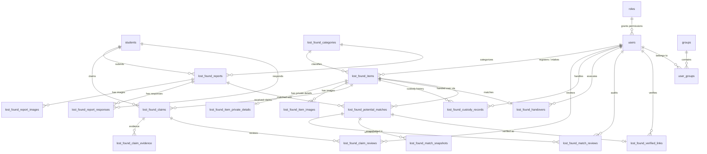

# توثيق ومخطط قاعدة بيانات منصة CampusFind

> **المشروع:** منصة CampusFind - النظام الجامعي الشامل لإدارة المعثورات والمفقودات  
> **نوع قاعدة البيانات:** MySQL 8.0+ / MariaDB 10.4+  
> **محرك التخزين والترميز:** `InnoDB` | `utf8mb4_unicode_ci`  
> **إجمالي الجداول:** 35 جدولاً  
> **تاريخ التوثيق:** 2026-10-04  
> **الملف المصدري المباشر للـ SQL:** [`database/schema/campusfind_full_schema.sql`](file:///home/hosam/Documents/compusfund/database/schema/campusfind_full_schema.sql)  

---

## 📑 فهرس المحتويات

1. [نظرة عامة على البنية المعمارية](#نظرة-عامة-على-البنية-المعمارية)
2. [مخطط علاقات الكيانات (ER Diagram)](#مخطط-علاقات-الكيانات-er-diagram)
3. [توثيق الجداول بحسب الوحدات البرمجية](#توثيق-الجداول-بحسب-الوحدات-البرمجية)
   - القسم الأول: نظام المفقودات والموجودات (Lost & Found Core System)
   - القسم الثاني: نظام الطلاب وحساباتهم (Student Module)
   - القسم الثالث: نظام الإدارة والمستخدمين والصلاحيات (Admin & User System)
   - القسم الرابع: الإعدادات المركزية واللغات (Core System & Localization)
   - القسم الخامس: مكوّنات فلاتر البيانات (DataGrid System)
   - القسم السادس: جداول البنية التحتية والمهام (Infrastructure & Laravel Framework)
4. [مصفوفة العلاقات والمفاتيح الأجنبية (Foreign Keys Matrix)](#مصفوفة-العلاقات-والمفاتيح-الأجنبية-foreign-keys-matrix)
5. [ملف الـ SQL الكامل لإنشاء قاعدة البيانات](#ملف-الـ-sql-الكامل-لإنشاء-قاعدة-البيانات)

---

## 🏗 نظرة عامة على البنية المعمارية

تعتمد منصة **CampusFind** على بنية حزم برمجية معيارية (Modular Package Architecture) تفصل المسؤوليات بوضوح بين:
- **حزمة المفقودات والمعثورات (`CampusFind\LostAndFound`):** تضمن دورة حياة كاملة للأغراض تبدأ من تسجيل البلاغ/المعثور، التحقق من الحيازة والعهدة، تدقيق المطالبات، الربط المعتمد، والتسليم الآمن عبر كود OTP وسجل تدقيق.
- **حزمة الطلاب (`CampusFind\Student`):** توفر إدارة مستقلة لهويات الطلاب في الحرم الجامعي.
- **حزمة المستخدمين والصلاحيات (`Webkul\User`):** توفر نظام صلاحيات هرمي مبني على الأدوار (Role-Based Access Control) لإدارة المشرفين وموظفي الأمن.
- **الحزم الأساسية والبنية التحتية (`Webkul\Core`, `DataGrid`, `Sanctum`):** لإدارة التكوين، اللغات المتعددة، الفلاتر الذكية، والمهام غير المتزامنة.

---

## 📊 مخطط علاقات الكيانات (ER Diagram)



---

## 📦 توثيق الجداول بحسب الوحدات البرمجية

### القسم الأول: نظام المفقودات والموجودات (Lost & Found Core System)

القلب التشغيلي لمنصة CampusFind، يشمل إدارة المعثورات، البلاغات، مطالبات الملكية، دورة العهدة، تسليم الأغراض، وخوارزميات التطابق الذكي.

#### جدول: `lost_found_categories` (تصنيفات المعثورات والمفقودات (Categories))

- **الوصف:** جدول التصنيفات الهيكلية للمواد (إلكترونيات، مستندات، حقائب ومحافظ، مفاتيح، إلخ) مع كود تصنيف فريد وحالة التفعيل وترتيب العرض.
- **الحزمة البرمجية (Package):** `CampusFind\LostAndFound`
- **نموذج Eloquent:** `CampusFind\LostAndFound\Models\LostFoundCategory`
- **ملفات التهجير (Migrations):**
  - [`packages/CampusFind/LostAndFound/src/Database/Migrations/2026_09_27_000000_create_lost_found_categories_table.php`](file:///home/hosam/Documents/compusfund/packages/CampusFind/LostAndFound/src/Database/Migrations/2026_09_27_000000_create_lost_found_categories_table.php)

##### أعمدة الجدول (Columns):

| اسم الحقل | نوع البيانات | يقبل Null | القيمة الافتراضية | الفهرس / المفتاح | تفاصيل إضافية |
|---|---|---|---|---|---|
| `id` | `bigint(20) unsigned` | لا | — | مفتاح رئيسي (PK) | `auto_increment` |
| `code` | `varchar(64)` | لا | — | فريد (Unique) | — |
| `is_active` | `tinyint(1)` | لا | `1` | فهرس (Index/FK) | — |
| `sort_order` | `int(11)` | لا | `0` | — | — |
| `created_at` | `timestamp` | نعم | `NULL` | — | — |
| `updated_at` | `timestamp` | نعم | `NULL` | — | — |

<details>
<summary><b>عرض كود إنشاء الجدول (SQL CREATE TABLE)</b></summary>

```sql
CREATE TABLE `lost_found_categories` (
  `id` bigint(20) unsigned NOT NULL AUTO_INCREMENT,
  `code` varchar(64) NOT NULL,
  `is_active` tinyint(1) NOT NULL DEFAULT 1,
  `sort_order` int(11) NOT NULL DEFAULT 0,
  `created_at` timestamp NULL DEFAULT NULL,
  `updated_at` timestamp NULL DEFAULT NULL,
  PRIMARY KEY (`id`),
  UNIQUE KEY `lost_found_categories_code_unique` (`code`),
  KEY `lost_found_categories_is_active_sort_order_index` (`is_active`,`sort_order`)
) ENGINE=InnoDB DEFAULT CHARSET=utf8mb4 COLLATE=utf8mb4_unicode_ci;
```

</details>

---

#### جدول: `lost_found_items` (الأغراض المعثور عليها (Found Items))

- **الوصف:** الجدول الرئيسي للمعثورات المسجلة بالنظام. يربط الغرض بالتصنيف والعهدة الحالية، وحالة الغرض (مسجل، قيد التحقق، جاهز للتسليم، تم التسليم، أرشيف)، وهوية الملتقط والجهة التي استلمته.
- **الحزمة البرمجية (Package):** `CampusFind\LostAndFound`
- **نموذج Eloquent:** `CampusFind\LostAndFound\Models\FoundItem`
- **ملفات التهجير (Migrations):**
  - [`packages/CampusFind/LostAndFound/src/Database/Migrations/2026_09_27_000001_create_lost_found_items_table.php`](file:///home/hosam/Documents/compusfund/packages/CampusFind/LostAndFound/src/Database/Migrations/2026_09_27_000001_create_lost_found_items_table.php)
  - [`packages/CampusFind/LostAndFound/src/Database/Migrations/2026_09_27_000007_add_approved_claim_id_to_lost_found_items_table.php`](file:///home/hosam/Documents/compusfund/packages/CampusFind/LostAndFound/src/Database/Migrations/2026_09_27_000007_add_approved_claim_id_to_lost_found_items_table.php)
  - [`packages/CampusFind/LostAndFound/src/Database/Migrations/2026_09_27_000009_add_current_custody_projection_to_lost_found_items_table.php`](file:///home/hosam/Documents/compusfund/packages/CampusFind/LostAndFound/src/Database/Migrations/2026_09_27_000009_add_current_custody_projection_to_lost_found_items_table.php)
  - [`packages/CampusFind/LostAndFound/src/Database/Migrations/2026_10_04_000016_harden_found_item_intake_identity.php`](file:///home/hosam/Documents/compusfund/packages/CampusFind/LostAndFound/src/Database/Migrations/2026_10_04_000016_harden_found_item_intake_identity.php)

##### أعمدة الجدول (Columns):

| اسم الحقل | نوع البيانات | يقبل Null | القيمة الافتراضية | الفهرس / المفتاح | تفاصيل إضافية |
|---|---|---|---|---|---|
| `id` | `bigint(20) unsigned` | لا | — | مفتاح رئيسي (PK) | `auto_increment` |
| `public_reference` | `varchar(64)` | لا | — | — | — |
| `public_reference_key` | `varchar(64)` | لا | — | فريد (Unique) | — |
| `category_id` | `bigint(20) unsigned` | نعم | `NULL` | فهرس (Index/FK) | — |
| `logged_by_user_id` | `int(10) unsigned` | نعم | `NULL` | فهرس (Index/FK) | — |
| `submission_channel` | `varchar(32)` | لا | `'legacy_uncertain'` | فهرس (Index/FK) | — |
| `reporter_student_id` | `bigint(20) unsigned` | نعم | `NULL` | فهرس (Index/FK) | — |
| `submitted_by_student_id` | `bigint(20) unsigned` | نعم | `NULL` | فهرس (Index/FK) | — |
| `intake_employee_user_id` | `int(10) unsigned` | نعم | `NULL` | فهرس (Index/FK) | — |
| `status` | `varchar(32)` | لا | `'draft'` | فهرس (Index/FK) | — |
| `title` | `varchar(160)` | لا | — | — | — |
| `public_description` | `text` | نعم | `NULL` | — | — |
| `found_location` | `varchar(255)` | نعم | `NULL` | — | — |
| `found_at` | `datetime` | نعم | `NULL` | — | — |
| `reported_at` | `datetime` | نعم | `NULL` | — | — |
| `created_at` | `timestamp` | نعم | `NULL` | — | — |
| `updated_at` | `timestamp` | نعم | `NULL` | — | — |
| `approved_claim_id` | `bigint(20) unsigned` | نعم | `NULL` | فريد (Unique) | — |
| `current_custodian_user_id` | `int(10) unsigned` | نعم | `NULL` | فهرس (Index/FK) | — |
| `current_storage_location` | `varchar(255)` | نعم | `NULL` | — | — |
| `custody_started_at` | `datetime` | نعم | `NULL` | — | — |
| `custody_changed_at` | `datetime` | نعم | `NULL` | — | — |

##### المفاتيح الأجنبية والقيود المرجعية (Foreign Keys):

| اسم الحقل | الجدول المرجعي | الحقل المرجعي | اسم القيد (Constraint) |
|---|---|---|---|
| `approved_claim_id` | `lost_found_claims` | `id` | `lost_found_items_approved_claim_id_foreign` |
| `category_id` | `lost_found_categories` | `id` | `lost_found_items_category_id_foreign` |
| `current_custodian_user_id` | `users` | `id` | `lost_found_items_current_custodian_user_id_foreign` |
| `intake_employee_user_id` | `users` | `id` | `lost_found_items_intake_employee_user_id_foreign` |
| `logged_by_user_id` | `users` | `id` | `lost_found_items_logged_by_user_id_foreign` |
| `reporter_student_id` | `students` | `id` | `lost_found_items_reporter_student_id_foreign` |
| `submitted_by_student_id` | `students` | `id` | `lost_found_items_submitted_by_student_id_foreign` |

<details>
<summary><b>عرض كود إنشاء الجدول (SQL CREATE TABLE)</b></summary>

```sql
CREATE TABLE `lost_found_items` (
  `id` bigint(20) unsigned NOT NULL AUTO_INCREMENT,
  `public_reference` varchar(64) NOT NULL,
  `public_reference_key` varchar(64) NOT NULL,
  `category_id` bigint(20) unsigned DEFAULT NULL,
  `logged_by_user_id` int(10) unsigned DEFAULT NULL,
  `submission_channel` varchar(32) NOT NULL DEFAULT 'legacy_uncertain',
  `reporter_student_id` bigint(20) unsigned DEFAULT NULL,
  `submitted_by_student_id` bigint(20) unsigned DEFAULT NULL,
  `intake_employee_user_id` int(10) unsigned DEFAULT NULL,
  `status` varchar(32) NOT NULL DEFAULT 'draft',
  `title` varchar(160) NOT NULL,
  `public_description` text DEFAULT NULL,
  `found_location` varchar(255) DEFAULT NULL,
  `found_at` datetime DEFAULT NULL,
  `reported_at` datetime DEFAULT NULL,
  `created_at` timestamp NULL DEFAULT NULL,
  `updated_at` timestamp NULL DEFAULT NULL,
  `approved_claim_id` bigint(20) unsigned DEFAULT NULL,
  `current_custodian_user_id` int(10) unsigned DEFAULT NULL,
  `current_storage_location` varchar(255) DEFAULT NULL,
  `custody_started_at` datetime DEFAULT NULL,
  `custody_changed_at` datetime DEFAULT NULL,
  PRIMARY KEY (`id`),
  UNIQUE KEY `lost_found_items_public_reference_key_unique` (`public_reference_key`),
  UNIQUE KEY `lost_found_items_approved_claim_id_unique` (`approved_claim_id`),
  KEY `lost_found_items_status_category_id_found_at_index` (`status`,`category_id`,`found_at`),
  KEY `lost_found_items_status_found_at_index` (`status`,`found_at`),
  KEY `lost_found_items_logged_by_user_id_index` (`logged_by_user_id`),
  KEY `lf_items_current_custodian_index` (`current_custodian_user_id`),
  KEY `lost_found_items_reporter_student_id_foreign` (`reporter_student_id`),
  KEY `lost_found_items_intake_employee_user_id_foreign` (`intake_employee_user_id`),
  KEY `lf_items_submission_channel_index` (`submission_channel`,`created_at`),
  KEY `lf_items_student_submissions_index` (`submitted_by_student_id`,`created_at`),
  KEY `lf_items_match_retrieval_index` (`category_id`,`status`,`found_at`,`id`),
  CONSTRAINT `lost_found_items_approved_claim_id_foreign` FOREIGN KEY (`approved_claim_id`) REFERENCES `lost_found_claims` (`id`),
  CONSTRAINT `lost_found_items_category_id_foreign` FOREIGN KEY (`category_id`) REFERENCES `lost_found_categories` (`id`),
  CONSTRAINT `lost_found_items_current_custodian_user_id_foreign` FOREIGN KEY (`current_custodian_user_id`) REFERENCES `users` (`id`),
  CONSTRAINT `lost_found_items_intake_employee_user_id_foreign` FOREIGN KEY (`intake_employee_user_id`) REFERENCES `users` (`id`),
  CONSTRAINT `lost_found_items_logged_by_user_id_foreign` FOREIGN KEY (`logged_by_user_id`) REFERENCES `users` (`id`),
  CONSTRAINT `lost_found_items_reporter_student_id_foreign` FOREIGN KEY (`reporter_student_id`) REFERENCES `students` (`id`),
  CONSTRAINT `lost_found_items_submitted_by_student_id_foreign` FOREIGN KEY (`submitted_by_student_id`) REFERENCES `students` (`id`)
) ENGINE=InnoDB DEFAULT CHARSET=utf8mb4 COLLATE=utf8mb4_unicode_ci;
```

</details>

---

#### جدول: `lost_found_item_private_details` (التفاصيل الحساسة والسرية للمعثورات (Found Item Private Details))

- **الوصف:** يخزن البيانات الحساسة المخفية عن الجمهور والتي تُستخدم في إثبات الملكية (الأرقام التسلسلية، علامات فارقة خاصة، محتويات مخفية، ملاحظات أمنية).
- **الحزمة البرمجية (Package):** `CampusFind\LostAndFound`
- **نموذج Eloquent:** `CampusFind\LostAndFound\Models\FoundItemPrivateDetail`
- **ملفات التهجير (Migrations):**
  - [`packages/CampusFind/LostAndFound/src/Database/Migrations/2026_09_27_000002_create_lost_found_item_private_details_table.php`](file:///home/hosam/Documents/compusfund/packages/CampusFind/LostAndFound/src/Database/Migrations/2026_09_27_000002_create_lost_found_item_private_details_table.php)

##### أعمدة الجدول (Columns):

| اسم الحقل | نوع البيانات | يقبل Null | القيمة الافتراضية | الفهرس / المفتاح | تفاصيل إضافية |
|---|---|---|---|---|---|
| `id` | `bigint(20) unsigned` | لا | — | مفتاح رئيسي (PK) | `auto_increment` |
| `found_item_id` | `bigint(20) unsigned` | لا | — | فريد (Unique) | — |
| `identifying_details` | `text` | نعم | `NULL` | — | — |
| `serial_fragment` | `text` | نعم | `NULL` | — | — |
| `staff_notes` | `text` | نعم | `NULL` | — | — |
| `created_at` | `timestamp` | نعم | `NULL` | — | — |
| `updated_at` | `timestamp` | نعم | `NULL` | — | — |

##### المفاتيح الأجنبية والقيود المرجعية (Foreign Keys):

| اسم الحقل | الجدول المرجعي | الحقل المرجعي | اسم القيد (Constraint) |
|---|---|---|---|
| `found_item_id` | `lost_found_items` | `id` | `lost_found_item_private_details_found_item_id_foreign` |

<details>
<summary><b>عرض كود إنشاء الجدول (SQL CREATE TABLE)</b></summary>

```sql
CREATE TABLE `lost_found_item_private_details` (
  `id` bigint(20) unsigned NOT NULL AUTO_INCREMENT,
  `found_item_id` bigint(20) unsigned NOT NULL,
  `identifying_details` text DEFAULT NULL,
  `serial_fragment` text DEFAULT NULL,
  `staff_notes` text DEFAULT NULL,
  `created_at` timestamp NULL DEFAULT NULL,
  `updated_at` timestamp NULL DEFAULT NULL,
  PRIMARY KEY (`id`),
  UNIQUE KEY `lost_found_item_private_details_found_item_id_unique` (`found_item_id`),
  CONSTRAINT `lost_found_item_private_details_found_item_id_foreign` FOREIGN KEY (`found_item_id`) REFERENCES `lost_found_items` (`id`) ON DELETE CASCADE
) ENGINE=InnoDB DEFAULT CHARSET=utf8mb4 COLLATE=utf8mb4_unicode_ci;
```

</details>

---

#### جدول: `lost_found_item_images` (صور المعثورات (Found Item Images))

- **الوصف:** ملفات الصور المرفوعة للأغراض المعثور عليها، مع تمييز الصورة الرئيسية/المصغرة (thumbnail)، وترتيب الصور والحالة.
- **الحزمة البرمجية (Package):** `CampusFind\LostAndFound`
- **نموذج Eloquent:** `CampusFind\LostAndFound\Models\FoundItemImage`
- **ملفات التهجير (Migrations):**
  - [`packages/CampusFind/LostAndFound/src/Database/Migrations/2026_09_27_000012_create_lost_found_item_images_table.php`](file:///home/hosam/Documents/compusfund/packages/CampusFind/LostAndFound/src/Database/Migrations/2026_09_27_000012_create_lost_found_item_images_table.php)

##### أعمدة الجدول (Columns):

| اسم الحقل | نوع البيانات | يقبل Null | القيمة الافتراضية | الفهرس / المفتاح | تفاصيل إضافية |
|---|---|---|---|---|---|
| `id` | `bigint(20) unsigned` | لا | — | مفتاح رئيسي (PK) | `auto_increment` |
| `found_item_id` | `bigint(20) unsigned` | لا | — | فهرس (Index/FK) | — |
| `created_by_user_id` | `int(10) unsigned` | نعم | `NULL` | فهرس (Index/FK) | — |
| `visibility` | `varchar(32)` | لا | — | — | — |
| `storage_key` | `varchar(255)` | لا | — | فريد (Unique) | — |
| `mime_type` | `varchar(64)` | لا | — | — | — |
| `byte_size` | `bigint(20) unsigned` | لا | — | — | — |
| `sort_order` | `int(10) unsigned` | لا | `0` | — | — |
| `created_at` | `timestamp` | نعم | `NULL` | — | — |
| `updated_at` | `timestamp` | نعم | `NULL` | — | — |

##### المفاتيح الأجنبية والقيود المرجعية (Foreign Keys):

| اسم الحقل | الجدول المرجعي | الحقل المرجعي | اسم القيد (Constraint) |
|---|---|---|---|
| `created_by_user_id` | `users` | `id` | `lost_found_item_images_created_by_user_id_foreign` |
| `found_item_id` | `lost_found_items` | `id` | `lost_found_item_images_found_item_id_foreign` |

<details>
<summary><b>عرض كود إنشاء الجدول (SQL CREATE TABLE)</b></summary>

```sql
CREATE TABLE `lost_found_item_images` (
  `id` bigint(20) unsigned NOT NULL AUTO_INCREMENT,
  `found_item_id` bigint(20) unsigned NOT NULL,
  `created_by_user_id` int(10) unsigned DEFAULT NULL,
  `visibility` varchar(32) NOT NULL,
  `storage_key` varchar(255) NOT NULL,
  `mime_type` varchar(64) NOT NULL,
  `byte_size` bigint(20) unsigned NOT NULL,
  `sort_order` int(10) unsigned NOT NULL DEFAULT 0,
  `created_at` timestamp NULL DEFAULT NULL,
  `updated_at` timestamp NULL DEFAULT NULL,
  PRIMARY KEY (`id`),
  UNIQUE KEY `lost_found_item_images_storage_key_unique` (`storage_key`),
  KEY `lf_item_images_lookup_index` (`found_item_id`,`visibility`,`sort_order`,`id`),
  KEY `lost_found_item_images_created_by_user_id_index` (`created_by_user_id`),
  CONSTRAINT `lost_found_item_images_created_by_user_id_foreign` FOREIGN KEY (`created_by_user_id`) REFERENCES `users` (`id`),
  CONSTRAINT `lost_found_item_images_found_item_id_foreign` FOREIGN KEY (`found_item_id`) REFERENCES `lost_found_items` (`id`)
) ENGINE=InnoDB DEFAULT CHARSET=utf8mb4 COLLATE=utf8mb4_unicode_ci;
```

</details>

---

#### جدول: `lost_found_reports` (بلاغات الفقدان (Lost Reports))

- **الوصف:** جدول بلاغات فقدان الأغراض المقدمة من الطلاب، متضمنة المرجع العام (Public Reference)، مفتاح التتبع (Key)، الموقع المحتمل للفقد، التاريخ، والتفاصيل العامة والسرية.
- **الحزمة البرمجية (Package):** `CampusFind\LostAndFound`
- **نموذج Eloquent:** `CampusFind\LostAndFound\Models\LostReport`
- **ملفات التهجير (Migrations):**
  - [`packages/CampusFind/LostAndFound/src/Database/Migrations/2026_09_27_000003_create_lost_found_reports_table.php`](file:///home/hosam/Documents/compusfund/packages/CampusFind/LostAndFound/src/Database/Migrations/2026_09_27_000003_create_lost_found_reports_table.php)

##### أعمدة الجدول (Columns):

| اسم الحقل | نوع البيانات | يقبل Null | القيمة الافتراضية | الفهرس / المفتاح | تفاصيل إضافية |
|---|---|---|---|---|---|
| `id` | `bigint(20) unsigned` | لا | — | مفتاح رئيسي (PK) | `auto_increment` |
| `public_reference` | `varchar(64)` | لا | — | — | — |
| `public_reference_key` | `varchar(64)` | لا | — | فريد (Unique) | — |
| `student_id` | `bigint(20) unsigned` | لا | — | فهرس (Index/FK) | — |
| `category_id` | `bigint(20) unsigned` | نعم | `NULL` | فهرس (Index/FK) | — |
| `resolved_found_item_id` | `bigint(20) unsigned` | نعم | `NULL` | فهرس (Index/FK) | — |
| `status` | `varchar(32)` | لا | `'draft'` | فهرس (Index/FK) | — |
| `title` | `varchar(160)` | لا | — | — | — |
| `public_description` | `text` | نعم | `NULL` | — | — |
| `private_description` | `text` | نعم | `NULL` | — | — |
| `lost_location` | `varchar(255)` | نعم | `NULL` | — | — |
| `lost_at` | `datetime` | نعم | `NULL` | — | — |
| `submitted_at` | `datetime` | نعم | `NULL` | — | — |
| `closed_at` | `datetime` | نعم | `NULL` | — | — |
| `created_at` | `timestamp` | نعم | `NULL` | — | — |
| `updated_at` | `timestamp` | نعم | `NULL` | — | — |

##### المفاتيح الأجنبية والقيود المرجعية (Foreign Keys):

| اسم الحقل | الجدول المرجعي | الحقل المرجعي | اسم القيد (Constraint) |
|---|---|---|---|
| `category_id` | `lost_found_categories` | `id` | `lost_found_reports_category_id_foreign` |
| `resolved_found_item_id` | `lost_found_items` | `id` | `lost_found_reports_resolved_found_item_id_foreign` |
| `student_id` | `students` | `id` | `lost_found_reports_student_id_foreign` |

<details>
<summary><b>عرض كود إنشاء الجدول (SQL CREATE TABLE)</b></summary>

```sql
CREATE TABLE `lost_found_reports` (
  `id` bigint(20) unsigned NOT NULL AUTO_INCREMENT,
  `public_reference` varchar(64) NOT NULL,
  `public_reference_key` varchar(64) NOT NULL,
  `student_id` bigint(20) unsigned NOT NULL,
  `category_id` bigint(20) unsigned DEFAULT NULL,
  `resolved_found_item_id` bigint(20) unsigned DEFAULT NULL,
  `status` varchar(32) NOT NULL DEFAULT 'draft',
  `title` varchar(160) NOT NULL,
  `public_description` text DEFAULT NULL,
  `private_description` text DEFAULT NULL,
  `lost_location` varchar(255) DEFAULT NULL,
  `lost_at` datetime DEFAULT NULL,
  `submitted_at` datetime DEFAULT NULL,
  `closed_at` datetime DEFAULT NULL,
  `created_at` timestamp NULL DEFAULT NULL,
  `updated_at` timestamp NULL DEFAULT NULL,
  PRIMARY KEY (`id`),
  UNIQUE KEY `lost_found_reports_public_reference_key_unique` (`public_reference_key`),
  KEY `lost_found_reports_student_id_status_index` (`student_id`,`status`),
  KEY `lost_found_reports_status_category_id_lost_at_index` (`status`,`category_id`,`lost_at`),
  KEY `lost_found_reports_resolved_found_item_id_index` (`resolved_found_item_id`),
  KEY `lf_reports_match_retrieval_index` (`category_id`,`status`,`lost_at`,`id`),
  CONSTRAINT `lost_found_reports_category_id_foreign` FOREIGN KEY (`category_id`) REFERENCES `lost_found_categories` (`id`),
  CONSTRAINT `lost_found_reports_resolved_found_item_id_foreign` FOREIGN KEY (`resolved_found_item_id`) REFERENCES `lost_found_items` (`id`),
  CONSTRAINT `lost_found_reports_student_id_foreign` FOREIGN KEY (`student_id`) REFERENCES `students` (`id`)
) ENGINE=InnoDB DEFAULT CHARSET=utf8mb4 COLLATE=utf8mb4_unicode_ci;
```

</details>

---

#### جدول: `lost_found_report_images` (صور بلاغات الفقدان (Lost Report Images))

- **الوصف:** الصور والمستندات التوضيحية المرفقة من قبل مقدم بلاغ الفقدان.
- **الحزمة البرمجية (Package):** `CampusFind\LostAndFound`
- **نموذج Eloquent:** `CampusFind\LostAndFound\Models\LostReportImage`
- **ملفات التهجير (Migrations):**
  - [`packages/CampusFind/LostAndFound/src/Database/Migrations/2026_09_27_000013_create_lost_found_report_images_table.php`](file:///home/hosam/Documents/compusfund/packages/CampusFind/LostAndFound/src/Database/Migrations/2026_09_27_000013_create_lost_found_report_images_table.php)

##### أعمدة الجدول (Columns):

| اسم الحقل | نوع البيانات | يقبل Null | القيمة الافتراضية | الفهرس / المفتاح | تفاصيل إضافية |
|---|---|---|---|---|---|
| `id` | `bigint(20) unsigned` | لا | — | مفتاح رئيسي (PK) | `auto_increment` |
| `lost_report_id` | `bigint(20) unsigned` | لا | — | فهرس (Index/FK) | — |
| `storage_key` | `varchar(255)` | لا | — | فريد (Unique) | — |
| `mime_type` | `varchar(255)` | لا | — | — | — |
| `byte_size` | `int(10) unsigned` | لا | — | — | — |
| `sort_order` | `int(10) unsigned` | لا | `0` | — | — |
| `created_at` | `timestamp` | نعم | `NULL` | — | — |
| `updated_at` | `timestamp` | نعم | `NULL` | — | — |

##### المفاتيح الأجنبية والقيود المرجعية (Foreign Keys):

| اسم الحقل | الجدول المرجعي | الحقل المرجعي | اسم القيد (Constraint) |
|---|---|---|---|
| `lost_report_id` | `lost_found_reports` | `id` | `lost_found_report_images_lost_report_id_foreign` |

<details>
<summary><b>عرض كود إنشاء الجدول (SQL CREATE TABLE)</b></summary>

```sql
CREATE TABLE `lost_found_report_images` (
  `id` bigint(20) unsigned NOT NULL AUTO_INCREMENT,
  `lost_report_id` bigint(20) unsigned NOT NULL,
  `storage_key` varchar(255) NOT NULL,
  `mime_type` varchar(255) NOT NULL,
  `byte_size` int(10) unsigned NOT NULL,
  `sort_order` int(10) unsigned NOT NULL DEFAULT 0,
  `created_at` timestamp NULL DEFAULT NULL,
  `updated_at` timestamp NULL DEFAULT NULL,
  PRIMARY KEY (`id`),
  UNIQUE KEY `lost_found_report_images_storage_key_unique` (`storage_key`),
  KEY `lf_report_images_lookup_index` (`lost_report_id`,`sort_order`,`id`),
  CONSTRAINT `lost_found_report_images_lost_report_id_foreign` FOREIGN KEY (`lost_report_id`) REFERENCES `lost_found_reports` (`id`)
) ENGINE=InnoDB DEFAULT CHARSET=utf8mb4 COLLATE=utf8mb4_unicode_ci;
```

</details>

---

#### جدول: `lost_found_report_responses` (استجابات المجتمع للبلاغات (Report Responses))

- **الوصف:** استجابات الطلاب والمجتمع الجامعي على بلاغات المفقودات عند مشاهدة غرض مشابه أو تقديم معلومات تفيد صاحب البلاغ.
- **الحزمة البرمجية (Package):** `CampusFind\LostAndFound`
- **نموذج Eloquent:** `CampusFind\LostAndFound\Models\FoundReportResponse`
- **ملفات التهجير (Migrations):**
  - [`packages/CampusFind/LostAndFound/src/Database/Migrations/2026_09_27_000015_create_lost_found_report_responses.php`](file:///home/hosam/Documents/compusfund/packages/CampusFind/LostAndFound/src/Database/Migrations/2026_09_27_000015_create_lost_found_report_responses.php)

##### أعمدة الجدول (Columns):

| اسم الحقل | نوع البيانات | يقبل Null | القيمة الافتراضية | الفهرس / المفتاح | تفاصيل إضافية |
|---|---|---|---|---|---|
| `id` | `bigint(20) unsigned` | لا | — | مفتاح رئيسي (PK) | `auto_increment` |
| `public_reference` | `varchar(64)` | لا | — | — | — |
| `public_reference_key` | `varchar(64)` | لا | — | فريد (Unique) | — |
| `lost_report_id` | `bigint(20) unsigned` | لا | — | فهرس (Index/FK) | — |
| `responder_student_id` | `bigint(20) unsigned` | لا | — | فهرس (Index/FK) | — |
| `reviewer_user_id` | `int(10) unsigned` | نعم | `NULL` | فهرس (Index/FK) | — |
| `resulting_found_item_id` | `bigint(20) unsigned` | نعم | `NULL` | فريد (Unique) | — |
| `status` | `varchar(32)` | لا | `'submitted'` | فهرس (Index/FK) | — |
| `found_location` | `varchar(255)` | لا | — | — | — |
| `found_at` | `datetime` | نعم | `NULL` | — | — |
| `dropoff_location` | `varchar(255)` | لا | — | — | — |
| `message` | `text` | نعم | `NULL` | — | — |
| `submitted_at` | `datetime` | لا | — | — | — |
| `review_started_at` | `datetime` | نعم | `NULL` | — | — |
| `verified_at` | `datetime` | نعم | `NULL` | — | — |
| `rejected_at` | `datetime` | نعم | `NULL` | — | — |
| `cancelled_at` | `datetime` | نعم | `NULL` | — | — |
| `created_at` | `timestamp` | نعم | `NULL` | — | — |
| `updated_at` | `timestamp` | نعم | `NULL` | — | — |

##### المفاتيح الأجنبية والقيود المرجعية (Foreign Keys):

| اسم الحقل | الجدول المرجعي | الحقل المرجعي | اسم القيد (Constraint) |
|---|---|---|---|
| `lost_report_id` | `lost_found_reports` | `id` | `lost_found_report_responses_lost_report_id_foreign` |
| `responder_student_id` | `students` | `id` | `lost_found_report_responses_responder_student_id_foreign` |
| `resulting_found_item_id` | `lost_found_items` | `id` | `lost_found_report_responses_resulting_found_item_id_foreign` |
| `reviewer_user_id` | `users` | `id` | `lost_found_report_responses_reviewer_user_id_foreign` |

<details>
<summary><b>عرض كود إنشاء الجدول (SQL CREATE TABLE)</b></summary>

```sql
CREATE TABLE `lost_found_report_responses` (
  `id` bigint(20) unsigned NOT NULL AUTO_INCREMENT,
  `public_reference` varchar(64) NOT NULL,
  `public_reference_key` varchar(64) NOT NULL,
  `lost_report_id` bigint(20) unsigned NOT NULL,
  `responder_student_id` bigint(20) unsigned NOT NULL,
  `reviewer_user_id` int(10) unsigned DEFAULT NULL,
  `resulting_found_item_id` bigint(20) unsigned DEFAULT NULL,
  `status` varchar(32) NOT NULL DEFAULT 'submitted',
  `found_location` varchar(255) NOT NULL,
  `found_at` datetime DEFAULT NULL,
  `dropoff_location` varchar(255) NOT NULL,
  `message` text DEFAULT NULL,
  `submitted_at` datetime NOT NULL,
  `review_started_at` datetime DEFAULT NULL,
  `verified_at` datetime DEFAULT NULL,
  `rejected_at` datetime DEFAULT NULL,
  `cancelled_at` datetime DEFAULT NULL,
  `created_at` timestamp NULL DEFAULT NULL,
  `updated_at` timestamp NULL DEFAULT NULL,
  PRIMARY KEY (`id`),
  UNIQUE KEY `lf_response_report_responder_unique` (`lost_report_id`,`responder_student_id`),
  UNIQUE KEY `lost_found_report_responses_public_reference_key_unique` (`public_reference_key`),
  UNIQUE KEY `lf_response_result_item_unique` (`resulting_found_item_id`),
  KEY `lost_found_report_responses_responder_student_id_foreign` (`responder_student_id`),
  KEY `lost_found_report_responses_reviewer_user_id_foreign` (`reviewer_user_id`),
  KEY `lf_response_status_time_index` (`status`,`submitted_at`),
  KEY `lf_response_report_status_index` (`lost_report_id`,`status`),
  CONSTRAINT `lost_found_report_responses_lost_report_id_foreign` FOREIGN KEY (`lost_report_id`) REFERENCES `lost_found_reports` (`id`),
  CONSTRAINT `lost_found_report_responses_responder_student_id_foreign` FOREIGN KEY (`responder_student_id`) REFERENCES `students` (`id`),
  CONSTRAINT `lost_found_report_responses_resulting_found_item_id_foreign` FOREIGN KEY (`resulting_found_item_id`) REFERENCES `lost_found_items` (`id`),
  CONSTRAINT `lost_found_report_responses_reviewer_user_id_foreign` FOREIGN KEY (`reviewer_user_id`) REFERENCES `users` (`id`)
) ENGINE=InnoDB DEFAULT CHARSET=utf8mb4 COLLATE=utf8mb4_unicode_ci;
```

</details>

---

#### جدول: `lost_found_report_response_images` (صور استجابات البلاغات (Report Response Images))

- **الوصف:** الصور المرفقة مع استجابات ومعلومات الطلاب عن الأغراض المفقودة.
- **الحزمة البرمجية (Package):** `CampusFind\LostAndFound`
- **نموذج Eloquent:** `CampusFind\LostAndFound\Models\FoundReportResponseImage`
- **ملفات التهجير (Migrations):**
  - [`packages/CampusFind/LostAndFound/src/Database/Migrations/2026_09_27_000015_create_lost_found_report_responses.php`](file:///home/hosam/Documents/compusfund/packages/CampusFind/LostAndFound/src/Database/Migrations/2026_09_27_000015_create_lost_found_report_responses.php)

##### أعمدة الجدول (Columns):

| اسم الحقل | نوع البيانات | يقبل Null | القيمة الافتراضية | الفهرس / المفتاح | تفاصيل إضافية |
|---|---|---|---|---|---|
| `id` | `bigint(20) unsigned` | لا | — | مفتاح رئيسي (PK) | `auto_increment` |
| `response_id` | `bigint(20) unsigned` | لا | — | فهرس (Index/FK) | — |
| `storage_key` | `text` | لا | — | — | — |
| `storage_key_hash` | `char(64)` | لا | — | فريد (Unique) | — |
| `mime_type` | `varchar(64)` | لا | — | — | — |
| `byte_size` | `bigint(20) unsigned` | لا | — | — | — |
| `submitted_at` | `datetime` | لا | — | — | — |
| `created_at` | `timestamp` | نعم | `NULL` | — | — |
| `updated_at` | `timestamp` | نعم | `NULL` | — | — |

##### المفاتيح الأجنبية والقيود المرجعية (Foreign Keys):

| اسم الحقل | الجدول المرجعي | الحقل المرجعي | اسم القيد (Constraint) |
|---|---|---|---|
| `response_id` | `lost_found_report_responses` | `id` | `lost_found_report_response_images_response_id_foreign` |

<details>
<summary><b>عرض كود إنشاء الجدول (SQL CREATE TABLE)</b></summary>

```sql
CREATE TABLE `lost_found_report_response_images` (
  `id` bigint(20) unsigned NOT NULL AUTO_INCREMENT,
  `response_id` bigint(20) unsigned NOT NULL,
  `storage_key` text NOT NULL,
  `storage_key_hash` char(64) NOT NULL,
  `mime_type` varchar(64) NOT NULL,
  `byte_size` bigint(20) unsigned NOT NULL,
  `submitted_at` datetime NOT NULL,
  `created_at` timestamp NULL DEFAULT NULL,
  `updated_at` timestamp NULL DEFAULT NULL,
  PRIMARY KEY (`id`),
  UNIQUE KEY `lost_found_report_response_images_storage_key_hash_unique` (`storage_key_hash`),
  KEY `lf_response_image_time_index` (`response_id`,`submitted_at`),
  CONSTRAINT `lost_found_report_response_images_response_id_foreign` FOREIGN KEY (`response_id`) REFERENCES `lost_found_report_responses` (`id`)
) ENGINE=InnoDB DEFAULT CHARSET=utf8mb4 COLLATE=utf8mb4_unicode_ci;
```

</details>

---

#### جدول: `lost_found_report_response_reviews` (مراجعات استجابات البلاغات (Response Reviews))

- **الوصف:** سجل تدقيق الإدارة والمشرفين على الاستجابات للتحقق من مصداقيتها قبل اعتمادها أو قبولها.
- **الحزمة البرمجية (Package):** `CampusFind\LostAndFound`
- **نموذج Eloquent:** `CampusFind\LostAndFound\Models\FoundReportResponseReview`
- **ملفات التهجير (Migrations):**
  - [`packages/CampusFind/LostAndFound/src/Database/Migrations/2026_09_27_000015_create_lost_found_report_responses.php`](file:///home/hosam/Documents/compusfund/packages/CampusFind/LostAndFound/src/Database/Migrations/2026_09_27_000015_create_lost_found_report_responses.php)

##### أعمدة الجدول (Columns):

| اسم الحقل | نوع البيانات | يقبل Null | القيمة الافتراضية | الفهرس / المفتاح | تفاصيل إضافية |
|---|---|---|---|---|---|
| `id` | `bigint(20) unsigned` | لا | — | مفتاح رئيسي (PK) | `auto_increment` |
| `response_id` | `bigint(20) unsigned` | لا | — | فهرس (Index/FK) | — |
| `reviewer_user_id` | `int(10) unsigned` | لا | — | فهرس (Index/FK) | — |
| `from_status` | `varchar(32)` | لا | — | — | — |
| `to_status` | `varchar(32)` | لا | — | — | — |
| `staff_notes` | `text` | نعم | `NULL` | — | — |
| `reviewed_at` | `datetime` | لا | — | — | — |
| `created_at` | `timestamp` | نعم | `NULL` | — | — |
| `updated_at` | `timestamp` | نعم | `NULL` | — | — |

##### المفاتيح الأجنبية والقيود المرجعية (Foreign Keys):

| اسم الحقل | الجدول المرجعي | الحقل المرجعي | اسم القيد (Constraint) |
|---|---|---|---|
| `response_id` | `lost_found_report_responses` | `id` | `lost_found_report_response_reviews_response_id_foreign` |
| `reviewer_user_id` | `users` | `id` | `lost_found_report_response_reviews_reviewer_user_id_foreign` |

<details>
<summary><b>عرض كود إنشاء الجدول (SQL CREATE TABLE)</b></summary>

```sql
CREATE TABLE `lost_found_report_response_reviews` (
  `id` bigint(20) unsigned NOT NULL AUTO_INCREMENT,
  `response_id` bigint(20) unsigned NOT NULL,
  `reviewer_user_id` int(10) unsigned NOT NULL,
  `from_status` varchar(32) NOT NULL,
  `to_status` varchar(32) NOT NULL,
  `staff_notes` text DEFAULT NULL,
  `reviewed_at` datetime NOT NULL,
  `created_at` timestamp NULL DEFAULT NULL,
  `updated_at` timestamp NULL DEFAULT NULL,
  PRIMARY KEY (`id`),
  KEY `lost_found_report_response_reviews_reviewer_user_id_foreign` (`reviewer_user_id`),
  KEY `lf_response_review_time_index` (`response_id`,`reviewed_at`),
  CONSTRAINT `lost_found_report_response_reviews_response_id_foreign` FOREIGN KEY (`response_id`) REFERENCES `lost_found_report_responses` (`id`),
  CONSTRAINT `lost_found_report_response_reviews_reviewer_user_id_foreign` FOREIGN KEY (`reviewer_user_id`) REFERENCES `users` (`id`)
) ENGINE=InnoDB DEFAULT CHARSET=utf8mb4 COLLATE=utf8mb4_unicode_ci;
```

</details>

---

#### جدول: `lost_found_claims` (مطالبات الملكية (Claims))

- **الوصف:** طلبات المطالبة التي يرفعها الطلاب لاسترداد غرض معثور عليه، متضمنة وصف الطالب وتفاصيل الإثبات ورقم المرجع وحالة المطالبة (قيد المراجعة، مقبولة، مرفوضة، مغلقة).
- **الحزمة البرمجية (Package):** `CampusFind\LostAndFound`
- **نموذج Eloquent:** `CampusFind\LostAndFound\Models\LostFoundClaim`
- **ملفات التهجير (Migrations):**
  - [`packages/CampusFind/LostAndFound/src/Database/Migrations/2026_09_27_000004_create_lost_found_claims_table.php`](file:///home/hosam/Documents/compusfund/packages/CampusFind/LostAndFound/src/Database/Migrations/2026_09_27_000004_create_lost_found_claims_table.php)

##### أعمدة الجدول (Columns):

| اسم الحقل | نوع البيانات | يقبل Null | القيمة الافتراضية | الفهرس / المفتاح | تفاصيل إضافية |
|---|---|---|---|---|---|
| `id` | `bigint(20) unsigned` | لا | — | مفتاح رئيسي (PK) | `auto_increment` |
| `found_item_id` | `bigint(20) unsigned` | لا | — | فهرس (Index/FK) | — |
| `claimant_student_id` | `bigint(20) unsigned` | لا | — | فهرس (Index/FK) | — |
| `status` | `varchar(32)` | لا | `'submitted'` | فهرس (Index/FK) | — |
| `submitted_at` | `datetime` | لا | — | — | — |
| `withdrawn_at` | `datetime` | نعم | `NULL` | — | — |
| `created_at` | `timestamp` | نعم | `NULL` | — | — |
| `updated_at` | `timestamp` | نعم | `NULL` | — | — |

##### المفاتيح الأجنبية والقيود المرجعية (Foreign Keys):

| اسم الحقل | الجدول المرجعي | الحقل المرجعي | اسم القيد (Constraint) |
|---|---|---|---|
| `claimant_student_id` | `students` | `id` | `lost_found_claims_claimant_student_id_foreign` |
| `found_item_id` | `lost_found_items` | `id` | `lost_found_claims_found_item_id_foreign` |

<details>
<summary><b>عرض كود إنشاء الجدول (SQL CREATE TABLE)</b></summary>

```sql
CREATE TABLE `lost_found_claims` (
  `id` bigint(20) unsigned NOT NULL AUTO_INCREMENT,
  `found_item_id` bigint(20) unsigned NOT NULL,
  `claimant_student_id` bigint(20) unsigned NOT NULL,
  `status` varchar(32) NOT NULL DEFAULT 'submitted',
  `submitted_at` datetime NOT NULL,
  `withdrawn_at` datetime DEFAULT NULL,
  `created_at` timestamp NULL DEFAULT NULL,
  `updated_at` timestamp NULL DEFAULT NULL,
  PRIMARY KEY (`id`),
  UNIQUE KEY `lf_claims_item_claimant_unique` (`found_item_id`,`claimant_student_id`),
  KEY `lf_claims_item_status_index` (`found_item_id`,`status`),
  KEY `lf_claims_claimant_status_index` (`claimant_student_id`,`status`),
  KEY `lf_claims_status_submitted_index` (`status`,`submitted_at`),
  CONSTRAINT `lost_found_claims_claimant_student_id_foreign` FOREIGN KEY (`claimant_student_id`) REFERENCES `students` (`id`),
  CONSTRAINT `lost_found_claims_found_item_id_foreign` FOREIGN KEY (`found_item_id`) REFERENCES `lost_found_items` (`id`)
) ENGINE=InnoDB DEFAULT CHARSET=utf8mb4 COLLATE=utf8mb4_unicode_ci;
```

</details>

---

#### جدول: `lost_found_claim_evidence` (أدلة وإثباتات المطالبة (Claim Evidence))

- **الوصف:** ملفات الإثبات (فواتير، صور قديمة، أوراق ثبوتية، هاش التحقق المشفر للتخزين) لدعم طلب استرداد الملكية.
- **الحزمة البرمجية (Package):** `CampusFind\LostAndFound`
- **نموذج Eloquent:** `CampusFind\LostAndFound\Models\ClaimEvidence`
- **ملفات التهجير (Migrations):**
  - [`packages/CampusFind/LostAndFound/src/Database/Migrations/2026_09_27_000005_create_lost_found_claim_evidence_table.php`](file:///home/hosam/Documents/compusfund/packages/CampusFind/LostAndFound/src/Database/Migrations/2026_09_27_000005_create_lost_found_claim_evidence_table.php)
  - [`packages/CampusFind/LostAndFound/src/Database/Migrations/2026_09_27_000011_add_storage_key_hash_to_lost_found_claim_evidence_table.php`](file:///home/hosam/Documents/compusfund/packages/CampusFind/LostAndFound/src/Database/Migrations/2026_09_27_000011_add_storage_key_hash_to_lost_found_claim_evidence_table.php)

##### أعمدة الجدول (Columns):

| اسم الحقل | نوع البيانات | يقبل Null | القيمة الافتراضية | الفهرس / المفتاح | تفاصيل إضافية |
|---|---|---|---|---|---|
| `id` | `bigint(20) unsigned` | لا | — | مفتاح رئيسي (PK) | `auto_increment` |
| `claim_id` | `bigint(20) unsigned` | لا | — | فهرس (Index/FK) | — |
| `evidence_type` | `varchar(32)` | لا | — | — | — |
| `text_value` | `text` | نعم | `NULL` | — | — |
| `file_path` | `text` | نعم | `NULL` | — | — |
| `storage_key_hash` | `char(64)` | نعم | `NULL` | فريد (Unique) | — |
| `original_name` | `text` | نعم | `NULL` | — | — |
| `mime_type` | `varchar(100)` | نعم | `NULL` | — | — |
| `byte_size` | `bigint(20) unsigned` | نعم | `NULL` | — | — |
| `submitted_at` | `datetime` | لا | — | — | — |
| `created_at` | `timestamp` | نعم | `NULL` | — | — |
| `updated_at` | `timestamp` | نعم | `NULL` | — | — |

##### المفاتيح الأجنبية والقيود المرجعية (Foreign Keys):

| اسم الحقل | الجدول المرجعي | الحقل المرجعي | اسم القيد (Constraint) |
|---|---|---|---|
| `claim_id` | `lost_found_claims` | `id` | `lost_found_claim_evidence_claim_id_foreign` |

<details>
<summary><b>عرض كود إنشاء الجدول (SQL CREATE TABLE)</b></summary>

```sql
CREATE TABLE `lost_found_claim_evidence` (
  `id` bigint(20) unsigned NOT NULL AUTO_INCREMENT,
  `claim_id` bigint(20) unsigned NOT NULL,
  `evidence_type` varchar(32) NOT NULL,
  `text_value` text DEFAULT NULL,
  `file_path` text DEFAULT NULL,
  `storage_key_hash` char(64) DEFAULT NULL,
  `original_name` text DEFAULT NULL,
  `mime_type` varchar(100) DEFAULT NULL,
  `byte_size` bigint(20) unsigned DEFAULT NULL,
  `submitted_at` datetime NOT NULL,
  `created_at` timestamp NULL DEFAULT NULL,
  `updated_at` timestamp NULL DEFAULT NULL,
  PRIMARY KEY (`id`),
  UNIQUE KEY `lost_found_claim_evidence_storage_key_hash_unique` (`storage_key_hash`),
  KEY `lf_claim_evidence_claim_type_index` (`claim_id`,`evidence_type`),
  CONSTRAINT `lost_found_claim_evidence_claim_id_foreign` FOREIGN KEY (`claim_id`) REFERENCES `lost_found_claims` (`id`)
) ENGINE=InnoDB DEFAULT CHARSET=utf8mb4 COLLATE=utf8mb4_unicode_ci;
```

</details>

---

#### جدول: `lost_found_claim_reviews` (قرارات مراجعة المطالبات (Claim Reviews))

- **الوصف:** سجل القرارات الإدارية المتخذة بشأن مطالبات الملكية (المشرف المسؤول، القرار، أسباب القبول أو الرفض، الملاحظات الداخلية).
- **الحزمة البرمجية (Package):** `CampusFind\LostAndFound`
- **نموذج Eloquent:** `CampusFind\LostAndFound\Models\ClaimReview`
- **ملفات التهجير (Migrations):**
  - [`packages/CampusFind/LostAndFound/src/Database/Migrations/2026_09_27_000006_create_lost_found_claim_reviews_table.php`](file:///home/hosam/Documents/compusfund/packages/CampusFind/LostAndFound/src/Database/Migrations/2026_09_27_000006_create_lost_found_claim_reviews_table.php)

##### أعمدة الجدول (Columns):

| اسم الحقل | نوع البيانات | يقبل Null | القيمة الافتراضية | الفهرس / المفتاح | تفاصيل إضافية |
|---|---|---|---|---|---|
| `id` | `bigint(20) unsigned` | لا | — | مفتاح رئيسي (PK) | `auto_increment` |
| `claim_id` | `bigint(20) unsigned` | لا | — | فهرس (Index/FK) | — |
| `reviewer_user_id` | `int(10) unsigned` | لا | — | فهرس (Index/FK) | — |
| `from_status` | `varchar(32)` | لا | — | — | — |
| `to_status` | `varchar(32)` | لا | — | — | — |
| `claimant_message` | `text` | نعم | `NULL` | — | — |
| `staff_notes` | `text` | نعم | `NULL` | — | — |
| `reviewed_at` | `datetime` | لا | — | — | — |
| `created_at` | `timestamp` | نعم | `NULL` | — | — |
| `updated_at` | `timestamp` | نعم | `NULL` | — | — |

##### المفاتيح الأجنبية والقيود المرجعية (Foreign Keys):

| اسم الحقل | الجدول المرجعي | الحقل المرجعي | اسم القيد (Constraint) |
|---|---|---|---|
| `claim_id` | `lost_found_claims` | `id` | `lost_found_claim_reviews_claim_id_foreign` |
| `reviewer_user_id` | `users` | `id` | `lost_found_claim_reviews_reviewer_user_id_foreign` |

<details>
<summary><b>عرض كود إنشاء الجدول (SQL CREATE TABLE)</b></summary>

```sql
CREATE TABLE `lost_found_claim_reviews` (
  `id` bigint(20) unsigned NOT NULL AUTO_INCREMENT,
  `claim_id` bigint(20) unsigned NOT NULL,
  `reviewer_user_id` int(10) unsigned NOT NULL,
  `from_status` varchar(32) NOT NULL,
  `to_status` varchar(32) NOT NULL,
  `claimant_message` text DEFAULT NULL,
  `staff_notes` text DEFAULT NULL,
  `reviewed_at` datetime NOT NULL,
  `created_at` timestamp NULL DEFAULT NULL,
  `updated_at` timestamp NULL DEFAULT NULL,
  PRIMARY KEY (`id`),
  KEY `lf_claim_reviews_claim_time_index` (`claim_id`,`reviewed_at`,`id`),
  KEY `lf_claim_reviews_reviewer_index` (`reviewer_user_id`),
  CONSTRAINT `lost_found_claim_reviews_claim_id_foreign` FOREIGN KEY (`claim_id`) REFERENCES `lost_found_claims` (`id`),
  CONSTRAINT `lost_found_claim_reviews_reviewer_user_id_foreign` FOREIGN KEY (`reviewer_user_id`) REFERENCES `users` (`id`)
) ENGINE=InnoDB DEFAULT CHARSET=utf8mb4 COLLATE=utf8mb4_unicode_ci;
```

</details>

---

#### جدول: `lost_found_custody_records` (سلسلة العهدة وحيازة المعثورات (Custody Records))

- **الوصف:** تتبع حركة الغرض المعثور عليه من لحظة استلامه، موقع التخزين (خزنة، مستودع، مكتب الأمن)، المسؤول الحالي، وسجل تسلسل الحيازة الموثق لمنع الفقدان أو التلاعب.
- **الحزمة البرمجية (Package):** `CampusFind\LostAndFound`
- **نموذج Eloquent:** `CampusFind\LostAndFound\Models\CustodyRecord`
- **ملفات التهجير (Migrations):**
  - [`packages/CampusFind/LostAndFound/src/Database/Migrations/2026_09_27_000008_create_lost_found_custody_records_table.php`](file:///home/hosam/Documents/compusfund/packages/CampusFind/LostAndFound/src/Database/Migrations/2026_09_27_000008_create_lost_found_custody_records_table.php)

##### أعمدة الجدول (Columns):

| اسم الحقل | نوع البيانات | يقبل Null | القيمة الافتراضية | الفهرس / المفتاح | تفاصيل إضافية |
|---|---|---|---|---|---|
| `id` | `bigint(20) unsigned` | لا | — | مفتاح رئيسي (PK) | `auto_increment` |
| `found_item_id` | `bigint(20) unsigned` | لا | — | فهرس (Index/FK) | — |
| `event_type` | `varchar(32)` | لا | — | — | — |
| `actor_user_id` | `int(10) unsigned` | لا | — | فهرس (Index/FK) | — |
| `from_custodian_user_id` | `int(10) unsigned` | نعم | `NULL` | فهرس (Index/FK) | — |
| `to_custodian_user_id` | `int(10) unsigned` | نعم | `NULL` | فهرس (Index/FK) | — |
| `from_storage_location` | `text` | نعم | `NULL` | — | — |
| `to_storage_location` | `text` | نعم | `NULL` | — | — |
| `notes` | `text` | نعم | `NULL` | — | — |
| `occurred_at` | `datetime` | لا | — | — | — |
| `created_at` | `timestamp` | نعم | `NULL` | — | — |
| `updated_at` | `timestamp` | نعم | `NULL` | — | — |

##### المفاتيح الأجنبية والقيود المرجعية (Foreign Keys):

| اسم الحقل | الجدول المرجعي | الحقل المرجعي | اسم القيد (Constraint) |
|---|---|---|---|
| `actor_user_id` | `users` | `id` | `lost_found_custody_records_actor_user_id_foreign` |
| `found_item_id` | `lost_found_items` | `id` | `lost_found_custody_records_found_item_id_foreign` |
| `from_custodian_user_id` | `users` | `id` | `lost_found_custody_records_from_custodian_user_id_foreign` |
| `to_custodian_user_id` | `users` | `id` | `lost_found_custody_records_to_custodian_user_id_foreign` |

<details>
<summary><b>عرض كود إنشاء الجدول (SQL CREATE TABLE)</b></summary>

```sql
CREATE TABLE `lost_found_custody_records` (
  `id` bigint(20) unsigned NOT NULL AUTO_INCREMENT,
  `found_item_id` bigint(20) unsigned NOT NULL,
  `event_type` varchar(32) NOT NULL,
  `actor_user_id` int(10) unsigned NOT NULL,
  `from_custodian_user_id` int(10) unsigned DEFAULT NULL,
  `to_custodian_user_id` int(10) unsigned DEFAULT NULL,
  `from_storage_location` text DEFAULT NULL,
  `to_storage_location` text DEFAULT NULL,
  `notes` text DEFAULT NULL,
  `occurred_at` datetime NOT NULL,
  `created_at` timestamp NULL DEFAULT NULL,
  `updated_at` timestamp NULL DEFAULT NULL,
  PRIMARY KEY (`id`),
  KEY `lost_found_custody_records_from_custodian_user_id_foreign` (`from_custodian_user_id`),
  KEY `lf_custody_item_occurred_index` (`found_item_id`,`occurred_at`,`id`),
  KEY `lf_custody_actor_index` (`actor_user_id`),
  KEY `lf_custody_to_custodian_index` (`to_custodian_user_id`),
  CONSTRAINT `lost_found_custody_records_actor_user_id_foreign` FOREIGN KEY (`actor_user_id`) REFERENCES `users` (`id`),
  CONSTRAINT `lost_found_custody_records_found_item_id_foreign` FOREIGN KEY (`found_item_id`) REFERENCES `lost_found_items` (`id`),
  CONSTRAINT `lost_found_custody_records_from_custodian_user_id_foreign` FOREIGN KEY (`from_custodian_user_id`) REFERENCES `users` (`id`),
  CONSTRAINT `lost_found_custody_records_to_custodian_user_id_foreign` FOREIGN KEY (`to_custodian_user_id`) REFERENCES `users` (`id`)
) ENGINE=InnoDB DEFAULT CHARSET=utf8mb4 COLLATE=utf8mb4_unicode_ci;
```

</details>

---

#### جدول: `lost_found_handovers` (عمليات التسليم والاستلام (Handovers))

- **الوصف:** عمليات التسليم الرسمية للغرض المعثور عليه إلى صاحبه الشرعي أو الجهة المخولة، مع توثيق كود التحقق (OTP)، إثبات هوية المستلم، وتوقيع/اعتماد الموظف المسؤول.
- **الحزمة البرمجية (Package):** `CampusFind\LostAndFound`
- **نموذج Eloquent:** `CampusFind\LostAndFound\Models\Handover`
- **ملفات التهجير (Migrations):**
  - [`packages/CampusFind/LostAndFound/src/Database/Migrations/2026_09_27_000010_create_lost_found_handovers_table.php`](file:///home/hosam/Documents/compusfund/packages/CampusFind/LostAndFound/src/Database/Migrations/2026_09_27_000010_create_lost_found_handovers_table.php)

##### أعمدة الجدول (Columns):

| اسم الحقل | نوع البيانات | يقبل Null | القيمة الافتراضية | الفهرس / المفتاح | تفاصيل إضافية |
|---|---|---|---|---|---|
| `id` | `bigint(20) unsigned` | لا | — | مفتاح رئيسي (PK) | `auto_increment` |
| `found_item_id` | `bigint(20) unsigned` | لا | — | فريد (Unique) | — |
| `claim_id` | `bigint(20) unsigned` | لا | — | فريد (Unique) | — |
| `recipient_student_id` | `bigint(20) unsigned` | لا | — | فهرس (Index/FK) | — |
| `staff_user_id` | `int(10) unsigned` | لا | — | فهرس (Index/FK) | — |
| `verification_method` | `text` | لا | — | — | — |
| `verification_note` | `text` | نعم | `NULL` | — | — |
| `handed_over_at` | `datetime` | لا | — | — | — |
| `created_at` | `timestamp` | نعم | `NULL` | — | — |
| `updated_at` | `timestamp` | نعم | `NULL` | — | — |

##### المفاتيح الأجنبية والقيود المرجعية (Foreign Keys):

| اسم الحقل | الجدول المرجعي | الحقل المرجعي | اسم القيد (Constraint) |
|---|---|---|---|
| `claim_id` | `lost_found_claims` | `id` | `lost_found_handovers_claim_id_foreign` |
| `found_item_id` | `lost_found_items` | `id` | `lost_found_handovers_found_item_id_foreign` |
| `recipient_student_id` | `students` | `id` | `lost_found_handovers_recipient_student_id_foreign` |
| `staff_user_id` | `users` | `id` | `lost_found_handovers_staff_user_id_foreign` |

<details>
<summary><b>عرض كود إنشاء الجدول (SQL CREATE TABLE)</b></summary>

```sql
CREATE TABLE `lost_found_handovers` (
  `id` bigint(20) unsigned NOT NULL AUTO_INCREMENT,
  `found_item_id` bigint(20) unsigned NOT NULL,
  `claim_id` bigint(20) unsigned NOT NULL,
  `recipient_student_id` bigint(20) unsigned NOT NULL,
  `staff_user_id` int(10) unsigned NOT NULL,
  `verification_method` text NOT NULL,
  `verification_note` text DEFAULT NULL,
  `handed_over_at` datetime NOT NULL,
  `created_at` timestamp NULL DEFAULT NULL,
  `updated_at` timestamp NULL DEFAULT NULL,
  PRIMARY KEY (`id`),
  UNIQUE KEY `lost_found_handovers_found_item_id_unique` (`found_item_id`),
  UNIQUE KEY `lost_found_handovers_claim_id_unique` (`claim_id`),
  KEY `lf_handovers_recipient_index` (`recipient_student_id`),
  KEY `lf_handovers_staff_time_index` (`staff_user_id`,`handed_over_at`),
  CONSTRAINT `lost_found_handovers_claim_id_foreign` FOREIGN KEY (`claim_id`) REFERENCES `lost_found_claims` (`id`),
  CONSTRAINT `lost_found_handovers_found_item_id_foreign` FOREIGN KEY (`found_item_id`) REFERENCES `lost_found_items` (`id`),
  CONSTRAINT `lost_found_handovers_recipient_student_id_foreign` FOREIGN KEY (`recipient_student_id`) REFERENCES `students` (`id`),
  CONSTRAINT `lost_found_handovers_staff_user_id_foreign` FOREIGN KEY (`staff_user_id`) REFERENCES `users` (`id`)
) ENGINE=InnoDB DEFAULT CHARSET=utf8mb4 COLLATE=utf8mb4_unicode_ci;
```

</details>

---

#### جدول: `lost_found_potential_matches` (التطابقات المحتملة (Potential Matches))

- **الوصف:** سجل التطابقات المحتملة الذكية والآلية بين بلاغات المفقودات والأغراض المعثور عليها بناءً على خوارزميات التشابه ونسبة الثقة (Confidence Score).
- **الحزمة البرمجية (Package):** `CampusFind\LostAndFound`
- **نموذج Eloquent:** `CampusFind\LostAndFound\Models\PotentialReportItemMatch`
- **ملفات التهجير (Migrations):**
  - [`packages/CampusFind/LostAndFound/src/Database/Migrations/2026_10_04_000017_create_assisted_match_audit_tables.php`](file:///home/hosam/Documents/compusfund/packages/CampusFind/LostAndFound/src/Database/Migrations/2026_10_04_000017_create_assisted_match_audit_tables.php)

##### أعمدة الجدول (Columns):

| اسم الحقل | نوع البيانات | يقبل Null | القيمة الافتراضية | الفهرس / المفتاح | تفاصيل إضافية |
|---|---|---|---|---|---|
| `id` | `bigint(20) unsigned` | لا | — | مفتاح رئيسي (PK) | `auto_increment` |
| `lost_report_id` | `bigint(20) unsigned` | لا | — | فهرس (Index/FK) | — |
| `found_item_id` | `bigint(20) unsigned` | لا | — | فهرس (Index/FK) | — |
| `proposed_by_user_id` | `int(10) unsigned` | لا | — | فهرس (Index/FK) | — |
| `proposed_at` | `datetime` | لا | — | — | — |
| `created_at` | `timestamp` | نعم | `NULL` | — | — |
| `updated_at` | `timestamp` | نعم | `NULL` | — | — |

##### المفاتيح الأجنبية والقيود المرجعية (Foreign Keys):

| اسم الحقل | الجدول المرجعي | الحقل المرجعي | اسم القيد (Constraint) |
|---|---|---|---|
| `found_item_id` | `lost_found_items` | `id` | `lost_found_potential_matches_found_item_id_foreign` |
| `lost_report_id` | `lost_found_reports` | `id` | `lost_found_potential_matches_lost_report_id_foreign` |
| `proposed_by_user_id` | `users` | `id` | `lost_found_potential_matches_proposed_by_user_id_foreign` |

<details>
<summary><b>عرض كود إنشاء الجدول (SQL CREATE TABLE)</b></summary>

```sql
CREATE TABLE `lost_found_potential_matches` (
  `id` bigint(20) unsigned NOT NULL AUTO_INCREMENT,
  `lost_report_id` bigint(20) unsigned NOT NULL,
  `found_item_id` bigint(20) unsigned NOT NULL,
  `proposed_by_user_id` int(10) unsigned NOT NULL,
  `proposed_at` datetime NOT NULL,
  `created_at` timestamp NULL DEFAULT NULL,
  `updated_at` timestamp NULL DEFAULT NULL,
  PRIMARY KEY (`id`),
  UNIQUE KEY `lf_potential_report_item_unique` (`lost_report_id`,`found_item_id`),
  UNIQUE KEY `lf_potential_identity_unique` (`id`,`lost_report_id`,`found_item_id`),
  KEY `lost_found_potential_matches_proposed_by_user_id_foreign` (`proposed_by_user_id`),
  KEY `lf_potential_item_time_index` (`found_item_id`,`proposed_at`),
  CONSTRAINT `lost_found_potential_matches_found_item_id_foreign` FOREIGN KEY (`found_item_id`) REFERENCES `lost_found_items` (`id`),
  CONSTRAINT `lost_found_potential_matches_lost_report_id_foreign` FOREIGN KEY (`lost_report_id`) REFERENCES `lost_found_reports` (`id`),
  CONSTRAINT `lost_found_potential_matches_proposed_by_user_id_foreign` FOREIGN KEY (`proposed_by_user_id`) REFERENCES `users` (`id`)
) ENGINE=InnoDB DEFAULT CHARSET=utf8mb4 COLLATE=utf8mb4_unicode_ci;
```

</details>

---

#### جدول: `lost_found_match_reviews` (مراجعة قرارات التطابق (Match Reviews))

- **الوصف:** قرارات التدقيق البشري للتطابقات المقترحة (تأكيد التطابق، رفضه، أو تعليقه)، مع حفظ سبب القرار والمستخدم المدقق.
- **الحزمة البرمجية (Package):** `CampusFind\LostAndFound`
- **نموذج Eloquent:** `CampusFind\LostAndFound\Models\MatchSuggestionReview`
- **ملفات التهجير (Migrations):**
  - [`packages/CampusFind/LostAndFound/src/Database/Migrations/2026_10_04_000017_create_assisted_match_audit_tables.php`](file:///home/hosam/Documents/compusfund/packages/CampusFind/LostAndFound/src/Database/Migrations/2026_10_04_000017_create_assisted_match_audit_tables.php)

##### أعمدة الجدول (Columns):

| اسم الحقل | نوع البيانات | يقبل Null | القيمة الافتراضية | الفهرس / المفتاح | تفاصيل إضافية |
|---|---|---|---|---|---|
| `id` | `bigint(20) unsigned` | لا | — | مفتاح رئيسي (PK) | `auto_increment` |
| `potential_match_id` | `bigint(20) unsigned` | لا | — | فهرس (Index/FK) | — |
| `reviewer_user_id` | `int(10) unsigned` | لا | — | فهرس (Index/FK) | — |
| `decision` | `varchar(20)` | لا | — | فهرس (Index/FK) | — |
| `notes` | `text` | نعم | `NULL` | — | — |
| `reviewed_at` | `datetime` | لا | — | — | — |
| `created_at` | `timestamp` | نعم | `NULL` | — | — |
| `updated_at` | `timestamp` | نعم | `NULL` | — | — |

##### المفاتيح الأجنبية والقيود المرجعية (Foreign Keys):

| اسم الحقل | الجدول المرجعي | الحقل المرجعي | اسم القيد (Constraint) |
|---|---|---|---|
| `potential_match_id` | `lost_found_potential_matches` | `id` | `lost_found_match_reviews_potential_match_id_foreign` |
| `reviewer_user_id` | `users` | `id` | `lost_found_match_reviews_reviewer_user_id_foreign` |

<details>
<summary><b>عرض كود إنشاء الجدول (SQL CREATE TABLE)</b></summary>

```sql
CREATE TABLE `lost_found_match_reviews` (
  `id` bigint(20) unsigned NOT NULL AUTO_INCREMENT,
  `potential_match_id` bigint(20) unsigned NOT NULL,
  `reviewer_user_id` int(10) unsigned NOT NULL,
  `decision` varchar(20) NOT NULL,
  `notes` text DEFAULT NULL,
  `reviewed_at` datetime NOT NULL,
  `created_at` timestamp NULL DEFAULT NULL,
  `updated_at` timestamp NULL DEFAULT NULL,
  PRIMARY KEY (`id`),
  KEY `lost_found_match_reviews_reviewer_user_id_foreign` (`reviewer_user_id`),
  KEY `lf_match_review_time_index` (`potential_match_id`,`reviewed_at`,`id`),
  KEY `lf_match_review_decision_index` (`decision`,`reviewed_at`),
  CONSTRAINT `lost_found_match_reviews_potential_match_id_foreign` FOREIGN KEY (`potential_match_id`) REFERENCES `lost_found_potential_matches` (`id`),
  CONSTRAINT `lost_found_match_reviews_reviewer_user_id_foreign` FOREIGN KEY (`reviewer_user_id`) REFERENCES `users` (`id`)
) ENGINE=InnoDB DEFAULT CHARSET=utf8mb4 COLLATE=utf8mb4_unicode_ci;
```

</details>

---

#### جدول: `lost_found_match_snapshots` (لقطات أرشيف التطابق (Match Snapshots))

- **الوصف:** حفظ نسخة غير قابلة للتعديل من بيانات البلاغ والغرض في اللحظة الزمنية التي تم فيها إنشاء التطابق لأغراض التدقيق والمساءلة القانونية.
- **الحزمة البرمجية (Package):** `CampusFind\LostAndFound`
- **نموذج Eloquent:** `CampusFind\LostAndFound\Models\MatchSuggestionSnapshot`
- **ملفات التهجير (Migrations):**
  - [`packages/CampusFind/LostAndFound/src/Database/Migrations/2026_10_04_000017_create_assisted_match_audit_tables.php`](file:///home/hosam/Documents/compusfund/packages/CampusFind/LostAndFound/src/Database/Migrations/2026_10_04_000017_create_assisted_match_audit_tables.php)

##### أعمدة الجدول (Columns):

| اسم الحقل | نوع البيانات | يقبل Null | القيمة الافتراضية | الفهرس / المفتاح | تفاصيل إضافية |
|---|---|---|---|---|---|
| `id` | `bigint(20) unsigned` | لا | — | مفتاح رئيسي (PK) | `auto_increment` |
| `potential_match_id` | `bigint(20) unsigned` | لا | — | فهرس (Index/FK) | — |
| `generated_by_user_id` | `int(10) unsigned` | لا | — | فهرس (Index/FK) | — |
| `algorithm_version` | `varchar(32)` | لا | — | — | — |
| `score_basis_points` | `int(10) unsigned` | لا | — | فهرس (Index/FK) | — |
| `signals` | `longtext` | لا | — | — | — |
| `input_fingerprint` | `char(64)` | لا | — | — | — |
| `generated_at` | `datetime` | لا | — | — | — |
| `created_at` | `timestamp` | نعم | `NULL` | — | — |
| `updated_at` | `timestamp` | نعم | `NULL` | — | — |

##### المفاتيح الأجنبية والقيود المرجعية (Foreign Keys):

| اسم الحقل | الجدول المرجعي | الحقل المرجعي | اسم القيد (Constraint) |
|---|---|---|---|
| `generated_by_user_id` | `users` | `id` | `lost_found_match_snapshots_generated_by_user_id_foreign` |
| `potential_match_id` | `lost_found_potential_matches` | `id` | `lost_found_match_snapshots_potential_match_id_foreign` |

<details>
<summary><b>عرض كود إنشاء الجدول (SQL CREATE TABLE)</b></summary>

```sql
CREATE TABLE `lost_found_match_snapshots` (
  `id` bigint(20) unsigned NOT NULL AUTO_INCREMENT,
  `potential_match_id` bigint(20) unsigned NOT NULL,
  `generated_by_user_id` int(10) unsigned NOT NULL,
  `algorithm_version` varchar(32) NOT NULL,
  `score_basis_points` int(10) unsigned NOT NULL,
  `signals` longtext CHARACTER SET utf8mb4 COLLATE utf8mb4_bin NOT NULL CHECK (json_valid(`signals`)),
  `input_fingerprint` char(64) NOT NULL,
  `generated_at` datetime NOT NULL,
  `created_at` timestamp NULL DEFAULT NULL,
  `updated_at` timestamp NULL DEFAULT NULL,
  PRIMARY KEY (`id`),
  UNIQUE KEY `lf_match_snapshot_fingerprint_unique` (`potential_match_id`,`input_fingerprint`),
  KEY `lost_found_match_snapshots_generated_by_user_id_foreign` (`generated_by_user_id`),
  KEY `lf_match_snapshot_time_index` (`potential_match_id`,`generated_at`),
  KEY `lf_match_snapshot_score_index` (`score_basis_points`,`generated_at`),
  CONSTRAINT `lost_found_match_snapshots_generated_by_user_id_foreign` FOREIGN KEY (`generated_by_user_id`) REFERENCES `users` (`id`),
  CONSTRAINT `lost_found_match_snapshots_potential_match_id_foreign` FOREIGN KEY (`potential_match_id`) REFERENCES `lost_found_potential_matches` (`id`)
) ENGINE=InnoDB DEFAULT CHARSET=utf8mb4 COLLATE=utf8mb4_unicode_ci;
```

</details>

---

#### جدول: `lost_found_verified_links` (الربط المعتمد بين البلاغ والغرض (Verified Links))

- **الوصف:** الربط النهائي الصريح والموثق بين بلاغ فقدان معين وغرض معثور عليه، مع أدلة التحقق والمشرف المعتمد وتاريخ الاعتماد.
- **الحزمة البرمجية (Package):** `CampusFind\LostAndFound`
- **نموذج Eloquent:** `CampusFind\LostAndFound\Models\VerifiedReportItemLink`
- **ملفات التهجير (Migrations):**
  - [`packages/CampusFind/LostAndFound/src/Database/Migrations/2026_09_27_000014_create_lost_found_report_item_links.php`](file:///home/hosam/Documents/compusfund/packages/CampusFind/LostAndFound/src/Database/Migrations/2026_09_27_000014_create_lost_found_report_item_links.php)
  - [`packages/CampusFind/LostAndFound/src/Database/Migrations/2026_10_04_000017_create_assisted_match_audit_tables.php`](file:///home/hosam/Documents/compusfund/packages/CampusFind/LostAndFound/src/Database/Migrations/2026_10_04_000017_create_assisted_match_audit_tables.php)

##### أعمدة الجدول (Columns):

| اسم الحقل | نوع البيانات | يقبل Null | القيمة الافتراضية | الفهرس / المفتاح | تفاصيل إضافية |
|---|---|---|---|---|---|
| `id` | `bigint(20) unsigned` | لا | — | مفتاح رئيسي (PK) | `auto_increment` |
| `potential_match_id` | `bigint(20) unsigned` | لا | — | فريد (Unique) | — |
| `lost_report_id` | `bigint(20) unsigned` | لا | — | فريد (Unique) | — |
| `found_item_id` | `bigint(20) unsigned` | لا | — | فريد (Unique) | — |
| `verified_by_user_id` | `int(10) unsigned` | لا | — | فهرس (Index/FK) | — |
| `verification_evidence` | `text` | لا | — | — | — |
| `verified_at` | `datetime` | لا | — | — | — |
| `created_at` | `timestamp` | نعم | `NULL` | — | — |
| `updated_at` | `timestamp` | نعم | `NULL` | — | — |

##### المفاتيح الأجنبية والقيود المرجعية (Foreign Keys):

| اسم الحقل | الجدول المرجعي | الحقل المرجعي | اسم القيد (Constraint) |
|---|---|---|---|
| `potential_match_id` | `lost_found_potential_matches` | `id` | `lf_verified_potential_foreign` |
| `lost_report_id` | `lost_found_potential_matches` | `lost_report_id` | `lf_verified_potential_foreign` |
| `found_item_id` | `lost_found_potential_matches` | `found_item_id` | `lf_verified_potential_foreign` |
| `verified_by_user_id` | `users` | `id` | `lost_found_verified_links_verified_by_user_id_foreign` |

<details>
<summary><b>عرض كود إنشاء الجدول (SQL CREATE TABLE)</b></summary>

```sql
CREATE TABLE `lost_found_verified_links` (
  `id` bigint(20) unsigned NOT NULL AUTO_INCREMENT,
  `potential_match_id` bigint(20) unsigned NOT NULL,
  `lost_report_id` bigint(20) unsigned NOT NULL,
  `found_item_id` bigint(20) unsigned NOT NULL,
  `verified_by_user_id` int(10) unsigned NOT NULL,
  `verification_evidence` text NOT NULL,
  `verified_at` datetime NOT NULL,
  `created_at` timestamp NULL DEFAULT NULL,
  `updated_at` timestamp NULL DEFAULT NULL,
  PRIMARY KEY (`id`),
  UNIQUE KEY `lf_verified_potential_unique` (`potential_match_id`),
  UNIQUE KEY `lf_verified_report_unique` (`lost_report_id`),
  UNIQUE KEY `lf_verified_item_unique` (`found_item_id`),
  KEY `lf_verified_potential_foreign` (`potential_match_id`,`lost_report_id`,`found_item_id`),
  KEY `lost_found_verified_links_verified_by_user_id_foreign` (`verified_by_user_id`),
  CONSTRAINT `lf_verified_potential_foreign` FOREIGN KEY (`potential_match_id`, `lost_report_id`, `found_item_id`) REFERENCES `lost_found_potential_matches` (`id`, `lost_report_id`, `found_item_id`),
  CONSTRAINT `lost_found_verified_links_verified_by_user_id_foreign` FOREIGN KEY (`verified_by_user_id`) REFERENCES `users` (`id`)
) ENGINE=InnoDB DEFAULT CHARSET=utf8mb4 COLLATE=utf8mb4_unicode_ci;
```

</details>

---

### القسم الثاني: نظام الطلاب وحساباتهم (Student Module)

إدارة هويات الطلاب في الجامعة، والمصادقة، وربط البلاغات والمطالبات بالسجلات الأكاديمية.

#### جدول: `students` (حسابات الطلاب (Students))

- **الوصف:** يحتوي على بيانات الطلاب المسجلين بالجامعة (رقم البطاقة الجامعية، التخصص، المستوى الدراسي، كلمة المرور، الصورة الشخصية)، ويمثل الهوية الأساسية لتقديم البلاغات والمطالبات.
- **الحزمة البرمجية (Package):** `CampusFind\Student`
- **نموذج Eloquent:** `CampusFind\Student\Models\Student`
- **ملفات التهجير (Migrations):**
  - [`packages/CampusFind/Student/src/Database/Migrations/2026_03_24_000001_create_students_table.php`](file:///home/hosam/Documents/compusfund/packages/CampusFind/Student/src/Database/Migrations/2026_03_24_000001_create_students_table.php)

##### أعمدة الجدول (Columns):

| اسم الحقل | نوع البيانات | يقبل Null | القيمة الافتراضية | الفهرس / المفتاح | تفاصيل إضافية |
|---|---|---|---|---|---|
| `id` | `bigint(20) unsigned` | لا | — | مفتاح رئيسي (PK) | `auto_increment` |
| `university_card_number` | `varchar(255)` | لا | — | فريد (Unique) | — |
| `password` | `varchar(255)` | لا | — | — | — |
| `name` | `varchar(255)` | لا | — | — | — |
| `registration_number` | `varchar(255)` | نعم | `NULL` | — | — |
| `major` | `varchar(255)` | نعم | `NULL` | — | — |
| `academic_level` | `varchar(255)` | نعم | `NULL` | — | — |
| `profile_image` | `varchar(255)` | نعم | `NULL` | — | — |
| `remember_token` | `varchar(100)` | نعم | `NULL` | — | — |
| `created_at` | `timestamp` | نعم | `NULL` | — | — |
| `updated_at` | `timestamp` | نعم | `NULL` | — | — |

<details>
<summary><b>عرض كود إنشاء الجدول (SQL CREATE TABLE)</b></summary>

```sql
CREATE TABLE `students` (
  `id` bigint(20) unsigned NOT NULL AUTO_INCREMENT,
  `university_card_number` varchar(255) NOT NULL,
  `password` varchar(255) NOT NULL,
  `name` varchar(255) NOT NULL,
  `registration_number` varchar(255) DEFAULT NULL,
  `major` varchar(255) DEFAULT NULL,
  `academic_level` varchar(255) DEFAULT NULL,
  `profile_image` varchar(255) DEFAULT NULL,
  `remember_token` varchar(100) DEFAULT NULL,
  `created_at` timestamp NULL DEFAULT NULL,
  `updated_at` timestamp NULL DEFAULT NULL,
  PRIMARY KEY (`id`),
  UNIQUE KEY `students_university_card_number_unique` (`university_card_number`)
) ENGINE=InnoDB AUTO_INCREMENT=2 DEFAULT CHARSET=utf8mb4 COLLATE=utf8mb4_unicode_ci;
```

</details>

---

### القسم الثالث: نظام الإدارة والمستخدمين والصلاحيات (Admin & User System)

إدارة المشرفين، موظفي الأمن، صلاحيات RBAC بصيغة JSON، المجموعات الإدارية، واستعادة كلمات المرور.

#### جدول: `users` (مستخدمو ومشرفو النظام (Admin Users))

- **الوصف:** حسابات موظفي وإداريي المنظمة ومسؤولي الأمن والمشرفين مع ربط الصلاحيات، نطاق الرؤية (view_permission)، والصورة الشخصية.
- **الحزمة البرمجية (Package):** `Webkul\User`
- **نموذج Eloquent:** `Webkul\User\Models\User`
- **ملفات التهجير (Migrations):**
  - [`packages/Webkul/User/src/Database/Migrations/2021_03_12_074857_create_users_table.php`](file:///home/hosam/Documents/compusfund/packages/Webkul/User/src/Database/Migrations/2021_03_12_074857_create_users_table.php)
  - [`packages/Webkul/Admin/src/Database/Migrations/2021_06_07_162808_add_lead_view_permission_column_in_users_table.php`](file:///home/hosam/Documents/compusfund/packages/Webkul/Admin/src/Database/Migrations/2021_06_07_162808_add_lead_view_permission_column_in_users_table.php)
  - [`packages/Webkul/User/src/Database/Migrations/2021_11_12_171510_add_image_column_in_users_table.php`](file:///home/hosam/Documents/compusfund/packages/Webkul/User/src/Database/Migrations/2021_11_12_171510_add_image_column_in_users_table.php)

##### أعمدة الجدول (Columns):

| اسم الحقل | نوع البيانات | يقبل Null | القيمة الافتراضية | الفهرس / المفتاح | تفاصيل إضافية |
|---|---|---|---|---|---|
| `id` | `int(10) unsigned` | لا | — | مفتاح رئيسي (PK) | `auto_increment` |
| `name` | `varchar(255)` | لا | — | — | — |
| `email` | `varchar(255)` | لا | — | فريد (Unique) | — |
| `password` | `varchar(255)` | نعم | `NULL` | — | — |
| `status` | `tinyint(1)` | لا | `0` | — | — |
| `view_permission` | `varchar(255)` | نعم | `'global'` | — | — |
| `role_id` | `int(10) unsigned` | لا | — | فهرس (Index/FK) | — |
| `remember_token` | `varchar(100)` | نعم | `NULL` | — | — |
| `created_at` | `timestamp` | نعم | `NULL` | — | — |
| `updated_at` | `timestamp` | نعم | `NULL` | — | — |
| `image` | `varchar(255)` | نعم | `NULL` | — | — |

##### المفاتيح الأجنبية والقيود المرجعية (Foreign Keys):

| اسم الحقل | الجدول المرجعي | الحقل المرجعي | اسم القيد (Constraint) |
|---|---|---|---|
| `role_id` | `roles` | `id` | `users_role_id_foreign` |

<details>
<summary><b>عرض كود إنشاء الجدول (SQL CREATE TABLE)</b></summary>

```sql
CREATE TABLE `users` (
  `id` int(10) unsigned NOT NULL AUTO_INCREMENT,
  `name` varchar(255) NOT NULL,
  `email` varchar(255) NOT NULL,
  `password` varchar(255) DEFAULT NULL,
  `status` tinyint(1) NOT NULL DEFAULT 0,
  `view_permission` varchar(255) DEFAULT 'global',
  `role_id` int(10) unsigned NOT NULL,
  `remember_token` varchar(100) DEFAULT NULL,
  `created_at` timestamp NULL DEFAULT NULL,
  `updated_at` timestamp NULL DEFAULT NULL,
  `image` varchar(255) DEFAULT NULL,
  PRIMARY KEY (`id`),
  UNIQUE KEY `users_email_unique` (`email`),
  KEY `users_role_id_foreign` (`role_id`),
  CONSTRAINT `users_role_id_foreign` FOREIGN KEY (`role_id`) REFERENCES `roles` (`id`) ON DELETE CASCADE
) ENGINE=InnoDB AUTO_INCREMENT=2 DEFAULT CHARSET=utf8mb4 COLLATE=utf8mb4_unicode_ci;
```

</details>

---

#### جدول: `roles` (الأدوار والصلاحيات (Roles))

- **الوصف:** تعريف مصفوفة الأدوار ونظام الصلاحيات الشامل بصيغة JSON، ونوع الصلاحيات (all / custom).
- **الحزمة البرمجية (Package):** `Webkul\User`
- **نموذج Eloquent:** `Webkul\User\Models\Role`
- **ملفات التهجير (Migrations):**
  - [`packages/Webkul/User/src/Database/Migrations/2021_03_12_074597_create_roles_table.php`](file:///home/hosam/Documents/compusfund/packages/Webkul/User/src/Database/Migrations/2021_03_12_074597_create_roles_table.php)

##### أعمدة الجدول (Columns):

| اسم الحقل | نوع البيانات | يقبل Null | القيمة الافتراضية | الفهرس / المفتاح | تفاصيل إضافية |
|---|---|---|---|---|---|
| `id` | `int(10) unsigned` | لا | — | مفتاح رئيسي (PK) | `auto_increment` |
| `name` | `varchar(255)` | لا | — | — | — |
| `description` | `varchar(255)` | نعم | `NULL` | — | — |
| `permission_type` | `varchar(255)` | لا | — | — | — |
| `permissions` | `longtext` | نعم | `NULL` | — | — |
| `created_at` | `timestamp` | نعم | `NULL` | — | — |
| `updated_at` | `timestamp` | نعم | `NULL` | — | — |

<details>
<summary><b>عرض كود إنشاء الجدول (SQL CREATE TABLE)</b></summary>

```sql
CREATE TABLE `roles` (
  `id` int(10) unsigned NOT NULL AUTO_INCREMENT,
  `name` varchar(255) NOT NULL,
  `description` varchar(255) DEFAULT NULL,
  `permission_type` varchar(255) NOT NULL,
  `permissions` longtext CHARACTER SET utf8mb4 COLLATE utf8mb4_bin DEFAULT NULL CHECK (json_valid(`permissions`)),
  `created_at` timestamp NULL DEFAULT NULL,
  `updated_at` timestamp NULL DEFAULT NULL,
  PRIMARY KEY (`id`)
) ENGINE=InnoDB AUTO_INCREMENT=2 DEFAULT CHARSET=utf8mb4 COLLATE=utf8mb4_unicode_ci;
```

</details>

---

#### جدول: `groups` (المجموعات الإدارية (Groups))

- **الوصف:** المجموعات التنظيمية والفرق الميدانية للمشرفين (مثل فريق أمن المبنى أ، إدارة شؤون الطلاب، إلخ).
- **الحزمة البرمجية (Package):** `Webkul\User`
- **نموذج Eloquent:** `Webkul\User\Models\Group`
- **ملفات التهجير (Migrations):**
  - [`packages/Webkul/User/src/Database/Migrations/2021_03_12_074578_create_groups_table.php`](file:///home/hosam/Documents/compusfund/packages/Webkul/User/src/Database/Migrations/2021_03_12_074578_create_groups_table.php)
  - [`packages/Webkul/User/src/Database/Migrations/2021_09_22_194622_add_unique_index_to_name_in_groups_table.php`](file:///home/hosam/Documents/compusfund/packages/Webkul/User/src/Database/Migrations/2021_09_22_194622_add_unique_index_to_name_in_groups_table.php)

##### أعمدة الجدول (Columns):

| اسم الحقل | نوع البيانات | يقبل Null | القيمة الافتراضية | الفهرس / المفتاح | تفاصيل إضافية |
|---|---|---|---|---|---|
| `id` | `int(10) unsigned` | لا | — | مفتاح رئيسي (PK) | `auto_increment` |
| `name` | `varchar(255)` | لا | — | فريد (Unique) | — |
| `description` | `varchar(255)` | نعم | `NULL` | — | — |
| `created_at` | `timestamp` | نعم | `NULL` | — | — |
| `updated_at` | `timestamp` | نعم | `NULL` | — | — |

<details>
<summary><b>عرض كود إنشاء الجدول (SQL CREATE TABLE)</b></summary>

```sql
CREATE TABLE `groups` (
  `id` int(10) unsigned NOT NULL AUTO_INCREMENT,
  `name` varchar(255) NOT NULL,
  `description` varchar(255) DEFAULT NULL,
  `created_at` timestamp NULL DEFAULT NULL,
  `updated_at` timestamp NULL DEFAULT NULL,
  PRIMARY KEY (`id`),
  UNIQUE KEY `groups_name_unique` (`name`)
) ENGINE=InnoDB DEFAULT CHARSET=utf8mb4 COLLATE=utf8mb4_unicode_ci;
```

</details>

---

#### جدول: `user_groups` (ربط المستخدمين بالمجموعات (User Groups Pivot))

- **الوصف:** جدول وسيط لربط المشرفين بمجموعات العمل والفرق المتعددة.
- **الحزمة البرمجية (Package):** `Webkul\User`
- **نموذج Eloquent:** `Pivot / Relationship`
- **ملفات التهجير (Migrations):**
  - [`packages/Webkul/User/src/Database/Migrations/2021_03_12_074867_create_user_groups_table.php`](file:///home/hosam/Documents/compusfund/packages/Webkul/User/src/Database/Migrations/2021_03_12_074867_create_user_groups_table.php)

##### أعمدة الجدول (Columns):

| اسم الحقل | نوع البيانات | يقبل Null | القيمة الافتراضية | الفهرس / المفتاح | تفاصيل إضافية |
|---|---|---|---|---|---|
| `group_id` | `int(10) unsigned` | لا | — | فهرس (Index/FK) | — |
| `user_id` | `int(10) unsigned` | لا | — | فهرس (Index/FK) | — |

##### المفاتيح الأجنبية والقيود المرجعية (Foreign Keys):

| اسم الحقل | الجدول المرجعي | الحقل المرجعي | اسم القيد (Constraint) |
|---|---|---|---|
| `group_id` | `groups` | `id` | `user_groups_group_id_foreign` |
| `user_id` | `users` | `id` | `user_groups_user_id_foreign` |

<details>
<summary><b>عرض كود إنشاء الجدول (SQL CREATE TABLE)</b></summary>

```sql
CREATE TABLE `user_groups` (
  `group_id` int(10) unsigned NOT NULL,
  `user_id` int(10) unsigned NOT NULL,
  KEY `user_groups_group_id_foreign` (`group_id`),
  KEY `user_groups_user_id_foreign` (`user_id`),
  CONSTRAINT `user_groups_group_id_foreign` FOREIGN KEY (`group_id`) REFERENCES `groups` (`id`) ON DELETE CASCADE,
  CONSTRAINT `user_groups_user_id_foreign` FOREIGN KEY (`user_id`) REFERENCES `users` (`id`) ON DELETE CASCADE
) ENGINE=InnoDB DEFAULT CHARSET=utf8mb4 COLLATE=utf8mb4_unicode_ci;
```

</details>

---

#### جدول: `user_password_resets` (استعادة كلمات مرور المشرفين (Password Resets))

- **الوصف:** رموز التحقق واستعادة كلمات المرور الخاصة بمستخدمي لوحة التحكم.
- **الحزمة البرمجية (Package):** `Webkul\User`
- **نموذج Eloquent:** `Internal Auth`
- **ملفات التهجير (Migrations):**
  - [`packages/Webkul/User/src/Database/Migrations/2021_03_12_074957_create_user_password_resets_table.php`](file:///home/hosam/Documents/compusfund/packages/Webkul/User/src/Database/Migrations/2021_03_12_074957_create_user_password_resets_table.php)

##### أعمدة الجدول (Columns):

| اسم الحقل | نوع البيانات | يقبل Null | القيمة الافتراضية | الفهرس / المفتاح | تفاصيل إضافية |
|---|---|---|---|---|---|
| `email` | `varchar(255)` | لا | — | فهرس (Index/FK) | — |
| `token` | `varchar(255)` | لا | — | — | — |
| `created_at` | `timestamp` | نعم | `NULL` | — | — |

<details>
<summary><b>عرض كود إنشاء الجدول (SQL CREATE TABLE)</b></summary>

```sql
CREATE TABLE `user_password_resets` (
  `email` varchar(255) NOT NULL,
  `token` varchar(255) NOT NULL,
  `created_at` timestamp NULL DEFAULT NULL,
  KEY `user_password_resets_email_index` (`email`)
) ENGINE=InnoDB DEFAULT CHARSET=utf8mb4 COLLATE=utf8mb4_unicode_ci;
```

</details>

---

### القسم الرابع: الإعدادات المركزية واللغات (Core System & Localization)

تخزين إعدادات النظام، اللغات المدعومة (RTL/LTR)، إعدادات الترجمة، والدول والمحافظات.

#### جدول: `core_config` (الإعدادات العامة المركزية (Core Configuration))

- **الوصف:** يخزن مفاتيح التكوين وقيم إعدادات النظام المتقدمة، الشعارات، إعدادات البريد والتنبيهات بصيغة مفتاح/قيمة.
- **الحزمة البرمجية (Package):** `Webkul\Core`
- **نموذج Eloquent:** `Webkul\Core\Models\CoreConfig`
- **ملفات التهجير (Migrations):**
  - [`packages/Webkul/Core/src/Database/Migrations/2021_03_12_060658_create_core_config_table.php`](file:///home/hosam/Documents/compusfund/packages/Webkul/Core/src/Database/Migrations/2021_03_12_060658_create_core_config_table.php)
  - [`packages/Webkul/Core/src/Database/Migrations/2025_01_29_133500_update_text_column_type_in_core_config_table.php`](file:///home/hosam/Documents/compusfund/packages/Webkul/Core/src/Database/Migrations/2025_01_29_133500_update_text_column_type_in_core_config_table.php)
  - [`packages/Webkul/Core/src/Database/Migrations/2026_03_23_120000_rename_core_config_admin_logo_code.php`](file:///home/hosam/Documents/compusfund/packages/Webkul/Core/src/Database/Migrations/2026_03_23_120000_rename_core_config_admin_logo_code.php)

##### أعمدة الجدول (Columns):

| اسم الحقل | نوع البيانات | يقبل Null | القيمة الافتراضية | الفهرس / المفتاح | تفاصيل إضافية |
|---|---|---|---|---|---|
| `id` | `int(10) unsigned` | لا | — | مفتاح رئيسي (PK) | `auto_increment` |
| `code` | `varchar(255)` | لا | — | — | — |
| `value` | `text` | لا | — | — | — |
| `created_at` | `timestamp` | نعم | `NULL` | — | — |
| `updated_at` | `timestamp` | نعم | `NULL` | — | — |

<details>
<summary><b>عرض كود إنشاء الجدول (SQL CREATE TABLE)</b></summary>

```sql
CREATE TABLE `core_config` (
  `id` int(10) unsigned NOT NULL AUTO_INCREMENT,
  `code` varchar(255) NOT NULL,
  `value` text NOT NULL,
  `created_at` timestamp NULL DEFAULT NULL,
  `updated_at` timestamp NULL DEFAULT NULL,
  PRIMARY KEY (`id`)
) ENGINE=InnoDB AUTO_INCREMENT=2 DEFAULT CHARSET=utf8mb4 COLLATE=utf8mb4_unicode_ci;
```

</details>

---

#### جدول: `locales` (اللغات المدعومة (Locales))

- **الوصف:** اللغات المفعلة بالنظام (مثل العربية ar، الإنجليزية en) مع اتجاه العرض (RTL/LTR) وحالة التفعيل.
- **الحزمة البرمجية (Package):** `Webkul\Core`
- **نموذج Eloquent:** `Webkul\Core\Models\Locale`
- **ملفات التهجير (Migrations):**
  - [`packages/Webkul/Core/src/Database/Migrations/2026_09_28_000000_create_locales_table.php`](file:///home/hosam/Documents/compusfund/packages/Webkul/Core/src/Database/Migrations/2026_09_28_000000_create_locales_table.php)

##### أعمدة الجدول (Columns):

| اسم الحقل | نوع البيانات | يقبل Null | القيمة الافتراضية | الفهرس / المفتاح | تفاصيل إضافية |
|---|---|---|---|---|---|
| `id` | `bigint(20) unsigned` | لا | — | مفتاح رئيسي (PK) | `auto_increment` |
| `code` | `varchar(16)` | لا | — | فريد (Unique) | — |
| `name` | `varchar(120)` | لا | — | — | — |
| `direction` | `enum('ltr','rtl')` | لا | — | — | — |
| `is_active` | `tinyint(1)` | لا | `1` | فهرس (Index/FK) | — |
| `sort_order` | `int(10) unsigned` | لا | `0` | — | — |
| `created_at` | `timestamp` | نعم | `NULL` | — | — |
| `updated_at` | `timestamp` | نعم | `NULL` | — | — |

<details>
<summary><b>عرض كود إنشاء الجدول (SQL CREATE TABLE)</b></summary>

```sql
CREATE TABLE `locales` (
  `id` bigint(20) unsigned NOT NULL AUTO_INCREMENT,
  `code` varchar(16) NOT NULL,
  `name` varchar(120) NOT NULL,
  `direction` enum('ltr','rtl') NOT NULL,
  `is_active` tinyint(1) NOT NULL DEFAULT 1,
  `sort_order` int(10) unsigned NOT NULL DEFAULT 0,
  `created_at` timestamp NULL DEFAULT NULL,
  `updated_at` timestamp NULL DEFAULT NULL,
  PRIMARY KEY (`id`),
  UNIQUE KEY `locales_code_unique` (`code`),
  KEY `locales_is_active_sort_order_code_index` (`is_active`,`sort_order`,`code`)
) ENGINE=InnoDB AUTO_INCREMENT=3 DEFAULT CHARSET=utf8mb4 COLLATE=utf8mb4_unicode_ci;
```

</details>

---

#### جدول: `content_locale_settings` (إعدادات لغات المحتوى (Content Locale Settings))

- **الوصف:** إعدادات ترجمة واجهات المحتوى وعرض اللغات المخصصة للموقع العام ولوحة الإدارة.
- **الحزمة البرمجية (Package):** `Webkul\Core`
- **نموذج Eloquent:** `Webkul\Core\Models\ContentLocaleSetting`
- **ملفات التهجير (Migrations):**
  - [`packages/Webkul/Core/src/Database/Migrations/2026_09_28_000001_create_content_locale_settings_table.php`](file:///home/hosam/Documents/compusfund/packages/Webkul/Core/src/Database/Migrations/2026_09_28_000001_create_content_locale_settings_table.php)

##### أعمدة الجدول (Columns):

| اسم الحقل | نوع البيانات | يقبل Null | القيمة الافتراضية | الفهرس / المفتاح | تفاصيل إضافية |
|---|---|---|---|---|---|
| `key` | `enum('primary')` | لا | — | مفتاح رئيسي (PK) | — |
| `primary_locale_id` | `bigint(20) unsigned` | لا | — | فهرس (Index/FK) | — |
| `created_at` | `timestamp` | نعم | `NULL` | — | — |
| `updated_at` | `timestamp` | نعم | `NULL` | — | — |

##### المفاتيح الأجنبية والقيود المرجعية (Foreign Keys):

| اسم الحقل | الجدول المرجعي | الحقل المرجعي | اسم القيد (Constraint) |
|---|---|---|---|
| `primary_locale_id` | `locales` | `id` | `content_locale_settings_primary_locale_id_foreign` |

<details>
<summary><b>عرض كود إنشاء الجدول (SQL CREATE TABLE)</b></summary>

```sql
CREATE TABLE `content_locale_settings` (
  `key` enum('primary') NOT NULL,
  `primary_locale_id` bigint(20) unsigned NOT NULL,
  `created_at` timestamp NULL DEFAULT NULL,
  `updated_at` timestamp NULL DEFAULT NULL,
  PRIMARY KEY (`key`),
  KEY `content_locale_settings_primary_locale_id_foreign` (`primary_locale_id`),
  CONSTRAINT `content_locale_settings_primary_locale_id_foreign` FOREIGN KEY (`primary_locale_id`) REFERENCES `locales` (`id`)
) ENGINE=InnoDB DEFAULT CHARSET=utf8mb4 COLLATE=utf8mb4_unicode_ci;
```

</details>

---

#### جدول: `countries` (الدول (Countries))

- **الوصف:** بيانات الدول ورموز ISO لتوحيد عناوين الاتصال والمواقع الجغرافية.
- **الحزمة البرمجية (Package):** `Webkul\Core`
- **نموذج Eloquent:** `Webkul\Core\Models\Country`
- **ملفات التهجير (Migrations):**
  - [`packages/Webkul/Core/src/Database/Migrations/2021_04_12_173232_create_countries_table.php`](file:///home/hosam/Documents/compusfund/packages/Webkul/Core/src/Database/Migrations/2021_04_12_173232_create_countries_table.php)

##### أعمدة الجدول (Columns):

| اسم الحقل | نوع البيانات | يقبل Null | القيمة الافتراضية | الفهرس / المفتاح | تفاصيل إضافية |
|---|---|---|---|---|---|
| `id` | `int(10) unsigned` | لا | — | مفتاح رئيسي (PK) | `auto_increment` |
| `code` | `varchar(255)` | لا | — | — | — |
| `name` | `varchar(255)` | لا | — | — | — |

<details>
<summary><b>عرض كود إنشاء الجدول (SQL CREATE TABLE)</b></summary>

```sql
CREATE TABLE `countries` (
  `id` int(10) unsigned NOT NULL AUTO_INCREMENT,
  `code` varchar(255) NOT NULL,
  `name` varchar(255) NOT NULL,
  PRIMARY KEY (`id`)
) ENGINE=InnoDB AUTO_INCREMENT=256 DEFAULT CHARSET=utf8mb4 COLLATE=utf8mb4_unicode_ci;
```

</details>

---

#### جدول: `country_states` (المحافظات والولايات (Country States))

- **الوصف:** التقسيمات الإدارية والمحافظات التابعة للدول.
- **الحزمة البرمجية (Package):** `Webkul\Core`
- **نموذج Eloquent:** `Webkul\Core\Models\CountryState`
- **ملفات التهجير (Migrations):**
  - [`packages/Webkul/Core/src/Database/Migrations/2021_04_12_173344_create_country_states_table.php`](file:///home/hosam/Documents/compusfund/packages/Webkul/Core/src/Database/Migrations/2021_04_12_173344_create_country_states_table.php)

##### أعمدة الجدول (Columns):

| اسم الحقل | نوع البيانات | يقبل Null | القيمة الافتراضية | الفهرس / المفتاح | تفاصيل إضافية |
|---|---|---|---|---|---|
| `id` | `int(10) unsigned` | لا | — | مفتاح رئيسي (PK) | `auto_increment` |
| `country_code` | `varchar(255)` | لا | — | — | — |
| `code` | `varchar(255)` | لا | — | — | — |
| `name` | `varchar(255)` | لا | — | — | — |
| `country_id` | `int(10) unsigned` | لا | — | فهرس (Index/FK) | — |

##### المفاتيح الأجنبية والقيود المرجعية (Foreign Keys):

| اسم الحقل | الجدول المرجعي | الحقل المرجعي | اسم القيد (Constraint) |
|---|---|---|---|
| `country_id` | `countries` | `id` | `country_states_country_id_foreign` |

<details>
<summary><b>عرض كود إنشاء الجدول (SQL CREATE TABLE)</b></summary>

```sql
CREATE TABLE `country_states` (
  `id` int(10) unsigned NOT NULL AUTO_INCREMENT,
  `country_code` varchar(255) NOT NULL,
  `code` varchar(255) NOT NULL,
  `name` varchar(255) NOT NULL,
  `country_id` int(10) unsigned NOT NULL,
  PRIMARY KEY (`id`),
  KEY `country_states_country_id_foreign` (`country_id`),
  CONSTRAINT `country_states_country_id_foreign` FOREIGN KEY (`country_id`) REFERENCES `countries` (`id`) ON DELETE CASCADE
) ENGINE=InnoDB AUTO_INCREMENT=569 DEFAULT CHARSET=utf8mb4 COLLATE=utf8mb4_unicode_ci;
```

</details>

---

### القسم الخامس: مكوّنات فلاتر البيانات (DataGrid System)

تخزين تفضيلات الفلترة المخصصة لجداول البيانات في لوحة الإدارة.

#### جدول: `datagrid_saved_filters` (الفلاتر المحفوظة لجداول البيانات (Saved DataGrid Filters))

- **الوصف:** تفضيلات المستخدمين وفلاتر البحث المحفوظة لجداول البيانات المتقدمة في لوحة التحكم.
- **الحزمة البرمجية (Package):** `Webkul\DataGrid`
- **نموذج Eloquent:** `Webkul\DataGrid\Models\SavedFilter`
- **ملفات التهجير (Migrations):**
  - [`packages/Webkul/DataGrid/src/Database/Migrations/2024_05_10_152848_create_saved_filters_table.php`](file:///home/hosam/Documents/compusfund/packages/Webkul/DataGrid/src/Database/Migrations/2024_05_10_152848_create_saved_filters_table.php)

##### أعمدة الجدول (Columns):

| اسم الحقل | نوع البيانات | يقبل Null | القيمة الافتراضية | الفهرس / المفتاح | تفاصيل إضافية |
|---|---|---|---|---|---|
| `id` | `bigint(20) unsigned` | لا | — | مفتاح رئيسي (PK) | `auto_increment` |
| `user_id` | `int(10) unsigned` | لا | — | فهرس (Index/FK) | — |
| `name` | `varchar(255)` | لا | — | — | — |
| `src` | `varchar(255)` | لا | — | — | — |
| `applied` | `longtext` | لا | — | — | — |
| `created_at` | `timestamp` | نعم | `NULL` | — | — |
| `updated_at` | `timestamp` | نعم | `NULL` | — | — |

<details>
<summary><b>عرض كود إنشاء الجدول (SQL CREATE TABLE)</b></summary>

```sql
CREATE TABLE `datagrid_saved_filters` (
  `id` bigint(20) unsigned NOT NULL AUTO_INCREMENT,
  `user_id` int(10) unsigned NOT NULL,
  `name` varchar(255) NOT NULL,
  `src` varchar(255) NOT NULL,
  `applied` longtext CHARACTER SET utf8mb4 COLLATE utf8mb4_bin NOT NULL CHECK (json_valid(`applied`)),
  `created_at` timestamp NULL DEFAULT NULL,
  `updated_at` timestamp NULL DEFAULT NULL,
  PRIMARY KEY (`id`),
  UNIQUE KEY `datagrid_saved_filters_user_id_name_src_unique` (`user_id`,`name`,`src`)
) ENGINE=InnoDB DEFAULT CHARSET=utf8mb4 COLLATE=utf8mb4_unicode_ci;
```

</details>

---

### القسم السادس: جداول البنية التحتية والمهام (Infrastructure & Laravel Framework)

إدارة توكنات المصادقة (Sanctum)، طوابير المعالجة في الخلفية (Queues & Batches)، وسجل الهجرات.

#### جدول: `personal_access_tokens` (رموز التوثيق للـ API (Personal Access Tokens))

- **الوصف:** توكنات المصادقة الصادرة عبر Laravel Sanctum لتطبيقات الهاتف وواجهات REST API.
- **الحزمة البرمجية (Package):** `Laravel\Sanctum`
- **نموذج Eloquent:** `Laravel\Sanctum\PersonalAccessToken`
- **ملفات التهجير (Migrations):**
  - [`database/migrations/2019_12_14_000001_create_personal_access_tokens_table.php`](file:///home/hosam/Documents/compusfund/database/migrations/2019_12_14_000001_create_personal_access_tokens_table.php)

##### أعمدة الجدول (Columns):

| اسم الحقل | نوع البيانات | يقبل Null | القيمة الافتراضية | الفهرس / المفتاح | تفاصيل إضافية |
|---|---|---|---|---|---|
| `id` | `bigint(20) unsigned` | لا | — | مفتاح رئيسي (PK) | `auto_increment` |
| `tokenable_type` | `varchar(255)` | لا | — | فهرس (Index/FK) | — |
| `tokenable_id` | `bigint(20) unsigned` | لا | — | — | — |
| `name` | `varchar(255)` | لا | — | — | — |
| `token` | `varchar(64)` | لا | — | فريد (Unique) | — |
| `abilities` | `text` | نعم | `NULL` | — | — |
| `last_used_at` | `timestamp` | نعم | `NULL` | — | — |
| `expires_at` | `timestamp` | نعم | `NULL` | — | — |
| `created_at` | `timestamp` | نعم | `NULL` | — | — |
| `updated_at` | `timestamp` | نعم | `NULL` | — | — |

<details>
<summary><b>عرض كود إنشاء الجدول (SQL CREATE TABLE)</b></summary>

```sql
CREATE TABLE `personal_access_tokens` (
  `id` bigint(20) unsigned NOT NULL AUTO_INCREMENT,
  `tokenable_type` varchar(255) NOT NULL,
  `tokenable_id` bigint(20) unsigned NOT NULL,
  `name` varchar(255) NOT NULL,
  `token` varchar(64) NOT NULL,
  `abilities` text DEFAULT NULL,
  `last_used_at` timestamp NULL DEFAULT NULL,
  `expires_at` timestamp NULL DEFAULT NULL,
  `created_at` timestamp NULL DEFAULT NULL,
  `updated_at` timestamp NULL DEFAULT NULL,
  PRIMARY KEY (`id`),
  UNIQUE KEY `personal_access_tokens_token_unique` (`token`),
  KEY `personal_access_tokens_tokenable_type_tokenable_id_index` (`tokenable_type`,`tokenable_id`)
) ENGINE=InnoDB DEFAULT CHARSET=utf8mb4 COLLATE=utf8mb4_unicode_ci;
```

</details>

---

#### جدول: `jobs` (طابور المهام (Queue Jobs))

- **الوصف:** طابور المهام غير المتزامنة في الخلفية (إرسال البريد، معالجة الصور، التنبيهات، خوارزميات المطابقة).
- **الحزمة البرمجية (Package):** `Laravel Framework`
- **نموذج Eloquent:** `Queue Driver`
- **ملفات التهجير (Migrations):**
  - [`database/migrations/2024_09_09_094042_create_jobs_table.php`](file:///home/hosam/Documents/compusfund/database/migrations/2024_09_09_094042_create_jobs_table.php)

##### أعمدة الجدول (Columns):

| اسم الحقل | نوع البيانات | يقبل Null | القيمة الافتراضية | الفهرس / المفتاح | تفاصيل إضافية |
|---|---|---|---|---|---|
| `id` | `bigint(20) unsigned` | لا | — | مفتاح رئيسي (PK) | `auto_increment` |
| `queue` | `varchar(255)` | لا | — | فهرس (Index/FK) | — |
| `payload` | `longtext` | لا | — | — | — |
| `attempts` | `tinyint(3) unsigned` | لا | — | — | — |
| `reserved_at` | `int(10) unsigned` | نعم | `NULL` | — | — |
| `available_at` | `int(10) unsigned` | لا | — | — | — |
| `created_at` | `int(10) unsigned` | لا | — | — | — |

<details>
<summary><b>عرض كود إنشاء الجدول (SQL CREATE TABLE)</b></summary>

```sql
CREATE TABLE `jobs` (
  `id` bigint(20) unsigned NOT NULL AUTO_INCREMENT,
  `queue` varchar(255) NOT NULL,
  `payload` longtext NOT NULL,
  `attempts` tinyint(3) unsigned NOT NULL,
  `reserved_at` int(10) unsigned DEFAULT NULL,
  `available_at` int(10) unsigned NOT NULL,
  `created_at` int(10) unsigned NOT NULL,
  PRIMARY KEY (`id`),
  KEY `jobs_queue_index` (`queue`)
) ENGINE=InnoDB DEFAULT CHARSET=utf8mb4 COLLATE=utf8mb4_unicode_ci;
```

</details>

---

#### جدول: `job_batches` (دفعات المهام (Job Batches))

- **الوصف:** تتبع الدفعات المجمعة للمهام المتزامنة وحالات إنجازها ونسبة الفشل.
- **الحزمة البرمجية (Package):** `Laravel Framework`
- **نموذج Eloquent:** `Queue Batching`
- **ملفات التهجير (Migrations):**
  - [`database/migrations/2024_09_09_094040_create_job_batches_table.php`](file:///home/hosam/Documents/compusfund/database/migrations/2024_09_09_094040_create_job_batches_table.php)

##### أعمدة الجدول (Columns):

| اسم الحقل | نوع البيانات | يقبل Null | القيمة الافتراضية | الفهرس / المفتاح | تفاصيل إضافية |
|---|---|---|---|---|---|
| `id` | `varchar(255)` | لا | — | مفتاح رئيسي (PK) | — |
| `name` | `varchar(255)` | لا | — | — | — |
| `total_jobs` | `int(11)` | لا | — | — | — |
| `pending_jobs` | `int(11)` | لا | — | — | — |
| `failed_jobs` | `int(11)` | لا | — | — | — |
| `failed_job_ids` | `text` | لا | — | — | — |
| `options` | `mediumtext` | نعم | `NULL` | — | — |
| `cancelled_at` | `int(11)` | نعم | `NULL` | — | — |
| `created_at` | `int(11)` | لا | — | — | — |
| `finished_at` | `int(11)` | نعم | `NULL` | — | — |

<details>
<summary><b>عرض كود إنشاء الجدول (SQL CREATE TABLE)</b></summary>

```sql
CREATE TABLE `job_batches` (
  `id` varchar(255) NOT NULL,
  `name` varchar(255) NOT NULL,
  `total_jobs` int(11) NOT NULL,
  `pending_jobs` int(11) NOT NULL,
  `failed_jobs` int(11) NOT NULL,
  `failed_job_ids` text NOT NULL,
  `options` mediumtext DEFAULT NULL,
  `cancelled_at` int(11) DEFAULT NULL,
  `created_at` int(11) NOT NULL,
  `finished_at` int(11) DEFAULT NULL,
  PRIMARY KEY (`id`)
) ENGINE=InnoDB DEFAULT CHARSET=utf8mb4 COLLATE=utf8mb4_unicode_ci;
```

</details>

---

#### جدول: `failed_jobs` (المهام الفاشلة (Failed Jobs))

- **الوصف:** سجل المهام التي تعثر تنفيذها في الخلفية مع تفاصيل الاستثناء (Exception trace) ووقت الفشل.
- **الحزمة البرمجية (Package):** `Laravel Framework`
- **نموذج Eloquent:** `Queue Exception`
- **ملفات التهجير (Migrations):**
  - [`database/migrations/2019_08_19_000000_create_failed_jobs_table.php`](file:///home/hosam/Documents/compusfund/database/migrations/2019_08_19_000000_create_failed_jobs_table.php)

##### أعمدة الجدول (Columns):

| اسم الحقل | نوع البيانات | يقبل Null | القيمة الافتراضية | الفهرس / المفتاح | تفاصيل إضافية |
|---|---|---|---|---|---|
| `id` | `bigint(20) unsigned` | لا | — | مفتاح رئيسي (PK) | `auto_increment` |
| `uuid` | `varchar(255)` | لا | — | فريد (Unique) | — |
| `connection` | `text` | لا | — | — | — |
| `queue` | `text` | لا | — | — | — |
| `payload` | `longtext` | لا | — | — | — |
| `exception` | `longtext` | لا | — | — | — |
| `failed_at` | `timestamp` | لا | `current_timestamp()` | — | — |

<details>
<summary><b>عرض كود إنشاء الجدول (SQL CREATE TABLE)</b></summary>

```sql
CREATE TABLE `failed_jobs` (
  `id` bigint(20) unsigned NOT NULL AUTO_INCREMENT,
  `uuid` varchar(255) NOT NULL,
  `connection` text NOT NULL,
  `queue` text NOT NULL,
  `payload` longtext NOT NULL,
  `exception` longtext NOT NULL,
  `failed_at` timestamp NOT NULL DEFAULT current_timestamp(),
  PRIMARY KEY (`id`),
  UNIQUE KEY `failed_jobs_uuid_unique` (`uuid`)
) ENGINE=InnoDB DEFAULT CHARSET=utf8mb4 COLLATE=utf8mb4_unicode_ci;
```

</details>

---

#### جدول: `migrations` (سجل الهجرات والتحديثات (Migrations Log))

- **الوصف:** سجل لتتبع أرقام الدفعات وملفات التهجير المنفذة في قاعدة البيانات.
- **الحزمة البرمجية (Package):** `Laravel Framework`
- **نموذج Eloquent:** `Migration Repository`
- **ملفات التهجير (Migrations):**
  - [`System Core`](file:///home/hosam/Documents/compusfund/System Core)

##### أعمدة الجدول (Columns):

| اسم الحقل | نوع البيانات | يقبل Null | القيمة الافتراضية | الفهرس / المفتاح | تفاصيل إضافية |
|---|---|---|---|---|---|
| `id` | `int(10) unsigned` | لا | — | مفتاح رئيسي (PK) | `auto_increment` |
| `migration` | `varchar(255)` | لا | — | — | — |
| `batch` | `int(11)` | لا | — | — | — |

<details>
<summary><b>عرض كود إنشاء الجدول (SQL CREATE TABLE)</b></summary>

```sql
CREATE TABLE `migrations` (
  `id` int(10) unsigned NOT NULL AUTO_INCREMENT,
  `migration` varchar(255) NOT NULL,
  `batch` int(11) NOT NULL,
  PRIMARY KEY (`id`)
) ENGINE=InnoDB AUTO_INCREMENT=40 DEFAULT CHARSET=utf8mb4 COLLATE=utf8mb4_unicode_ci;
```

</details>

---

## 🔗 مصفوفة العلاقات والمفاتيح الأجنبية (Foreign Keys Matrix)

| الجدول المصدر | الحقل | الجدول الهدف | الحقل الهدف | القيد |
|---|---|---|---|---|
| `content_locale_settings` | `primary_locale_id` | `locales` | `id` | `content_locale_settings_primary_locale_id_foreign` |
| `country_states` | `country_id` | `countries` | `id` | `country_states_country_id_foreign` |
| `lost_found_claim_evidence` | `claim_id` | `lost_found_claims` | `id` | `lost_found_claim_evidence_claim_id_foreign` |
| `lost_found_claim_reviews` | `claim_id` | `lost_found_claims` | `id` | `lost_found_claim_reviews_claim_id_foreign` |
| `lost_found_claim_reviews` | `reviewer_user_id` | `users` | `id` | `lost_found_claim_reviews_reviewer_user_id_foreign` |
| `lost_found_claims` | `claimant_student_id` | `students` | `id` | `lost_found_claims_claimant_student_id_foreign` |
| `lost_found_claims` | `found_item_id` | `lost_found_items` | `id` | `lost_found_claims_found_item_id_foreign` |
| `lost_found_custody_records` | `actor_user_id` | `users` | `id` | `lost_found_custody_records_actor_user_id_foreign` |
| `lost_found_custody_records` | `found_item_id` | `lost_found_items` | `id` | `lost_found_custody_records_found_item_id_foreign` |
| `lost_found_custody_records` | `from_custodian_user_id` | `users` | `id` | `lost_found_custody_records_from_custodian_user_id_foreign` |
| `lost_found_custody_records` | `to_custodian_user_id` | `users` | `id` | `lost_found_custody_records_to_custodian_user_id_foreign` |
| `lost_found_handovers` | `claim_id` | `lost_found_claims` | `id` | `lost_found_handovers_claim_id_foreign` |
| `lost_found_handovers` | `found_item_id` | `lost_found_items` | `id` | `lost_found_handovers_found_item_id_foreign` |
| `lost_found_handovers` | `recipient_student_id` | `students` | `id` | `lost_found_handovers_recipient_student_id_foreign` |
| `lost_found_handovers` | `staff_user_id` | `users` | `id` | `lost_found_handovers_staff_user_id_foreign` |
| `lost_found_item_images` | `created_by_user_id` | `users` | `id` | `lost_found_item_images_created_by_user_id_foreign` |
| `lost_found_item_images` | `found_item_id` | `lost_found_items` | `id` | `lost_found_item_images_found_item_id_foreign` |
| `lost_found_item_private_details` | `found_item_id` | `lost_found_items` | `id` | `lost_found_item_private_details_found_item_id_foreign` |
| `lost_found_items` | `approved_claim_id` | `lost_found_claims` | `id` | `lost_found_items_approved_claim_id_foreign` |
| `lost_found_items` | `category_id` | `lost_found_categories` | `id` | `lost_found_items_category_id_foreign` |
| `lost_found_items` | `current_custodian_user_id` | `users` | `id` | `lost_found_items_current_custodian_user_id_foreign` |
| `lost_found_items` | `intake_employee_user_id` | `users` | `id` | `lost_found_items_intake_employee_user_id_foreign` |
| `lost_found_items` | `logged_by_user_id` | `users` | `id` | `lost_found_items_logged_by_user_id_foreign` |
| `lost_found_items` | `reporter_student_id` | `students` | `id` | `lost_found_items_reporter_student_id_foreign` |
| `lost_found_items` | `submitted_by_student_id` | `students` | `id` | `lost_found_items_submitted_by_student_id_foreign` |
| `lost_found_match_reviews` | `potential_match_id` | `lost_found_potential_matches` | `id` | `lost_found_match_reviews_potential_match_id_foreign` |
| `lost_found_match_reviews` | `reviewer_user_id` | `users` | `id` | `lost_found_match_reviews_reviewer_user_id_foreign` |
| `lost_found_match_snapshots` | `generated_by_user_id` | `users` | `id` | `lost_found_match_snapshots_generated_by_user_id_foreign` |
| `lost_found_match_snapshots` | `potential_match_id` | `lost_found_potential_matches` | `id` | `lost_found_match_snapshots_potential_match_id_foreign` |
| `lost_found_potential_matches` | `found_item_id` | `lost_found_items` | `id` | `lost_found_potential_matches_found_item_id_foreign` |
| `lost_found_potential_matches` | `lost_report_id` | `lost_found_reports` | `id` | `lost_found_potential_matches_lost_report_id_foreign` |
| `lost_found_potential_matches` | `proposed_by_user_id` | `users` | `id` | `lost_found_potential_matches_proposed_by_user_id_foreign` |
| `lost_found_report_images` | `lost_report_id` | `lost_found_reports` | `id` | `lost_found_report_images_lost_report_id_foreign` |
| `lost_found_report_response_images` | `response_id` | `lost_found_report_responses` | `id` | `lost_found_report_response_images_response_id_foreign` |
| `lost_found_report_response_reviews` | `response_id` | `lost_found_report_responses` | `id` | `lost_found_report_response_reviews_response_id_foreign` |
| `lost_found_report_response_reviews` | `reviewer_user_id` | `users` | `id` | `lost_found_report_response_reviews_reviewer_user_id_foreign` |
| `lost_found_report_responses` | `lost_report_id` | `lost_found_reports` | `id` | `lost_found_report_responses_lost_report_id_foreign` |
| `lost_found_report_responses` | `responder_student_id` | `students` | `id` | `lost_found_report_responses_responder_student_id_foreign` |
| `lost_found_report_responses` | `resulting_found_item_id` | `lost_found_items` | `id` | `lost_found_report_responses_resulting_found_item_id_foreign` |
| `lost_found_report_responses` | `reviewer_user_id` | `users` | `id` | `lost_found_report_responses_reviewer_user_id_foreign` |
| `lost_found_reports` | `category_id` | `lost_found_categories` | `id` | `lost_found_reports_category_id_foreign` |
| `lost_found_reports` | `resolved_found_item_id` | `lost_found_items` | `id` | `lost_found_reports_resolved_found_item_id_foreign` |
| `lost_found_reports` | `student_id` | `students` | `id` | `lost_found_reports_student_id_foreign` |
| `lost_found_verified_links` | `potential_match_id` | `lost_found_potential_matches` | `id` | `lf_verified_potential_foreign` |
| `lost_found_verified_links` | `lost_report_id` | `lost_found_potential_matches` | `lost_report_id` | `lf_verified_potential_foreign` |
| `lost_found_verified_links` | `found_item_id` | `lost_found_potential_matches` | `found_item_id` | `lf_verified_potential_foreign` |
| `lost_found_verified_links` | `verified_by_user_id` | `users` | `id` | `lost_found_verified_links_verified_by_user_id_foreign` |
| `user_groups` | `group_id` | `groups` | `id` | `user_groups_group_id_foreign` |
| `user_groups` | `user_id` | `users` | `id` | `user_groups_user_id_foreign` |
| `users` | `role_id` | `roles` | `id` | `users_role_id_foreign` |

---

## 💾 ملف الـ SQL الكامل لإنشاء قاعدة البيانات

تم استخراج كافة أكواد الـ SQL لجميع الـ 35 جدولاً وحفظها في ملف مخصص قابل للتنفيذ المباشر:

📁 **مسار الملف:** [`database/schema/campusfind_full_schema.sql`](file:///home/hosam/Documents/compusfund/database/schema/campusfind_full_schema.sql)

### طريقة استيراد الملف في MySQL / MariaDB:

```bash
# باستخدام الطرفية (Terminal):
mysql -u root -p laraseed < database/schema/campusfind_full_schema.sql

# أو عبر بيئة التطوير عبر Laravel Artisan:
php artisan migrate:fresh
```

