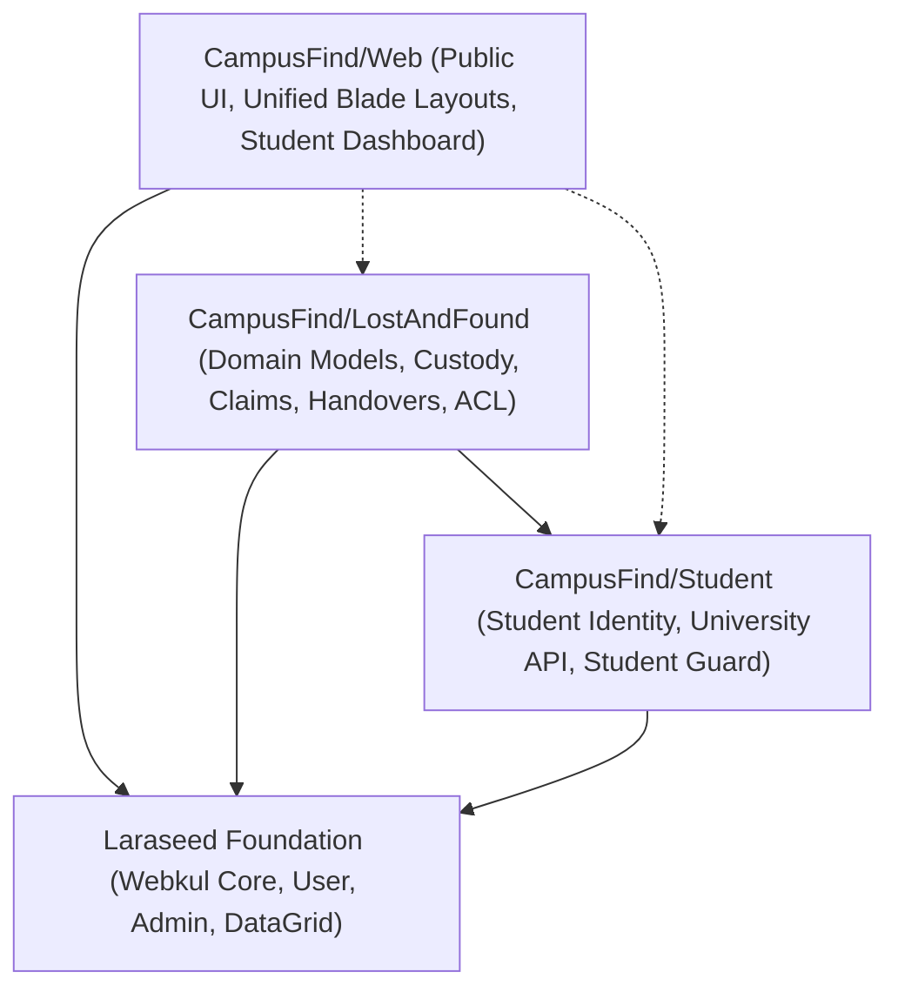

# 01. Current System Audit — CampusFind Lost & Found

## 1. Executive Architectural Summary

**CampusFind** is an enterprise-grade campus Lost & Found management platform built on the **Laraseed Modular Application Foundation** (Laravel 12 / PHP 8.3). The system utilizes a multi-package modular architecture managed via Composer path repositories and Laraseed Package Discovery.

This forensic audit evaluates the actual state of the codebase across four primary packages:
1. **Laraseed Foundation** (`packages/Webkul/Core`, `User`, `DataGrid`, `Admin`, `Installer`)
2. **CampusFind Student Package** (`packages/CampusFind/Student`)
3. **CampusFind LostAndFound Package** (`packages/CampusFind/LostAndFound`)
4. **CampusFind Web Package** (`packages/CampusFind/Web`)

---

## 2. Package Inventory and Dependency Topology



### Dependency Invariants Verified
1. **Reverse Dependency Law**: The `CampusFind/Student` package contains **0 references** to `CampusFind/LostAndFound`. It is completely self-contained and operates purely as an identity and student registry provider.
2. **Optional Package Decoupling**: The `CampusFind/Web` package safely checks for package presence at runtime via `app()->bound(...)` and `class_exists(...)`, preventing runtime fatals if an optional package is deactivated.
3. **Foundation Isolation**: Foundation packages (`packages/Webkul/*`) contain zero domain-specific references to Lost & Found or Student models.

---

## 3. Forensic Functionality Classification

Every feature in the current codebase is categorized into one of five rigorous operational states:

| Category | Definition | Codebase Coverage |
|---|---|---|
| **1. Implemented Functionality** | Fully written in source code, wired through routes/services, covered by passing automated tests. | Domain models, strict state machines, claim resolution, physical custody chain, immutable handover, image raster sanitization, student auth. |
| **2. Partially Implemented Functionality** | Backend service/schema exists but frontend is missing, or UI exists but only interacts with a subset of backend capabilities. | Public search/catalog (only indexes `FoundItem`, ignores `LostReport`), citizen drop-off reporting (creates draft items with system intake user), employee custody UI (API endpoints exist, full UI modals partial). |
| **3. Documented But Not Implemented** | Referenced in documentation or architectural specs but lacking code/migrations. | Automated matching engine, automatic email/SMS notification triggers on state transitions. |
| **4. Missing Functionality** | Required business capability absent from schema, controllers, and services. | Dual interaction workflow ("I Found This Item" response to lost reports), retention period auto-disposal worker, QR code physical item tagging. |
| **5. Proposed Functionality** | Forward-looking architectural extensions requiring project-owner approval. | Unified multi-criteria matching scoring algorithm, citizen-to-student direct contact brokering, decentralized custody desks. |

---

## 4. Comprehensive Audit of Implemented Functionality

### 4.1. Core Domain Models and Persistence
Located in [`packages/CampusFind/LostAndFound/src/Models/`](file:///home/hosam/Documents/compusfund/packages/CampusFind/LostAndFound/src/Models):

- **[`FoundItem`](file:///home/hosam/Documents/compusfund/packages/CampusFind/LostAndFound/src/Models/FoundItem.php#L12-L114)** (table `lost_found_items`):
  - Stores public reference, category, title, public description, found location, found date, status, current custodian ID, current storage location, and approved claim ID.
  - Generates immutable normalized reference keys via [`PublicReference`](file:///home/hosam/Documents/compusfund/packages/CampusFind/LostAndFound/src/Services/PublicReference.php).
- **[`FoundItemPrivateDetail`](file:///home/hosam/Documents/compusfund/packages/CampusFind/LostAndFound/src/Models/FoundItemPrivateDetail.php#L7-L34)** (table `lost_found_item_private_details`):
  - Stores encrypted fields (`identifying_details`, `serial_fragment`, `staff_notes`) isolated from public serialization via Eloquent `$hidden` and `'encrypted'` casts.
- **[`FoundItemImage`](file:///home/hosam/Documents/compusfund/packages/CampusFind/LostAndFound/src/Models/FoundItemImage.php#L11-L44)** (table `lost_found_item_images`):
  - Differentiates between `public_safe` images (stored in `public` disk) and `staff_only` images (stored in `lost_found_private` disk).
- **[`LostReport`](file:///home/hosam/Documents/compusfund/packages/CampusFind/LostAndFound/src/Models/LostReport.php#L11-L72)** (table `lost_found_reports`):
  - Stores student lost reports with encrypted `private_description`, linked category, and resolution pointer to `resolved_found_item_id`.
- **[`LostReportImage`](file:///home/hosam/Documents/compusfund/packages/CampusFind/LostAndFound/src/Models/LostReportImage.php#L8-L46)** (table `lost_found_report_images`):
  - Strictly append-only model. Throws `LogicException` on any update or delete attempt.
- **[`LostFoundClaim`](file:///home/hosam/Documents/compusfund/packages/CampusFind/LostAndFound/src/Models/LostFoundClaim.php#L10-L52)** (table `lost_found_claims`):
  - Manages student ownership claims for found items with unique composite constraint `[found_item_id, claimant_student_id]`.
- **[`ClaimEvidence`](file:///home/hosam/Documents/compusfund/packages/CampusFind/LostAndFound/src/Models/ClaimEvidence.php#L10-L86)** (table `lost_found_claim_evidence`):
  - Stores encrypted text values, encrypted file paths, SHA-256 hashed storage keys, and enforces strict append-only constraints.
- **[`ClaimReview`](file:///home/hosam/Documents/compusfund/packages/CampusFind/LostAndFound/src/Models/ClaimReview.php#L10-L57)** (table `lost_found_claim_reviews`):
  - Append-only audit trail recording every state transition, reviewer staff user ID, encrypted claimant messages, and encrypted staff notes.
- **[`CustodyRecord`](file:///home/hosam/Documents/compusfund/packages/CampusFind/LostAndFound/src/Models/CustodyRecord.php#L10-L73)** (table `lost_found_custody_records`):
  - Immutable chain-of-custody ledger recording all item movements, custodians, and encrypted storage locations.
- **[`Handover`](file:///home/hosam/Documents/compusfund/packages/CampusFind/LostAndFound/src/Models/Handover.php#L10-L67)** (table `lost_found_handovers`):
  - Immutable proof-of-handover record tying found item, approved claim, recipient student, verifying staff, and encrypted verification notes.

---

### 4.2. Business Logic and State Machines
Located in [`packages/CampusFind/LostAndFound/src/Services/`](file:///home/hosam/Documents/compusfund/packages/CampusFind/LostAndFound/src/Services):

1. **[`ItemStateService`](file:///home/hosam/Documents/compusfund/packages/CampusFind/LostAndFound/src/Services/ItemStateService.php#L8-L45)**:
   - Manages state transitions for found items (`draft` &rarr; `reported` | `in_custody`; `reported` &rarr; `in_custody`; `in_custody` &rarr; `returned` | `disposed`).
2. **[`ReportStateService`](file:///home/hosam/Documents/compusfund/packages/CampusFind/LostAndFound/src/Services/ReportStateService.php#L8-L42)**:
   - Manages transitions for lost reports (`draft` &rarr; `active` | `cancelled`; `active` &rarr; `resolved` | `cancelled`).
3. **[`ClaimStateService`](file:///home/hosam/Documents/compusfund/packages/CampusFind/LostAndFound/src/Services/ClaimStateService.php#L8-L51)**:
   - Enforces valid claim transitions (`submitted` &rarr; `under_review` | `withdrawn`; `under_review` &rarr; `needs_information` | `approved` | `rejected` | `withdrawn`; `needs_information` &rarr; `under_review` | `withdrawn`; `approved` &rarr; `rejected` [via revocation]).
4. **[`ClaimResolutionService`](file:///home/hosam/Documents/compusfund/packages/CampusFind/LostAndFound/src/Services/ClaimResolutionService.php#L15-L298)**:
   - Executes atomic claim approval with row-level pessimistic locking (`lockForUpdate`).
   - Automatically finds all competing active claims on the same found item and rejects them with review note `'ownership_awarded_to_competing_claim'`.
   - Supports atomic approval revocation if physical handover has not yet transpired.
5. **[`CustodyService`](file:///home/hosam/Documents/compusfund/packages/CampusFind/LostAndFound/src/Services/CustodyService.php#L17-L300)**:
   - Enforces strict dual-entry custody management: creates an immutable `CustodyRecord` and updates the item's live projection fields (`current_custodian_user_id`, `current_storage_location`, `custody_changed_at`).
   - Validates that projection values always match the latest historical custody record.
6. **[`HandoverService`](file:///home/hosam/Documents/compusfund/packages/CampusFind/LostAndFound/src/Services/HandoverService.php#L22-L237)**:
   - Enforces non-secret verification methods using [`SecurityInvariants::assertNoAuthSecrets`](file:///home/hosam/Documents/compusfund/packages/CampusFind/LostAndFound/src/Services/SecurityInvariants.php#L38-L49).
   - Atomically transitions item to `returned`, creates `Handover` record, records a terminal custody event, clears active custody projection, and auto-resolves any active `LostReport` belonging to the recipient student in the same category.
7. **[`LostFoundRasterSanitizer`](file:///home/hosam/Documents/compusfund/packages/CampusFind/LostAndFound/src/Services/LostFoundRasterSanitizer.php)**:
   - Protects against malicious image uploads by decoding images into raw memory and re-encoding them (stripping malicious EXIF headers, PHP polyglots, and embedded scripts).

---

## 5. Automated Test Suite Certification

The existing test suite passes with **100% green coverage** across all packages:
- **Full Test Suite**: 519 tests, 3,177 assertions.
- **LostAndFound Test Suite** (`vendor/bin/pest --testsuite=LostAndFound`): 288 tests, 1,589 assertions across 22 test files.
- **Student Test Suite** (`vendor/bin/pest --testsuite=Student`): 34 tests, 214 assertions.
- **Web Test Suite** (`CampusFind\Web\Tests\Feature\Web\WebPageTest`): 18 tests, 68 assertions.

---

## 6. Detailed Gap Summary

```text
┌──────────────────────────────────────────────────────────────────────────────────┐
│                             CURRENT SYSTEM AUDIT                                 │
├──────────────────────────────────────────────────────────────────────────────────┤
│ [✓] Domain Persistence & Encryption         [✓] Image Raster Sanitization        │
│ [✓] Claim Review, Approval & Competing Auto-Rejection                            │
│ [✓] Chain of Custody & Projection Integrity  [✓] Immutable Physical Handover     │
│ [✓] Student Auth (Local + University API)   [✓] Admin ACL & DataGrids            │
│ ──────────────────────────────────────────────────────────────────────────────── │
│ [!] Public Catalog shows ONLY Found Items (Lost Reports are NOT indexed)         │
│ [!] Missing "I Found This Item" citizen response workflow on Lost Reports        │
│ [!] Missing Automated / Assisted Matching Algorithm                              │
│ [!] Missing Event-Driven Notification System (Mail/Database/SMS)                 │
│ [!] Missing Automated Item Retention Expiration and Disposal Execution          │
│ [!] Missing Student Dashboard UI for Evidence Upload / Claim Appeals             │
└──────────────────────────────────────────────────────────────────────────────────┘
```
