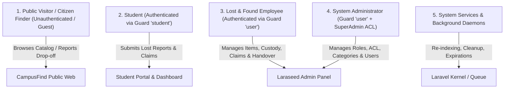

# 02. System Actors and Permissions — CampusFind Lost & Found

## 1. Verified System Actors

Based on physical inspection of `packages/CampusFind/LostAndFound`, `packages/CampusFind/Student`, `packages/Webkul/User`, and `packages/CampusFind/Web`, the actual system supports the following distinct actors:



---

## 2. Actor Specifications and Operational Capabilities

### 2.1. Public Visitor / Citizen (Guest)
- **Authentication**: None (`guest:student` and `guest:user`).
- **Identifier**: Anonymous web session.
- **Responsibilities**:
  - Discover lost or found items on campus.
  - Report found items dropped off at campus security desks or reception offices.
- **Permitted Operations**:
  - Browse public items catalog (`GET /items` via [`ItemController@index`](file:///home/hosam/Documents/compusfund/packages/CampusFind/Web/src/Web/Http/Controllers/ItemController.php#L15)).
  - View public-safe item details (`GET /items/{reference}` via [`ItemController@show`](file:///home/hosam/Documents/compusfund/packages/CampusFind/Web/src/Web/Http/Controllers/ItemController.php#L56)).
  - Submit citizen found-item notification (`POST /reports/found` via [`ReportController@storeFound`](file:///home/hosam/Documents/compusfund/packages/CampusFind/Web/src/Web/Http/Controllers/ReportController.php#L130)).
- **Accessible Data**:
  - Public reference code, public title, public category code, public description, found location, found date, and images marked with visibility `public_safe`.
- **Restricted Data**:
  - All private distinguishing details, encrypted serial fragments, staff internal notes, custody locations, claimant identities, student card numbers, and evidence images.
- **Operational Gaps**:
  - Public visitors currently cannot see `LostReport` records in `/items` (only `FoundItem` is returned by [`PublicLostAndFoundService`](file:///home/hosam/Documents/compusfund/packages/CampusFind/LostAndFound/src/Services/PublicLostAndFoundService.php)).
  - Public visitors cannot respond "I Found This Item" to a lost report.

---

### 2.2. Student
- **Authentication**: Authenticated via guard `'student'` (Model: [`CampusFind\Student\Models\Student`](file:///home/hosam/Documents/compusfund/packages/CampusFind/Student/src/Models/Student.php)).
- **Identity Verification**:
  - First login: Real-time verification against the University Student Information System API via [`UniversityStudentApiClient`](file:///home/hosam/Documents/compusfund/packages/CampusFind/Student/src/Services/UniversityStudentApiClient.php) (verifies University Card Number and Student Password).
  - Subsequent logins: Local bcrypt hash verification in `students` table.
- **Responsibilities**:
  - Report lost belongings with private ownership verification details.
  - Search campus inventory for matching found items.
  - Submit ownership claims with evidence (descriptions, receipts, photos).
  - Collect verified items in person.
- **Permitted Operations**:
  - View personal dashboard (`GET /account/dashboard` via [`AccountController@dashboard`](file:///home/hosam/Documents/compusfund/packages/CampusFind/Web/src/Web/Http/Controllers/AccountController.php#L17)).
  - Create lost item report (`POST /reports/lost` & `POST /student/lost-found/reports`).
  - Update own lost report while in `draft` status (`PUT /student/lost-found/reports/{id}`).
  - Upload private lost report images (`POST /student/lost-found/reports/{id}/images`).
  - Submit ownership claim on found item (`POST /items/{reference}/claim` & `POST /student/lost-found/claims`).
  - Upload private claim evidence images (`POST /student/lost-found/claims/{id}/images`).
  - Withdraw own ownership claim (`POST /student/lost-found/claims/{id}/withdraw`).
- **Ownership Enforcement**:
  - Enforced by [`LostAndFoundAuthorization::authorizeStudentOwnership`](file:///home/hosam/Documents/compusfund/packages/CampusFind/LostAndFound/src/Services/Application/LostAndFoundAuthorization.php#L32-L37) (verifies `(int) $actor->id === (int) $resource->student_id`).
- **Restricted Data**:
  - Other students' lost reports, other claimants' submitted evidence, internal staff review notes, precise warehouse storage shelf locations.

---

### 2.3. Lost & Found Employee (Staff)
- **Authentication**: Authenticated via guard `'user'` (Model: [`Webkul\User\Models\User`](file:///home/hosam/Documents/compusfund/packages/CampusFind/User/src/Models/User.php)).
- **Permissions**: Defined via Laraseed ACL keys in [`packages/CampusFind/LostAndFound/src/Config/acl.php`](file:///home/hosam/Documents/compusfund/packages/CampusFind/LostAndFound/src/Config/acl.php).
- **Responsibilities**:
  - Receive physical found items and register inventory records.
  - Record private distinguishing marks and serial fragments.
  - Maintain physical storage locations and perform custody transfers.
  - Review student ownership claims and inspect submitted evidence.
  - Request additional evidence (`needs_information`), approve valid claims, or reject fraudulent claims.
  - Conduct in-person identity verification and execute immutable handover.
- **Permitted Operations**:
  - View items & reports DataGrids (`admin.lost_found.items.index`, `admin.lost_found.reports.index`).
  - Register new found item (`admin.lost_found.items.store`).
  - Update found item & manage private details (`admin.lost_found.items.update`).
  - Upload public/staff images (`admin.lost_found.items.images.store`).
  - Manage custody: Receive into storage, transfer custodian, update shelf location (`admin.lost_found.custody.receive`, `transfer`, `move_storage`).
  - Review, approve, reject, or revoke claims (`admin.lost_found.claims.review`, `approve`, `reject`, `revoke`).
  - Inspect private claim evidence file stream (`admin.lost_found.claims.evidence.file`).
  - Complete physical handover (`admin.lost_found.handover.complete`).
- **Restricted Data**:
  - Cleartext claimant authentication secrets (enforced by [`SecurityInvariants::assertNoAuthSecrets`](file:///home/hosam/Documents/compusfund/packages/CampusFind/LostAndFound/src/Services/SecurityInvariants.php#L38)).

---

### 2.4. System Administrator
- **Authentication**: Guard `'user'` with `role->permission_type === 'all'`.
- **Responsibilities**:
  - Configure item categories (`lost_found_categories`).
  - Manage employee staff accounts and role assignments.
  - Oversee system-wide audit logs and custody integrity.
  - Manage university API integrations and filesystem disks.
- **Permitted Operations**:
  - Unrestricted access across all `admin.lost_found.*` routes and `admin.students.*` routes.
  - Create and edit item categories (`admin.lost_found.settings.categories.*`).

---

### 2.5. System Services & Background Daemons
- **Authentication**: CLI / Cron execution context.
- **Responsibilities**:
  - Purge orphaned temporary staging image files from `lost_found_private` disk.
  - Synchronize external university student data cache.
  - [Proposed] Scan for expired unclaimed items reaching retention limit.
  - [Proposed] Execute batch matching suggestions between lost reports and found items.

---

## 3. Comprehensive ACL Authorization Matrix

The actual permissions configured in [`packages/CampusFind/LostAndFound/src/Config/acl.php`](file:///home/hosam/Documents/compusfund/packages/CampusFind/LostAndFound/src/Config/acl.php) and [`packages/CampusFind/Student/src/Config/acl.php`](file:///home/hosam/Documents/compusfund/packages/CampusFind/Student/src/Config/acl.php):

| ACL Permission Key | Route Name(s) | Description | Authorized Roles |
|---|---|---|---|
| `lost_found` | `admin.lost_found.index` | Main navigation root | Employee, Supervisor, Admin |
| `lost_found.items` | `admin.lost_found.items.index` | Items menu header | Employee, Supervisor, Admin |
| `lost_found.items.view` | `admin.lost_found.items.index`, `reports.index` | View items and reports DataGrids | Employee, Supervisor, Admin |
| `lost_found.items.create` | `admin.lost_found.items.create`, `.store` | Register new found items | Intake Officer, Employee, Admin |
| `lost_found.items.edit` | `admin.lost_found.items.edit`, `.update`, `.approve`, `.images.store`, `reports.approve`, `reports.reject` | Edit items, upload images, approve citizen reports | Employee, Supervisor, Admin |
| `lost_found.claims` | `admin.lost_found.claims.index` | Claims menu header | Employee, Supervisor, Admin |
| `lost_found.claims.view` | `admin.lost_found.claims.index`, `items.claims.index`, `claims.show`, `claims.evidence.file` | View claims & download evidence files | Verification Officer, Employee, Admin |
| `lost_found.claims.review` | `admin.lost_found.claims.review`, `.update_review` | Transition claims to `under_review` or `needs_information` | Verification Officer, Employee, Admin |
| `lost_found.claims.approve` | `admin.lost_found.claims.approve`, `.revoke` | Approve ownership claim or revoke prior approval | Verification Officer, Supervisor, Admin |
| `lost_found.claims.reject` | `admin.lost_found.claims.reject` | Reject ownership claim | Verification Officer, Supervisor, Admin |
| `lost_found.custody` | `admin.lost_found.custody.index` | Custody menu header | Custodian, Supervisor, Admin |
| `lost_found.custody.manage` | `admin.lost_found.custody.receive`, `.transfer`, `.move_storage` | Receive into custody, transfer custodian, move shelf | Custodian, Warehouse Staff, Admin |
| `lost_found.handover` | `admin.lost_found.handover.index` | Handover menu header | Handover Officer, Admin |
| `lost_found.handover.complete` | `admin.lost_found.handover.complete` | Complete physical verification and item release | Handover Officer, Supervisor, Admin |
| `lost_found.settings` | `admin.lost_found.settings.index` | Settings root menu | Admin |
| `lost_found.settings.categories` | `admin.lost_found.settings.categories.*` | CRUD item categories | Admin |
| `students` | `admin.students.index`, `.search` | View student roster | Student Affairs, Admin |
| `students.create` | `admin.students.create`, `.store` | Create student record | Student Affairs, Admin |
| `students.edit` | `admin.students.edit`, `.update` | Update student profile | Student Affairs, Admin |
| `students.view` | `admin.students.view` | View student details | Student Affairs, Admin |
| `students.delete` | `admin.students.delete`, `.mass_delete` | Delete student records | Admin |

---

## 4. Data Access and Security Boundaries

```text
┌─────────────────────────────────────────────────────────────────────────────────────────────┐
│                                   DATA ACCESS MATRIX                                        │
├──────────────────────────┬──────────────┬──────────────┬──────────────┬─────────────────────┤
│ Entity / Data Field      │ Public Guest │ Student Owner│ L&F Employee │ System Admin        │
├──────────────────────────┼──────────────┼──────────────┼──────────────┼─────────────────────┤
│ Found Item Public Ref    │ READ         │ READ         │ READ         │ READ                │
│ Found Item Title/Desc    │ READ         │ READ         │ READ         │ READ / WRITE        │
│ Public-Safe Images       │ READ         │ READ         │ READ         │ READ / WRITE        │
│ Staff-Only Images        │ DENIED       │ DENIED       │ READ / WRITE │ READ / WRITE        │
│ Private Identifying Marks│ DENIED       │ DENIED       │ READ / WRITE │ READ / WRITE        │
│ Exact Warehouse Shelf    │ DENIED       │ DENIED       │ READ / WRITE │ READ / WRITE        │
│ Lost Report Title/Desc   │ [GAP: Hidden]│ READ / WRITE │ READ         │ READ / WRITE        │
│ Lost Report Private Note │ DENIED       │ READ / WRITE │ READ         │ READ / WRITE        │
│ Submitted Claim Evidence │ DENIED       │ READ (Own)   │ READ         │ READ                │
│ Claim Staff Review Notes │ DENIED       │ DENIED       │ READ / WRITE │ READ / WRITE        │
│ Handover Recipient Rec   │ DENIED       │ READ (Own)   │ READ / WRITE │ READ / WRITE        │
└──────────────────────────┴──────────────┴──────────────┴──────────────┴─────────────────────┘
```

---

## 5. Identified Authorization Gaps and Ambiguities

1. **Public Lost Report Invisibility**:
   - `PublicLostAndFoundService` does not provide public read access to `LostReport` records, preventing citizens or other students from finding out what items have been lost.
2. **Citizen Drop-off Intake Identity**:
   - When a citizen reports a found item via [`ReportController@storeFound`](file:///home/hosam/Documents/compusfund/packages/CampusFind/Web/src/Web/Http/Controllers/ReportController.php#L152-L164), the system looks up or creates a pseudo-user `"System Intake"`. This blurs employee audit accountability until an employee explicitly receives the item into institutional custody.
3. **Absence of Dual-Actor Interaction Permissions**:
   - No permission exists for a student/citizen to submit a response ("I Found This Item") to a lost report.
4. **Student Claim Evidence Management UI**:
   - While backend route `POST /student/lost-found/claims/{id}/evidence` is protected by `auth:student` and ownership checks, the student frontend dashboard does not expose a form to submit additional evidence when a claim enters `needs_information` status.
