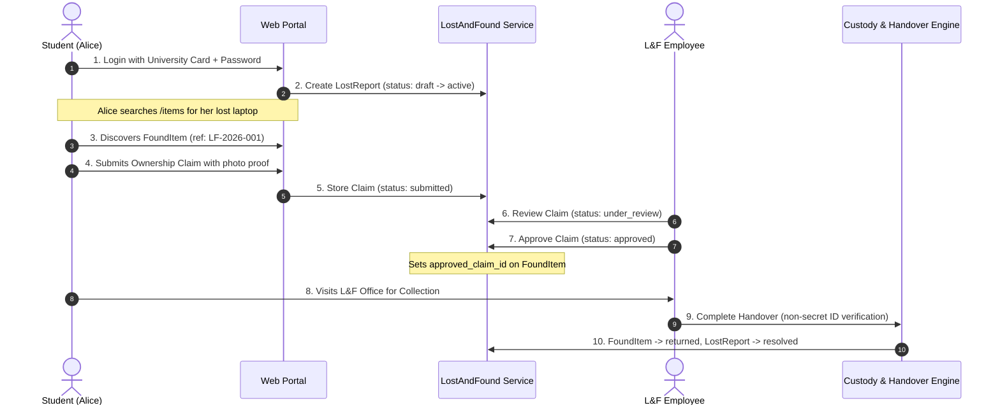
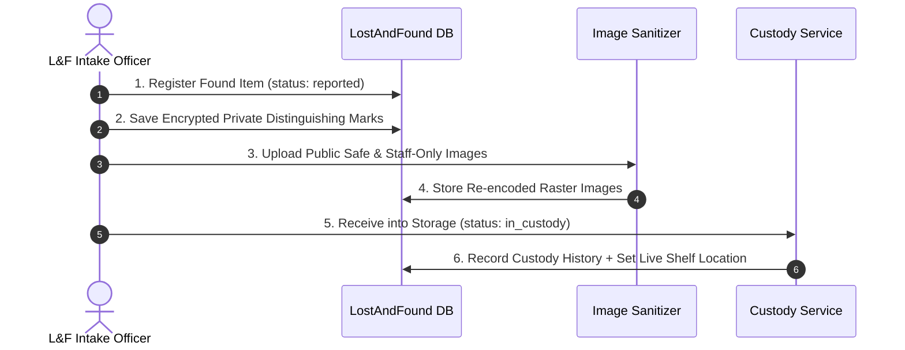
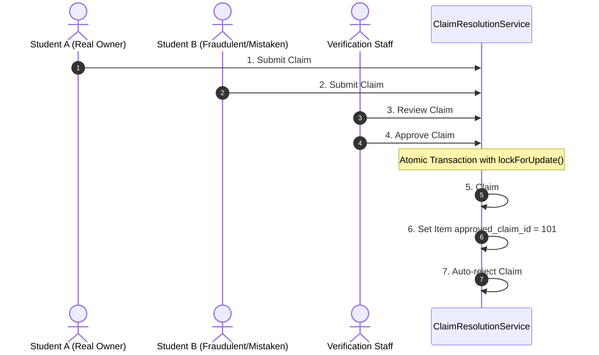
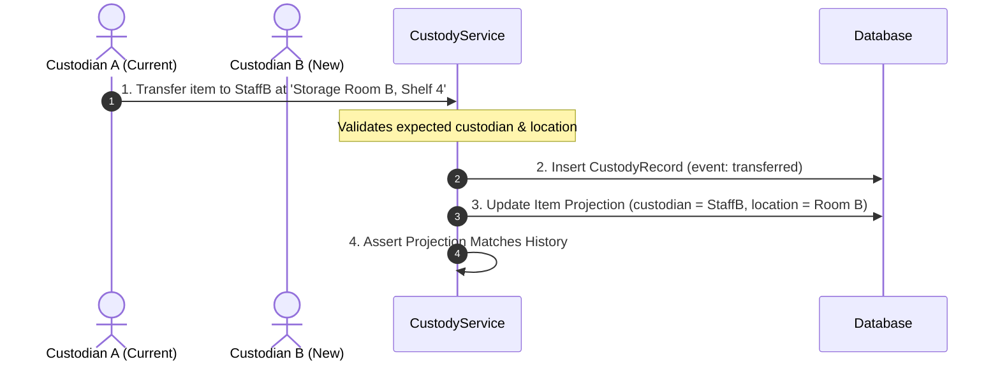

# 03. Complete Operational Scenarios — CampusFind Lost & Found

This document details complete operational walkthroughs for all core business scenarios.
Every scenario is analyzed across two distinct, unmerged perspectives:
- **CURRENT IMPLEMENTATION**: Demonstrably supported in the current codebase.
- **PROPOSED WORKFLOW**: Recommended enhancements to resolve identified gaps.

---

## Scenario A — Student Loses an Item (End-to-End Lifecycle)

### CURRENT IMPLEMENTATION
1. **Access & Authentication**: The student navigates to `/login` and provides University Card Number and password. Handled by [`LoginController@store`](file:///home/hosam/Documents/compusfund/packages/CampusFind/Web/src/Web/Http/Controllers/LoginController.php#L37). If local record exists, bcrypt attempt is executed; otherwise [`UniversityStudentApiClient`](file:///home/hosam/Documents/compusfund/packages/CampusFind/Student/src/Services/UniversityStudentApiClient.php) verifies credentials against university API and creates local student record.
2. **Lost Report Creation**: Student fills lost item report at `GET /reports/lost`. Handled by [`ReportController@storeLost`](file:///home/hosam/Documents/compusfund/packages/CampusFind/Web/src/Web/Http/Controllers/ReportController.php#L46), invoking [`StudentReportApplicationService@createLostReport`](file:///home/hosam/Documents/compusfund/packages/CampusFind/LostAndFound/src/Services/Application/StudentReportApplicationService.php#L22). Report is created in status `draft` (or auto-submitted) with public description and encrypted `private_description`. Optional image is processed via [`LostReportImageService`](file:///home/hosam/Documents/compusfund/packages/CampusFind/LostAndFound/src/Services/LostReportImageService.php).
3. **Browsing Catalog**: Student navigates to `GET /items`. Public search executed via [`PublicLostAndFoundService@searchPublicFoundItems`](file:///home/hosam/Documents/compusfund/packages/CampusFind/LostAndFound/src/Services/PublicLostAndFoundService.php#L56) displaying active found items with `public_safe` images.
4. **Claim Submission**: Student opens item detail `GET /items/{reference}` and submits claim statement + proof image via `POST /items/{reference}/claim` ([`ItemController@storeClaim`](file:///home/hosam/Documents/compusfund/packages/CampusFind/Web/src/Web/Http/Controllers/ItemController.php#L101)). Invokes [`StudentClaimApplicationService@submitClaim`](file:///home/hosam/Documents/compusfund/packages/CampusFind/LostAndFound/src/Services/Application/StudentClaimApplicationService.php#L28). Claim is stored in status `submitted`.
5. **Staff Review & Approval**: Employee accesses admin panel `GET /admin/lost-found/claims/{id}` ([`EmployeeClaimReadController@show`](file:///home/hosam/Documents/compusfund/packages/CampusFind/LostAndFound/src/Http/Controllers/Employee/EmployeeClaimReadController.php#L44)), inspects private evidence stream, and submits approval via `POST /admin/lost-found/claims/{id}/approve` ([`EmployeeClaimController@approve`](file:///home/hosam/Documents/compusfund/packages/CampusFind/LostAndFound/src/Http/Controllers/Employee/EmployeeClaimController.php#L43)). [`ClaimResolutionService@approve`](file:///home/hosam/Documents/compusfund/packages/CampusFind/LostAndFound/src/Services/ClaimResolutionService.php#L72) executes atomic update, sets `approved_claim_id` on item, and rejects competing claims.
6. **Physical Handover**: Student presents university card at the office. Staff submits `POST /admin/lost-found/items/{id}/handover` ([`EmployeeHandoverController@complete`](file:///home/hosam/Documents/compusfund/packages/CampusFind/LostAndFound/src/Http/Controllers/Employee/EmployeeHandoverController.php#L19)). [`HandoverService@complete`](file:///home/hosam/Documents/compusfund/packages/CampusFind/LostAndFound/src/Services/HandoverService.php#L24) verifies active staff, approved claim, non-secret verification note, sets status to `returned`, creates immutable `Handover` record, and automatically updates matching `LostReport` to `resolved`.

### PROPOSED WORKFLOW
- Include automated notification (email & in-app bell) to the student when staff approves their claim, including office opening hours, collection instructions, and required ID documents.
- Add QR code verification token to the student's dashboard to accelerate in-person handover scanning.

---

## Scenario B — Staff Receives a Found Item (Intake to Return)

### CURRENT IMPLEMENTATION
1. **Intake Registration**: Staff enters item title, category, found location, and found datetime via `POST /admin/lost-found/items` ([`EmployeeFoundItemController@store`](file:///home/hosam/Documents/compusfund/packages/CampusFind/LostAndFound/src/Http/Controllers/Employee/EmployeeFoundItemController.php#L23)). Private distinguishing details (`identifying_details`, `serial_fragment`, `staff_notes`) are encrypted and saved into `lost_found_item_private_details` via [`EmployeeItemApplicationService@createFoundItem`](file:///home/hosam/Documents/compusfund/packages/CampusFind/LostAndFound/src/Services/Application/EmployeeItemApplicationService.php#L24).
2. **Image Processing**: Staff uploads item photos via `POST /admin/lost-found/items/{id}/images`. [`FoundItemImageService@addImage`](file:///home/hosam/Documents/compusfund/packages/CampusFind/LostAndFound/src/Services/FoundItemImageService.php#L21) validates and re-encodes images via [`LostFoundRasterSanitizer`](file:///home/hosam/Documents/compusfund/packages/CampusFind/LostAndFound/src/Services/LostFoundRasterSanitizer.php). `public_safe` images are saved to `public` disk, while `staff_only` images are saved to `lost_found_private`.
3. **Custody Intake**: If storage location is provided, [`CustodyService@receive`](file:///home/hosam/Documents/compusfund/packages/CampusFind/LostAndFound/src/Services/CustodyService.php#L21) atomically transitions status to `in_custody`, writes the first `CustodyRecord` (event: `logged`), and updates the item projection (`current_custodian_user_id`, `current_storage_location`, `custody_started_at`).
4. **Public Exposure**: Item immediately becomes searchable on public catalog via [`PublicLostAndFoundService`](file:///home/hosam/Documents/compusfund/packages/CampusFind/LostAndFound/src/Services/PublicLostAndFoundService.php).

### PROPOSED WORKFLOW
- Print physical barcode / QR inventory label upon custody receipt to attach to the physical storage bin/bag.
- Trigger automatic matching scanner against active lost reports upon new item intake.

---

## Scenario C — Multiple Students Claim the Same Item (Competing Claims)

### CURRENT IMPLEMENTATION
1. Both Alice and Bob submit claims on `FoundItem #50`. Because the database enforces unique composite constraint `(found_item_id, claimant_student_id)`, each student can submit exactly one claim.
2. Staff reviews both claims in `GET /admin/lost-found/items/50/claims` ([`EmployeeClaimReadController@index`](file:///home/hosam/Documents/compusfund/packages/CampusFind/LostAndFound/src/Http/Controllers/Employee/EmployeeClaimReadController.php#L29)).
3. Alice provides an exact serial number match. Staff calls `POST /admin/lost-found/claims/101/approve`.
4. Inside [`ClaimResolutionService@approve`](file:///home/hosam/Documents/compusfund/packages/CampusFind/LostAndFound/src/Services/ClaimResolutionService.php#L79-L131):
   - Row-level lock acquired on item and all claims.
   - `lost_found_items.approved_claim_id` set to `101`.
   - Claim #101 transitioned to `approved`.
   - Competing claim #102 is iterated and automatically transitioned to `under_review` &rarr; `rejected` with note `'ownership_awarded_to_competing_claim'`.
5. If staff later discovers Claim #101 was fraudulent prior to handover, staff can call `POST /admin/lost-found/claims/101/revoke` ([`EmployeeClaimController@revoke`](file:///home/hosam/Documents/compusfund/packages/CampusFind/LostAndFound/src/Http/Controllers/Employee/EmployeeClaimController.php#L81)), clearing `approved_claim_id` and reopening the item for review of other claims.

### PROPOSED WORKFLOW
- Provide automated notification to Bob with polite rejection message explaining that ownership was verified for another party.
- Provide appeal mechanism allowing Bob to request supervisor review if evidence was misunderstood.

---

## Scenario D — Student Reports an Item That Has Not Been Found

### CURRENT IMPLEMENTATION
1. Student submits lost report via `/reports/lost` (status: `draft` / `active`).
2. The report is recorded in `lost_found_reports` with encrypted `private_description`.
3. Report is visible to the student in `/account/dashboard` and to staff in `GET /admin/lost-found/reports`.
4. **Current limitation**: The report does NOT appear in the public `/items` catalog, so other campus members cannot see it.
5. If the report remains unmatched, it stays in `active` status indefinitely until the student cancels it via [`StudentReportApplicationService@cancelOwnLostReport`](file:///home/hosam/Documents/compusfund/packages/CampusFind/LostAndFound/src/Services/Application/StudentReportApplicationService.php#L65).

### PROPOSED WORKFLOW
- Display active `LostReport` cards in the unified `/items` catalog with clear "LOST" badge.
- Allow public visitors to click "I Found This Item" to submit a found-item response.
- Execute background periodic matching against newly registered found items and notify the student if a similarity score exceeds threshold.

---

## Scenario E — Custody Transfer Between Staff or Storage Locations

### CURRENT IMPLEMENTATION
1. Staff executes transfer via `POST /admin/lost-found/items/{id}/custody/transfer` ([`EmployeeCustodyController@transfer`](file:///home/hosam/Documents/compusfund/packages/CampusFind/LostAndFound/src/Http/Controllers/Employee/EmployeeCustodyController.php#L45)).
2. [`CustodyService@transfer`](file:///home/hosam/Documents/compusfund/packages/CampusFind/LostAndFound/src/Services/CustodyService.php#L91-L116) verifies:
   - Item is in status `in_custody`.
   - Destination custodian user is active.
   - Stale source check: verifies `expected_custodian_user_id` and `expected_storage_location` match current state.
   - Appends append-only `CustodyRecord` (event: `transferred`).
   - Updates `lost_found_items` projection with optimistic locking check.
   - Calls `assertProjectionMatchesHistory` to guarantee data integrity.

### PROPOSED WORKFLOW
- Add custody transfer acceptance handshake (requiring Staff B to confirm receipt in the system).
- Add physical scan verification using storage bin barcode.

---

## Scenario F — Claim is Rejected or Requires Additional Evidence

### CURRENT IMPLEMENTATION
1. **Requesting Information**: Staff reviews claim and needs clarification. Staff calls `POST /admin/lost-found/claims/{id}/review` with status `needs_information` and review notes.
2. Inside [`ClaimResolutionService@review`](file:///home/hosam/Documents/compusfund/packages/CampusFind/LostAndFound/src/Services/ClaimResolutionService.php#L19-L70), claim transitions `under_review` &rarr; `needs_information`.
3. An append-only `ClaimReview` audit record is created with encrypted staff notes and claimant message.
4. **Adding Evidence**: Student can upload additional evidence via `POST /student/lost-found/claims/{id}/evidence` or `POST /student/lost-found/claims/{id}/images`.
5. **Rejection**: If claim is fraudulent, staff calls `POST /admin/lost-found/claims/{id}/reject`. Claim transitions to terminal status `rejected`.

### PROPOSED WORKFLOW
- In-app notification and email to student when claim enters `needs_information`.
- Interactive evidence upload card rendered on student dashboard when a claim is marked `needs_information`.

---

## Scenario G — Item Remains Unclaimed (Retention & Disposal Policy)

### CURRENT IMPLEMENTATION
1. Schema and state machine support terminal status `ItemStatus::DISPOSED` in [`ItemStateService`](file:///home/hosam/Documents/compusfund/packages/CampusFind/LostAndFound/src/Services/ItemStateService.php#L20).
2. **Current gap**: No automated scheduled worker or UI exists to flag items exceeding retention period (e.g. 90 days) or transition them to `disposed`.

### PROPOSED WORKFLOW
- Implement `lost-found:check-retention` scheduled artisan command running daily.
- For items in custody > 90 days with no approved claims, flag for supervisor disposal review (charity donation, university auction, or safe electronic recycling).
- Record final disposal audit record in `CustodyRecord` (event: `disposed`).

---

## Scenario H — Operational and Transactional Failure Handling

### CURRENT IMPLEMENTATION
1. **Image Staging Compensation**: If database transaction fails during image upload, [`ClaimEvidenceImageService`](file:///home/hosam/Documents/compusfund/packages/CampusFind/LostAndFound/src/Services/ClaimEvidenceImageService.php#L122-L130) and [`FoundItemImageService`](file:///home/hosam/Documents/compusfund/packages/CampusFind/LostAndFound/src/Services/FoundItemImageService.php#L124-L132) execute automatic catch-and-compensation blocks, deleting staged files from disk to prevent storage leaks.
2. **Double-Handover Prevention**: Database unique constraint on `lost_found_handovers.found_item_id` and `lost_found_handovers.claim_id` physically prevents duplicate handovers even under concurrent race conditions.
3. **Pessimistic Locking**: All state changes lock rows using `lockForUpdate()`, eliminating lost updates.
4. **Immutable Models**: `ClaimEvidence`, `ClaimReview`, `CustodyRecord`, and `Handover` models throw `LogicException` on update/delete, guaranteeing immutable persistence.

### PROPOSED WORKFLOW
- Centralized dead-letter queue logging for failed image cleanups.
- Automated system health check endpoint for private storage disk writability.
