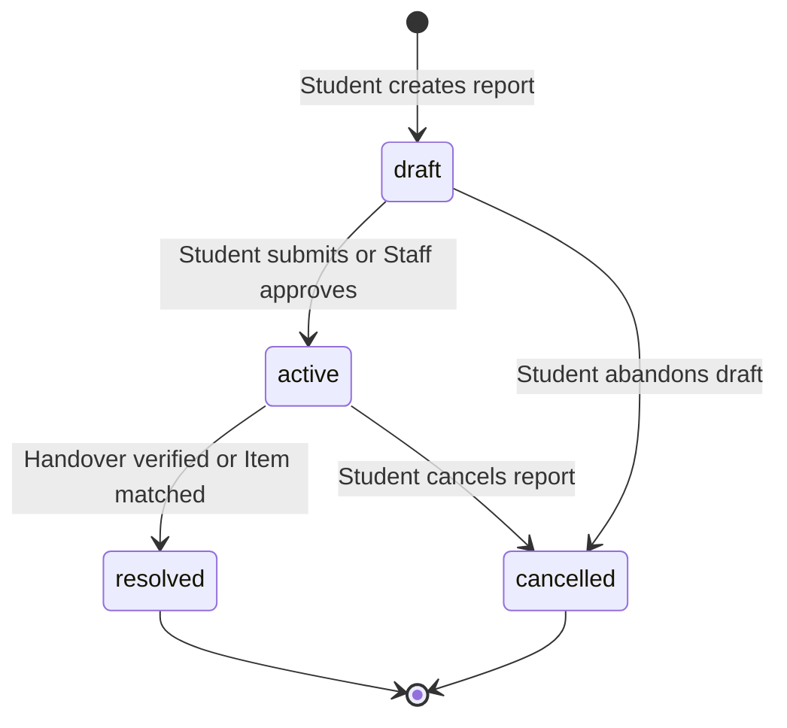
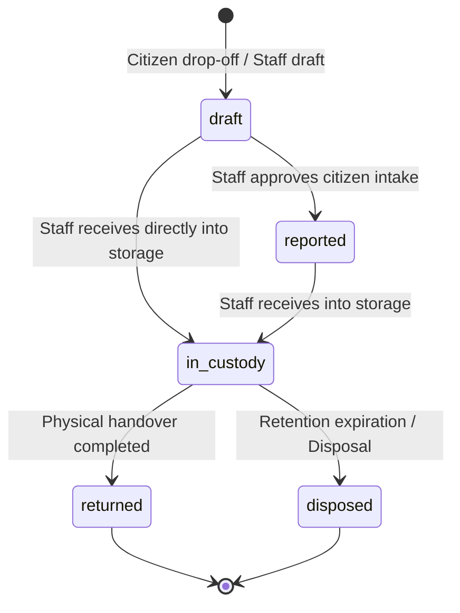
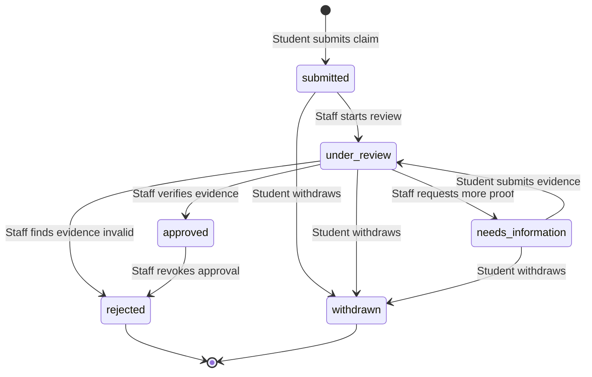
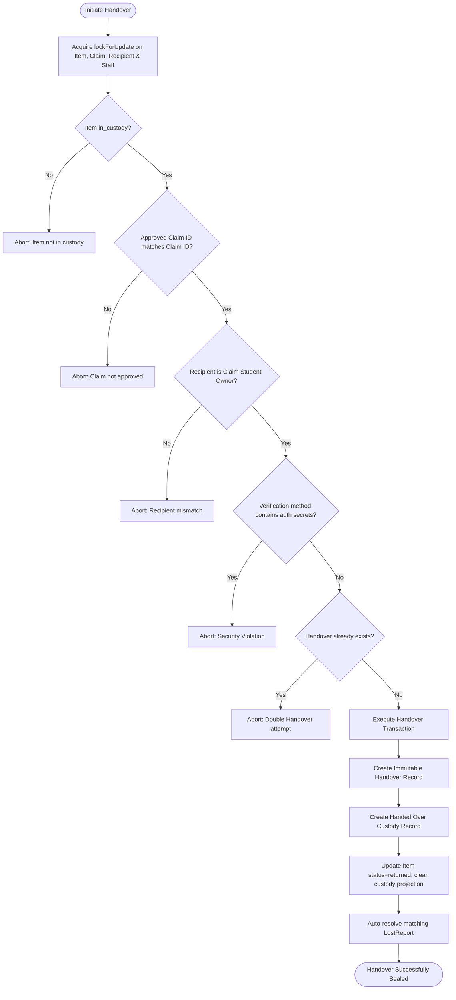

# 04. State Machines and Business Rules — CampusFind Lost & Found

This document provides the formal extraction and specification of all domain state machines in `packages/CampusFind/LostAndFound`.

---

## 1. Lost Report State Machine (`LostReport`)

Governed by [`CampusFind\LostAndFound\Services\ReportStateService`](file:///home/hosam/Documents/compusfund/packages/CampusFind/LostAndFound/src/Services/ReportStateService.php) and [`CampusFind\LostAndFound\Enums\ReportStatus`](file:///home/hosam/Documents/compusfund/packages/CampusFind/LostAndFound/src/Enums/ReportStatus.php).



### Transition Specifications

| Initial State | Target State | Authorized Actor | Preconditions | Database Changes | Side Effects & Audit |
|---|---|---|---|---|---|
| `[*] (None)` | `draft` | Student / Staff | Valid category & title | Insert `lost_found_reports` (`status='draft'`) | Generate unique public reference code |
| `draft` | `active` | Student Owner / Staff | Required fields complete | Update `status='active'`, `submitted_at=now()` | Report becomes eligible for search & matching |
| `draft` | `cancelled` | Student Owner | Report belongs to student | Update `status='cancelled'`, `closed_at=now()` | Draft dismissed |
| `active` | `resolved` | System / Staff | Verified handover to student | Update `status='resolved'`, `resolved_found_item_id={item_id}`, `closed_at=now()` | Auto-triggered upon completed Handover |
| `active` | `cancelled` | Student Owner | Student indicates item recovered | Update `status='cancelled'`, `closed_at=now()` | Report removed from active matching |

---

## 2. Found Item State Machine (`FoundItem`)

Governed by [`CampusFind\LostAndFound\Services\ItemStateService`](file:///home/hosam/Documents/compusfund/packages/CampusFind/LostAndFound/src/Services/ItemStateService.php) and [`CampusFind\LostAndFound\Enums\ItemStatus`](file:///home/hosam/Documents/compusfund/packages/CampusFind/LostAndFound/src/Enums/ItemStatus.php).



### Transition Specifications

| Initial State | Target State | Authorized Actor | Preconditions | Database Changes | Side Effects & Audit |
|---|---|---|---|---|---|
| `[*] (None)` | `draft` | Citizen / Staff | Valid drop-off or intake data | Insert `lost_found_items` (`status='draft'`) | Public visibility hidden until approved |
| `draft` | `reported` | Staff (`lost_found.items.edit`) | Staff verifies intake record | Update `status='reported'`, `reported_at=now()` | Item becomes visible on public search |
| `draft` | `in_custody` | Staff (`lost_found.custody.manage`)| Valid storage location provided | Update `status='in_custody'`, set custody projection | Inserts `CustodyRecord` (event: `logged`) |
| `reported` | `in_custody` | Staff (`lost_found.custody.manage`)| Item exists, valid storage shelf | Update `status='in_custody'`, set custody projection | Inserts `CustodyRecord` (event: `logged`) |
| `in_custody` | `returned` | Staff (`lost_found.handover.complete`)| Approved claim exists, ID verified | Update `status='returned'`, clear custody projection | Inserts `Handover` & `CustodyRecord` (`handed_over`) |
| `in_custody` | `disposed` | Supervisor / Admin | Retention period elapsed (>90 days)| Update `status='disposed'`, clear custody projection | Inserts `CustodyRecord` (`disposed`) |

---

## 3. Ownership Claim State Machine (`LostFoundClaim`)

Governed by [`CampusFind\LostAndFound\Services\ClaimStateService`](file:///home/hosam/Documents/compusfund/packages/CampusFind/LostAndFound/src/Services/ClaimStateService.php) and [`CampusFind\LostAndFound\Enums\ClaimStatus`](file:///home/hosam/Documents/compusfund/packages/CampusFind/LostAndFound/src/Enums/ClaimStatus.php).



### Transition Specifications

| Initial State | Target State | Authorized Actor | Preconditions | Database Changes | Side Effects & Audit |
|---|---|---|---|---|---|
| `[*] (None)` | `submitted` | Student Claimant | Item in `reported`/`in_custody`, no existing claim by student | Insert `lost_found_claims` (`status='submitted'`) | Unique constraint `(item_id, student_id)` checked |
| `submitted` | `under_review` | Staff (`lost_found.claims.review`) | Claim assigned for review | Update `status='under_review'` | Appends `ClaimReview` record |
| `submitted` | `withdrawn` | Student Claimant | Claim belongs to student | Update `status='withdrawn'`, `withdrawn_at=now()` | Closes claim |
| `under_review` | `needs_information`| Staff (`lost_found.claims.review`) | Staff provides question/notes | Update `status='needs_information'` | Appends `ClaimReview` record |
| `needs_information`| `under_review` | Student Claimant | Student uploads additional evidence | Update `status='under_review'` | Appends `ClaimEvidence` record |
| `under_review` | `approved` | Staff (`lost_found.claims.approve`)| Item has no other approved claim | Update `status='approved'`, set `items.approved_claim_id` | **Auto-rejects all competing claims** |
| `under_review` | `rejected` | Staff (`lost_found.claims.reject`) | Evidence insufficient / fraudulent | Update `status='rejected'` | Appends `ClaimReview` with staff notes |
| `approved` | `rejected` | Staff (`lost_found.claims.approve`)| Handover not yet completed | Update `status='rejected'`, clear `items.approved_claim_id` | Approval revoked; item reopened |

---

## 4. Chain of Custody Event Model (`CustodyRecord`)

Governed by [`CampusFind\LostAndFound\Services\CustodyService`](file:///home/hosam/Documents/compusfund/packages/CampusFind/LostAndFound/src/Services/CustodyService.php) and [`CampusFind\LostAndFound\Enums\CustodyEventType`](file:///home/hosam/Documents/compusfund/packages/CampusFind/LostAndFound/src/Enums/CustodyEventType.php).


### Dual-Entry Projection Invariant
For any `FoundItem` in status `in_custody`, the projection columns on `lost_found_items` must mathematically mirror the most recent `lost_found_custody_records` row:
```text
lost_found_items.current_custodian_user_id == latest(custody_records).to_custodian_user_id
lost_found_items.current_storage_location  == latest(custody_records).to_storage_location
lost_found_items.custody_changed_at        == latest(custody_records).occurred_at
```
Enforced by [`CustodyService::assertProjectionMatchesHistory()`](file:///home/hosam/Documents/compusfund/packages/CampusFind/LostAndFound/src/Services/CustodyService.php#L265-L281). Any divergence aborts the transaction with `DomainException`.

---

## 5. Physical Handover Security Invariants

Governed by [`CampusFind\LostAndFound\Services\HandoverService`](file:///home/hosam/Documents/compusfund/packages/CampusFind/LostAndFound/src/Services/HandoverService.php) and [`CampusFind\LostAndFound\Services\SecurityInvariants`](file:///home/hosam/Documents/compusfund/packages/CampusFind/LostAndFound/src/Services/SecurityInvariants.php).


