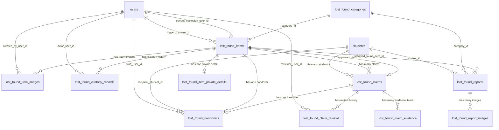

# 05. Data Flow and Database Relationships — CampusFind Lost & Found

## 1. Complete Entity-Relationship (ER) Architecture

The diagram below represents the exact relational schema implemented across all migrations in `packages/CampusFind/LostAndFound/src/Database/Migrations/`:

---

## 2. Table-by-Table Schema Analysis

### 2.1. `lost_found_categories`
- **Migration**: `2026_09_27_000000_create_lost_found_categories_table.php`
- **Model**: [`CampusFind\LostAndFound\Models\LostFoundCategory`](file:///home/hosam/Documents/compusfund/packages/CampusFind/LostAndFound/src/Models/LostFoundCategory.php)
- **Primary Key**: `id` (BigIncrements)
- **Columns**:
  - `code` (VARCHAR(64), UNIQUE): Machine name (e.g. `'electronics'`, `'documents'`, `'wallets'`).
  - `is_active` (BOOLEAN, default: `true`): Toggles visibility in dropdowns and search filters.
  - `sort_order` (INTEGER, default: `0`): UI ordering weight.
  - `timestamps` (`created_at`, `updated_at`).
- **Indexes**: Composite index on `['is_active', 'sort_order']`.

---

### 2.2. `lost_found_items`
- **Migration**: `2026_09_27_000001`, `...0007`, `...0009`
- **Model**: [`CampusFind\LostAndFound\Models\FoundItem`](file:///home/hosam/Documents/compusfund/packages/CampusFind/LostAndFound/src/Models/FoundItem.php)
- **Primary Key**: `id` (BigIncrements)
- **Columns**:
  - `public_reference` (VARCHAR(64)): Human-readable code (e.g. `LF-2026-0A1B2C`).
  - `public_reference_key` (VARCHAR(64), UNIQUE): Normalized uppercase search key.
  - `category_id` (UnsignedBigInteger, FK &rarr; `lost_found_categories.id`, `restrictOnDelete`).
  - `logged_by_user_id` (UnsignedInteger, FK &rarr; `users.id`, `restrictOnDelete`).
  - `status` (VARCHAR(32), default: `'draft'`): Cast to `ItemStatus` enum.
  - `title` (VARCHAR(160)): Public title.
  - `public_description` (TEXT, nullable): Public-safe description.
  - `found_location` (VARCHAR(255), nullable): Public location found.
  - `found_at` (DATETIME, nullable): Datetime item was found.
  - `reported_at` (DATETIME, nullable): Datetime item was approved/logged.
  - `approved_claim_id` (UnsignedBigInteger, nullable, UNIQUE, FK &rarr; `lost_found_claims.id`, `restrictOnDelete`).
  - `current_custodian_user_id` (UnsignedInteger, nullable, FK &rarr; `users.id`, `restrictOnDelete`).
  - `current_storage_location` (VARCHAR(255), nullable): Live storage room/bin.
  - `custody_started_at` (DATETIME, nullable): Initial custody receipt timestamp.
  - `custody_changed_at` (DATETIME, nullable): Most recent custody event timestamp.
  - `timestamps`.
- **Indexes**:
  - `['status', 'category_id', 'found_at']`
  - `['status', 'found_at']`
  - `logged_by_user_id`
  - `current_custodian_user_id`
- **Integrity**: Deletion of categories or users with linked items is restricted by DB foreign keys.

---

### 2.3. `lost_found_item_private_details`
- **Migration**: `2026_09_27_000002_create_lost_found_item_private_details_table.php`
- **Model**: [`CampusFind\LostAndFound\Models\FoundItemPrivateDetail`](file:///home/hosam/Documents/compusfund/packages/CampusFind/LostAndFound/src/Models/FoundItemPrivateDetail.php)
- **Primary Key**: `id`
- **Foreign Key**: `found_item_id` (UnsignedBigInteger, UNIQUE, FK &rarr; `lost_found_items.id`, `cascadeOnDelete`).
- **Encrypted Columns**:
  - `identifying_details` (TEXT, encrypted): Secret identifying marks not visible to public.
  - `serial_fragment` (TEXT, encrypted): Partial serial numbers used for verification.
  - `staff_notes` (TEXT, encrypted): Internal intake notes.
- **Security Invariant**: Never included in JSON responses; cast as `'encrypted'` in Eloquent.

---

### 2.4. `lost_found_item_images`
- **Migration**: `2026_09_27_000012_create_lost_found_item_images_table.php`
- **Model**: [`CampusFind\LostAndFound\Models\FoundItemImage`](file:///home/hosam/Documents/compusfund/packages/CampusFind/LostAndFound/src/Models/FoundItemImage.php)
- **Columns**:
  - `found_item_id` (UnsignedBigInteger, FK &rarr; `lost_found_items.id`, `restrictOnDelete`).
  - `created_by_user_id` (UnsignedInteger, FK &rarr; `users.id`, `restrictOnDelete`).
  - `visibility` (VARCHAR(32)): Cast to `FoundItemImageVisibility` (`public_safe` | `staff_only`).
  - `storage_key` (VARCHAR(255), UNIQUE): Relative storage path on disk.
  - `mime_type` (VARCHAR(64)): `image/jpeg`, `image/png`, or `image/webp`.
  - `byte_size` (UnsignedBigInteger): Sanitized file size in bytes.
  - `sort_order` (UnsignedInteger, default: 0).
  - `timestamps`.

---

### 2.5. `lost_found_reports`
- **Migration**: `2026_09_27_000003_create_lost_found_reports_table.php`
- **Model**: [`CampusFind\LostAndFound\Models\LostReport`](file:///home/hosam/Documents/compusfund/packages/CampusFind/LostAndFound/src/Models/LostReport.php)
- **Columns**:
  - `public_reference` (VARCHAR(64)) & `public_reference_key` (VARCHAR(64), UNIQUE).
  - `student_id` (UnsignedBigInteger, FK &rarr; `students.id`, `restrictOnDelete`).
  - `category_id` (UnsignedBigInteger, nullable, FK &rarr; `lost_found_categories.id`, `restrictOnDelete`).
  - `resolved_found_item_id` (UnsignedBigInteger, nullable, FK &rarr; `lost_found_items.id`, `restrictOnDelete`).
  - `status` (VARCHAR(32), default: `'draft'`): Cast to `ReportStatus`.
  - `title` (VARCHAR(160)): Item name reported lost.
  - `public_description` (TEXT, nullable): Public description.
  - `private_description` (TEXT, nullable, **encrypted**): Student's secret proof details.
  - `lost_location` (VARCHAR(255), nullable).
  - `lost_at` (DATETIME, nullable).
  - `submitted_at` (DATETIME, nullable).
  - `closed_at` (DATETIME, nullable).
  - `timestamps`.

---

### 2.6. `lost_found_report_images`
- **Migration**: `2026_09_27_000013_create_lost_found_report_images_table.php`
- **Model**: [`CampusFind\LostAndFound\Models\LostReportImage`](file:///home/hosam/Documents/compusfund/packages/CampusFind/LostAndFound/src/Models/LostReportImage.php)
- **Immutability Enforcement**: `updating` and `deleting` model boot events throw `LogicException`.
- **Columns**: `lost_report_id` (FK &rarr; `lost_found_reports.id`), `storage_key` (UNIQUE), `mime_type`, `byte_size`, `sort_order`, `timestamps`.

---

### 2.7. `lost_found_claims`
- **Migration**: `2026_09_27_000004_create_lost_found_claims_table.php`
- **Model**: [`CampusFind\LostAndFound\Models\LostFoundClaim`](file:///home/hosam/Documents/compusfund/packages/CampusFind/LostAndFound/src/Models/LostFoundClaim.php)
- **Columns**:
  - `found_item_id` (UnsignedBigInteger, FK &rarr; `lost_found_items.id`, `restrictOnDelete`).
  - `claimant_student_id` (UnsignedBigInteger, FK &rarr; `students.id`, `restrictOnDelete`).
  - `status` (VARCHAR(32), default: `'submitted'`): Cast to `ClaimStatus`.
  - `submitted_at` (DATETIME).
  - `withdrawn_at` (DATETIME, nullable).
  - `timestamps`.
- **Unique Constraint**: `['found_item_id', 'claimant_student_id']` ensures a student cannot spam duplicate claims on the same item.

---

### 2.8. `lost_found_claim_evidence`
- **Migration**: `2026_09_27_000005`, `...00011`
- **Model**: [`CampusFind\LostAndFound\Models\ClaimEvidence`](file:///home/hosam/Documents/compusfund/packages/CampusFind/LostAndFound/src/Models/ClaimEvidence.php)
- **Immutability**: Append-only (update/delete blocked).
- **Encrypted Columns**: `text_value`, `file_path`, `original_name`.
- **Hashed Column**: `storage_key_hash` (CHAR(64), UNIQUE) holds SHA-256 hash of private file path for safe database indexing without exposing raw paths.

---

### 2.9. `lost_found_claim_reviews`
- **Migration**: `2026_09_27_000006_create_lost_found_claim_reviews_table.php`
- **Model**: [`CampusFind\LostAndFound\Models\ClaimReview`](file:///home/hosam/Documents/compusfund/packages/CampusFind/LostAndFound/src/Models/ClaimReview.php)
- **Immutability**: Append-only audit trail.
- **Encrypted Columns**: `claimant_message`, `staff_notes`.
- **Columns**: `claim_id` (FK), `reviewer_user_id` (FK &rarr; `users.id`), `from_status`, `to_status`, `reviewed_at`, `timestamps`.

---

### 2.10. `lost_found_custody_records`
- **Migration**: `2026_09_27_000008`, `...00010`
- **Model**: [`CampusFind\LostAndFound\Models\CustodyRecord`](file:///home/hosam/Documents/compusfund/packages/CampusFind/LostAndFound/src/Models/CustodyRecord.php)
- **Immutability**: Append-only ledger.
- **Encrypted Columns**: `from_storage_location`, `to_storage_location`, `notes`.
- **Columns**: `found_item_id` (FK), `event_type` (`logged` | `storage_location_changed` | `transferred` | `handed_over`), `actor_user_id` (FK), `from_custodian_user_id` (FK, nullable), `to_custodian_user_id` (FK, nullable), `occurred_at`, `timestamps`.

---

### 2.11. `lost_found_handovers`
- **Migration**: `2026_09_27_000010_create_lost_found_handovers_table.php`
- **Model**: [`CampusFind\LostAndFound\Models\Handover`](file:///home/hosam/Documents/compusfund/packages/CampusFind/LostAndFound/src/Models/Handover.php)
- **Immutability**: Sealed permanent legal receipt (update/delete blocked).
- **Unique Constraints**: `found_item_id` (UNIQUE) and `claim_id` (UNIQUE) physically prevent double-handover.
- **Encrypted Columns**: `verification_method`, `verification_note`.
- **Columns**: `found_item_id` (FK), `claim_id` (FK), `recipient_student_id` (FK &rarr; `students.id`), `staff_user_id` (FK &rarr; `users.id`), `handed_over_at`, `timestamps`.

---

## 3. Data Flow Diagram (DFD)

```mermaid
graph TD
    subgraph PublicFlow["Public / Citizen Layer"]
        PublicSearch["Search Items (GET /items)"]
        CitizenReport["Report Drop-off (POST /reports/found)"]
    end

    subgraph StudentFlow["Student Layer"]
        StudentAuth["Verify SIS / Password"]
        StudentLostReport["Submit Lost Report (POST /reports/lost)"]
        StudentClaim["Submit Claim + Proof (POST /items/{ref}/claim)"]
    end

    subgraph StaffFlow["Staff & Custody Layer"]
        ItemIntake["Register Found Item"]
        CustodyMgmt["Receive / Move / Transfer Custody"]
        ClaimReviewProc["Review / Approve Claim"]
        HandoverProc["Verify Recipient & Complete Handover"]
    end

    subgraph StorageEngines["Persistence & Storage Engine"]
        MySQL_Public["lost_found_items / lost_found_categories (Public Data)"]
        MySQL_Encrypted["private_details / claim_evidence / handovers (AES-256-CBC)"]
        Disk_Public["Public Disk (public_safe images)"]
        Disk_Private["lost_found_private Disk (evidence & report images)"]
    end

    PublicSearch -->|Read Only| MySQL_Public
    PublicSearch -->|Read Only| Disk_Public
    CitizenReport -->|Draft Item| MySQL_Public

    StudentAuth -->|Student Record| MySQL_Encrypted
    StudentLostReport --> MySQL_Public
    StudentLostReport --> MySQL_Encrypted
    StudentLostReport --> Disk_Private
    StudentClaim --> MySQL_Encrypted
    StudentClaim --> Disk_Private

    ItemIntake --> MySQL_Public
    ItemIntake --> MySQL_Encrypted
    ItemIntake --> Disk_Public
    ItemIntake --> Disk_Private
    CustodyMgmt --> MySQL_Public
    CustodyMgmt --> MySQL_Encrypted
    ClaimReviewProc --> MySQL_Encrypted
    HandoverProc --> MySQL_Public
    HandoverProc --> MySQL_Encrypted
```

