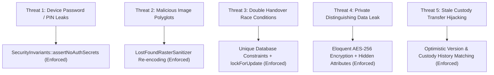

# 07. Security and Operational Integrity Audit — CampusFind

## 1. Security Architecture and Threat Model

CampusFind handles sensitive student identity data, ownership verification material, and physical custody of high-value personal assets (laptops, phones, wallets, IDs). This audit analyzes the implemented safeguards and identifies residual operational risks.

---

## 2. Forensic Analysis of Implemented Defenses

### 2.1. Authentication Secrets Leakage Prevention
- **Threat**: Students or staff accidentally entering device unlock PINs, passwords, screen patterns, or OTPs into public description or verification fields.
- **Evidence**: [`CampusFind\LostAndFound\Services\SecurityInvariants::assertNoAuthSecrets`](file:///home/hosam/Documents/compusfund/packages/CampusFind/LostAndFound/src/Services/SecurityInvariants.php#L38-L49).
- **Implementation**: Inspects all verification method strings, claim evidence names, and handover notes against forbidden multilingual keywords:
  - English: `password`, `passcode`, `pin`, `unlock pattern`, `device unlock code`, `authentication token`, `security answer`, `otp`, `recovery code`, `secret key`.
  - Arabic: `كلمة المرور`, `كلمة السر`, `الرقم السري`, `رمز التحقق`, `نمط القفل`, `رمز الامان`, etc.
- **Enforcement**: Throws `InvalidArgumentException` before transaction execution.

---

### 2.2. Secure Image Uploads & Anti-Polyglot Defense
- **Threat**: Uploading executable PHP scripts masked as JPEG/PNG images, or embedding malicious payloads in EXIF metadata.
- **Evidence**: [`CampusFind\LostAndFound\Services\LostFoundRasterSanitizer`](file:///home/hosam/Documents/compusfund/packages/CampusFind/LostAndFound/src/Services/LostFoundRasterSanitizer.php).
- **Implementation**:
  1. Validates MIME type and extension agreement (`image/jpeg`, `image/png`, `image/webp`).
  2. Enforces maximum byte size, dimension bounds (max 4096px), and total pixel bounds (max 12,000,000 pixels) to prevent Image Decompression Bombs.
  3. Uses GD/Imagick to decode the image into a raw in-memory pixel raster, completely stripping all original headers, comments, EXIF tags, and malicious polyglot code.
  4. Re-encodes the image from raw pixels into clean bytes prior to persisting.

---

### 2.3. Storage Isolation (Public vs Private Disks)
- **Threat**: Direct URL guessing or web server indexing of confidential proof documents (student IDs, purchase receipts, police reports).
- **Evidence**: [`packages/CampusFind/LostAndFound/src/Config/filesystems.php`](file:///home/hosam/Documents/compusfund/packages/CampusFind/LostAndFound/src/Config/filesystems.php#L4-L9).
- **Implementation**:
  - `public_safe` item photos are saved on the `public` disk (`storage/app/public/...`) for CDN and browser caching.
  - Claim evidence, report images, and staff-only photos are saved exclusively on the `lost_found_private` disk (`storage/app/lost-found-private/...`), located **outside** the web server document root.
  - Access to private evidence is strictly routed through [`EmployeeClaimReadController@evidenceFile`](file:///home/hosam/Documents/compusfund/packages/CampusFind/LostAndFound/src/Http/Controllers/Employee/EmployeeClaimReadController.php#L104-L130), enforcing `lost_found.claims.view` ACL checks.

---

### 2.4. Double-Handover & Concurrency Defense
- **Threat**: Concurrent race condition where two staff members hand over the same physical item to different claimants simultaneously.
- **Evidence**:
  - Database schema: `lost_found_handovers.found_item_id` has a **UNIQUE constraint** ([`create_lost_found_handovers_table.php`](file:///home/hosam/Documents/compusfund/packages/CampusFind/LostAndFound/src/Database/Migrations/2026_09_27_000010_create_lost_found_handovers_table.php#L19)).
  - Service logic: [`HandoverService@complete`](file:///home/hosam/Documents/compusfund/packages/CampusFind/LostAndFound/src/Services/HandoverService.php#L52-L191) runs inside `DB::transaction`, acquires `lockForUpdate()` on the item, claim, student, and staff records, and verifies that `Handover::where('found_item_id', $id)->exists()` is false.

---

### 2.5. Stale Custody Transfer Protection
- **Threat**: Staff member transferring an item based on outdated screen data when the item was already moved to another custodian or warehouse shelf.
- **Evidence**: [`CustodyService@changeCurrentCustody`](file:///home/hosam/Documents/compusfund/packages/CampusFind/LostAndFound/src/Services/CustodyService.php#L150-L229).
- **Implementation**:
  - Requires `expectedCustodianUserId` and `expectedStorageLocation`.
  - Compares against live database state under lock.
  - Aborts with `DomainException('The expected custody source is stale.')` if mismatched.
  - Optimistic locking WHERE clause requires exact `custody_changed_at` timestamp match.

---

## 3. Residual Operational Risks and Recommendations

| Risk # | Description | Operational Impact | Recommended Resolution |
|---|---|---|---|
| **R-01** | Student Claim Evidence Re-submission Gap | Student cannot supply missing evidence after initial submission without contacting staff manually. | Add interactive evidence upload modal on student dashboard for claims in `needs_information` status. |
| **R-02** | Unclaimed Item Retention Drift | Found items may accumulate in storage indefinitely if no automated disposal trigger runs. | Implement scheduled daily artisan command `lost-found:check-retention` to flag items > 90 days for disposal. |
| **R-03** | Lack of Multi-Factor Handover PIN | In-person handover relies entirely on physical ID visual inspection without a cryptographic OTP. | Generate one-time 6-digit claim collection token in student portal to be verified by staff during handover. |
| **R-04** | Missing Rate Limiting on Lost Report Submissions | Malicious student could submit high volume of automated lost reports. | Add `throttle:10,1` middleware to `student.lost_found.reports.store` route. |
| **R-05** | Lack of Real-Time Staff Notifications | Staff must periodically refresh DataGrids to notice new claim submissions. | Implement Laravel Notifications with database queue listeners to broadcast real-time badges to L&F staff. |
