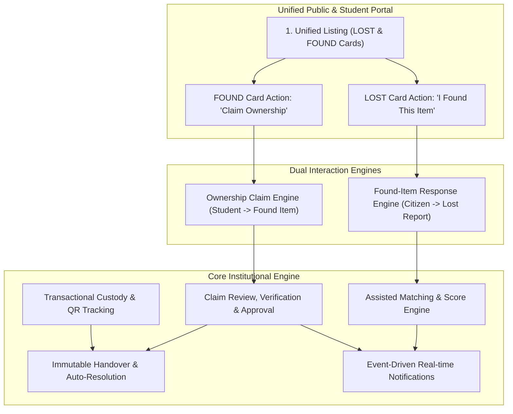
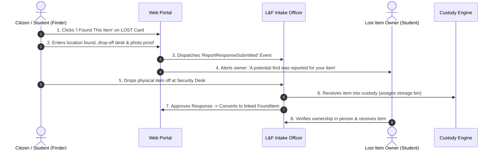
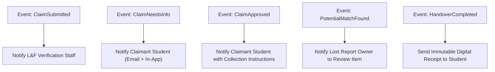

# 09. Proposed Complete Target Workflow — CampusFind Lost & Found

## 1. Architectural Vision and Guiding Principles

The proposed complete workflow unifies lost and found operations into a cohesive, secure, and transparent campus ecosystem.

---

## 2. End-to-End Operational Walkthroughs

### 2.1. Unified Browsing and Discovery
1. **Public Inventory Access**: Visitors and students open `/items`. The page renders a responsive grid showing both **LOST** reports and **FOUND** items side-by-side.
2. **Filter Controls**:
   - Filter Tabs: `[ All Items (45) | Lost Items (18) | Found Items (27) ]`.
   - Category Dropdown (Electronics, Bags, Wallets, IDs, Keys, Books, Other).
   - Location & Date Proximity Filter.
   - Text Search input matching title, public description, and reference numbers.
3. **Context-Aware Card Actions**:
   - If Card Type is **LOST**: Primary action button displays **"I Found This Item"** (`/reports/lost/{reference}/found`).
   - If Card Type is **FOUND**: Primary action button displays **"Claim Ownership"** (`/items/{reference}/claim`).

---

### 2.2. Dual Interaction Path A: "I Found This Item" (Found-Item Response)

1. **Submission**: A campus visitor sees a LOST report for a student's missing backpack. The visitor clicks **"I Found This Item"**.
2. **Intake Data**: The finder submits:
   - Location where found.
   - Physical drop-off location chosen (e.g. Main Security Gate, Student Affairs Desk).
   - Optional photo of the found item.
   - Finder contact details (kept strictly confidential from the owner).
3. **Safety & Notification**:
   - The lost item owner receives a notification: *"Good news! A student/staff member reported finding an item matching your lost report. Please monitor your dashboard for verification updates."*
   - The response record enters `under_review` status.
4. **Physical Intake**: The physical item arrives at the campus Lost & Found desk. Staff registers physical receipt, links it to the response, and places the item in a verified storage bin.
5. **Resolution**: Once verified, the owner is invited to collect the item. Handover is executed, resolving both the lost report and the response record.

---

### 2.3. Dual Interaction Path B: "Claim Ownership" (Found Item Claim)
1. **Discovery & Claim**: A student discovers a FOUND report for their lost calculator. The student clicks **"Claim Ownership"**.
2. **Evidence Submission**: Student provides:
   - Detailed statement describing unique non-public features (scratches, stickers, contents).
   - Purchase receipt, invoice, or original box serial number photo.
3. **Staff Evaluation & Competing Claims**:
   - Staff reviews evidence in the admin console.
   - If incomplete, staff requests information (`needs_information`), triggering an instant notification to the student.
   - If verified, staff clicks **"Approve Claim"**. The system acquires a pessimistic lock, sets `approved_claim_id`, and automatically rejects competing claims.
4. **Collection & Handover**:
   - Student arrives at the office with university ID.
   - Staff completes physical handover via `POST /admin/lost-found/items/{id}/handover`.
   - The item status becomes `returned`, custody is closed, and matching lost reports are marked `resolved`.

---

## 3. Event-Driven Architecture and Notification Flow

---

## 4. Key Target State Invariants

1. **No Direct Citizen-to-Student Sensitive Data Exposure**: Citizen finders never receive the private phone number or student ID of the report owner. All physical interactions occur through supervised university custody desks.
2. **No Auto-Closure without Handover**: Neither a lost report nor a found item may be marked `resolved` or `returned` until physical identity verification and immutable handover records are created.
3. **Audit Trail Completeness**: Every state transition, storage relocation, claim evaluation note, and evidence download must be immutably recorded in append-only database tables.
