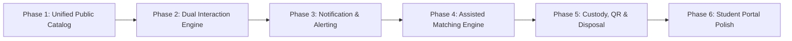

# 10. Phased Implementation Roadmap — CampusFind Lost & Found

## 1. Architectural Strategy and Phasing

To deliver the missing capabilities without risking regression in existing passing test suites (519 tests, 100% green), implementation must follow strict modular boundaries respecting Laraseed Foundation and package isolation principles.

---

## 2. Detailed Phase Specifications

### Phase 1: Unified Public Catalog & Search Integration
- **Objective**: Display both active **LOST** reports and **FOUND** items in the public listing with type filtering.
- **Existing Foundation**: [`PublicLostAndFoundService`](file:///home/hosam/Documents/compusfund/packages/CampusFind/LostAndFound/src/Services/PublicLostAndFoundService.php), `PublicFoundItemData` DTO, `items/index.blade.php`.
- **Backend Changes**:
  - Extend [`PublicLostAndFoundReadContract`](file:///home/hosam/Documents/compusfund/packages/CampusFind/LostAndFound/src/Contracts/PublicLostAndFoundReadContract.php) to support `searchUnifiedItems(PublicUnifiedSearchCriteria $criteria): PublicUnifiedSearchResult`.
  - Introduce `PublicReportTypeEnum` (`ALL`, `LOST`, `FOUND`).
  - Create `PublicUnifiedItemData` DTO normalizing attributes (`type`, `reference`, `title`, `category`, `location`, `occurred_at`, `imageUrl`, `status`).
- **Frontend Changes**:
  - Update `items/index.blade.php` to render filter tabs (`All`, `Lost`, `Found`) and contextual card action buttons.
- **Required Tests**: Feature tests verifying mixed search results, category filtering across both models, and SQL injection safety.
- **Acceptance Criteria**: Visiting `/items` shows active lost reports and active found items with proper badges and search behavior.

---

### Phase 2: Dual Interaction Workflow ("I Found This Item" Response)
- **Objective**: Allow users/students to submit "I Found This Item" responses directly against published lost reports.
- **Database Implications**:
  - Migration: `create_lost_found_report_responses_table` (`id`, `report_id`, `responder_student_id`, `status`, `found_location`, `dropoff_location`, `notes`, `image_storage_key`, `submitted_at`, `timestamps`).
- **Backend Changes**:
  - Model: `ReportResponse` with `belongsTo(LostReport)`.
  - Service: `ReportResponseApplicationService` with methods `submitResponse`, `reviewResponse`, `acceptResponse`.
  - Controller: `StudentReportResponseController` (`POST /reports/lost/{reference}/found`).
- **Frontend Changes**:
  - New Blade view: `reports/response.blade.php` ("I Found This Item" form).
- **Required Tests**: Unit and feature tests for response validation, image sanitization, status transitions, and student ownership checks.
- **Acceptance Criteria**: Clicking "I Found This Item" on a lost report opens a form that safely persists the response and alerts staff.

---

### Phase 3: Notification System & Real-Time Alerts
- **Objective**: Deliver real-time notifications for critical workflow events.
- **Backend Changes**:
  - Create Laravel Notification classes in `CampusFind\LostAndFound\Notifications`:
    - `ClaimSubmittedStaffNotification`
    - `ClaimReviewedStudentNotification`
    - `PotentialMatchFoundNotification`
    - `ReportResponseReceivedNotification`
    - `HandoverCompleteReceiptNotification`
  - Register event listeners attached to `ClaimResolutionService`, `HandoverService`, and `ReportResponseService`.
- **Frontend Changes**:
  - In-app notification bell icon in navigation bar with unread count badge and mark-as-read dropdown.
- **Acceptance Criteria**: State changes immediately dispatch queued database notifications and email alerts to recipient students/staff.

---

### Phase 4: Assisted Matching & Report Linking Engine
- **Objective**: Provide automated suggestions linking lost reports to found items.
- **Backend Changes**:
  - Service: `CampusFind\LostAndFound\Services\Matching\ItemMatchingEngine` calculating composite similarity score (0–100%):
    - Category Weight: 40%
    - Date Proximity Weight: 20%
    - Location Proximity Weight: 20%
    - Title/Description Token Overlap: 20%
  - Migration: `create_lost_found_matches_table` (`id`, `report_id`, `found_item_id`, `score`, `status`, `timestamps`).
- **Admin UI Changes**:
  - "Potential Matches" card rendered on `admin/lost-found/items/{id}` and `admin/lost-found/reports/{id}`.
  - One-click "Link Items" and "Notify Student" buttons.
- **Acceptance Criteria**: Newly registered found items automatically display relevant lost reports with confidence scores.

---

### Phase 5: Custody Enhancements (QR/Barcode, Storage Audits & Disposal)
- **Objective**: Digitize physical custody with QR codes and automate retention expiration.
- **Backend Changes**:
  - Service: `InventoryTagService` generating printable SVG/PDF QR labels.
  - Artisan Command: `php artisan lost-found:process-retention` flagging items > 90 days.
  - Service: `DisposalManagementService` handling status transitions to `ItemStatus::DISPOSED`.
- **Admin UI Changes**:
  - Printable label action on item detail page.
  - Disposal authorization batch console for supervisors.
- **Acceptance Criteria**: Staff can print physical QR inventory labels and execute policy-compliant item disposals.

---

### Phase 6: Student Portal Enhancements & Self-Service Polish
- **Objective**: Provide complete self-service tools for students.
- **Frontend Changes**:
  - Add "Submit More Evidence" modal on `account/dashboard` when claim is in `needs_information`.
  - Add "Withdraw Claim" and "Cancel Lost Report" action buttons with confirmation modals.
  - Add detailed timeline accordion showing review audit history and staff advice.
- **Acceptance Criteria**: Student can manage their entire lost & found activity directly from their dashboard without manual phone calls or emails.

---

## 3. Implementation Risk Management

| Phase | Technical Risk | Mitigation |
|---|---|---|
| Phase 1 | Large dataset query performance on unified search | Add composite indexes on `(status, category_id, created_at)` on both tables. |
| Phase 2 | Spam/trolling via "I Found This Item" form | Enforce CAPTCHA / rate-limiting (`throttle:15,1`) and restrict sensitive data display. |
| Phase 3 | Mail server downtime blocking requests | Use asynchronous Laravel Queues (`sync` fallback in local dev, `database` in production). |
| Phase 4 | False positive match notifications annoying students | Set high confidence threshold ($>60\%$) before triggering automated notifications. |
| Phase 5 | Accidental disposal of items under active claim review | Enforce invariant: `disposed` transition strictly prohibited if any non-terminal claim exists. |
