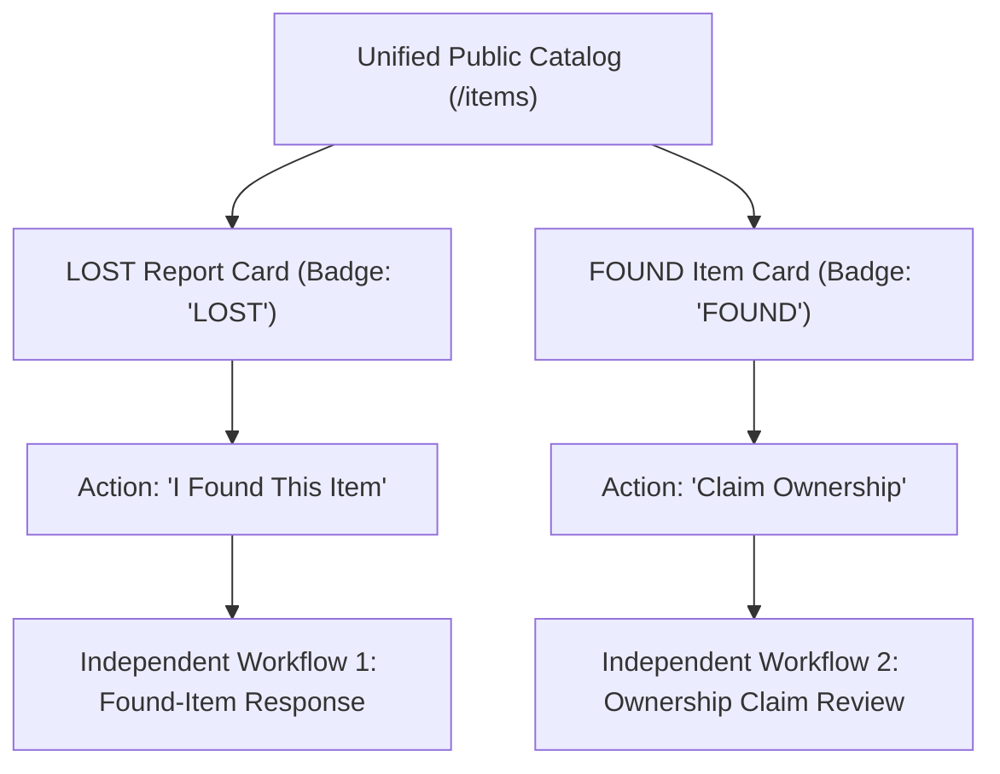
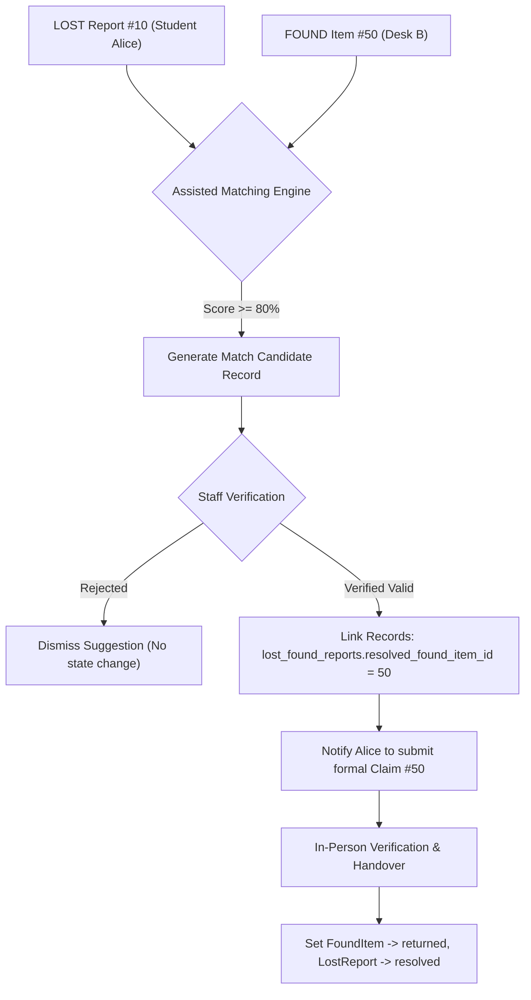

# 11. Unified Reports and Dual Interaction Workflows — CampusFind

## 1. Unified Reporting & Browsing Architecture

CampusFind's operational model centers on a **Unified Public-Facing Portal** where campus members can discover and interact with all campus lost and found reports.

### Key Unified Catalog Specifications
1. **Side-by-Side Presentation**: Visitors see both report types in the same browsing interface, sorted chronologically by default.
2. **Distinctive Visual Hierarchy**:
   - **LOST Reports**: Rose/Amber accent badges, clear "LOST" status pill, subtitle indicating date and location lost. Primary CTA: **"I Found This Item"**.
   - **FOUND Items**: Emerald/Mint accent badges, clear "FOUND" status pill, subtitle indicating date and location found. Primary CTA: **"Claim Ownership"**.
3. **Multi-Faceted Filtering**:
   - Filter Tabs: `All Reports`, `Lost Reports`, `Found Reports`.
   - Category Filter: Electronics, Wallets, IDs/Cards, Keys, Bags, Books, Clothing, Other.
   - Date range selector & Location search.
4. **Information Safeguards**:
   - Only public-safe attributes (title, public description, general location, date) are rendered.
   - Private identifying details, serial fragments, and owner personal phone numbers/IDs are strictly excluded from public templates.

---

## 2. Two Independent Business Processes

The platform strictly avoids conflating found-item responses and ownership claims into a single generic operation. They represent two logically and legally separate workflows:

| Attribute | Process 1: Found-Item Response | Process 2: Ownership Claim |
|---|---|---|
| **Target Entity** | `LostReport` (Reported by a student who lost something) | `FoundItem` (Registered by staff or citizen drop-off) |
| **Actor** | Finder (Citizen / Student who found an item) | Claimant (Student claiming ownership of a found item) |
| **Core Intent** | "I have found an item matching your lost report" | "This found item belongs to me; please return it" |
| **Submitted Material** | Where found, drop-off location, optional photo | Ownership evidence, receipts, non-public details |
| **Review Authority** | Intake Desk & Lost Report Owner | L&F Verification Officer / Custodian |
| **Result of Approval** | Item received into custody & matched to report | Item ownership awarded to claimant |
| **Handover Role** | Handed IN to university custody | Handed OUT to verified student owner |

---

## 3. Report-to-Report Matching and Linking Rules

When a student publishes a **LOST report** and another party independently registers a **FOUND item**, the system supports safe linking according to the following invariants:

### Linking Invariants
1. **No Automatic Merge or Premature Closure**: A potential match suggestion **never** automatically closes either report.
2. **Explicit Verification Prerequisite**: A `LostReport` is only marked `resolved` when the physical item is handed over to the verified owner.
3. **Competing Links**: If multiple lost reports match a single found item, staff must review each claim independently under row-level lock.

---

## 4. Mandatory Operational Scenarios (Walkthroughs 1 to 7)

---

### Scenario 1: Student loses item, publishes LOST report, another student responds "I Found This Item"

- **Actors**: Student Alice (Lost Owner), Student Bob (Finder), Staff Officer (L&F Desk).
- **Preconditions**: Alice is authenticated and publishes a LOST report for her calculator.
- **User Actions**:
  1. Bob sees Alice's LOST report on the public catalog `/items`.
  2. Bob clicks **"I Found This Item"**.
  3. Bob selects "Library Front Desk" as the drop-off location, writes a note, uploads a photo of the calculator, and submits.
- **System Actions & DB Operations**:
  1. Creates `lost_found_report_responses` record (`report_id = Alice's report`, `status = 'submitted'`, `dropoff_location = 'Library Desk'`).
  2. Dispatches `ReportResponseReceivedNotification` to Alice: *"A student reported finding your item at Library Front Desk. Staff is verifying custody."*
- **Verification & Handover**:
  1. Bob hands the physical calculator to the Library Desk staff.
  2. Staff receives item into custody via `CustodyService@receive`, creating `FoundItem` linked to the response.
  3. Alice visits the desk, verifies calculator serial number, and signs handover.
- **Final Resolution**:
  - `FoundItem` becomes `returned`.
  - Alice's `LostReport` becomes `resolved`.
  - Response record becomes `completed`.

---

### Scenario 2: Employee registers FOUND item, and its owner submits Ownership Claim

- **Actors**: Staff Intake Officer, Student Alice (Owner).
- **Preconditions**: Staff registers found Apple AirPods via admin console (`POST /admin/lost-found/items`), receives into storage shelf `Box 14`.
- **User Actions**:
  1. Alice browses `/items`, locates the AirPods listing (`LF-2026-089`).
  2. Alice clicks **"Claim Ownership"**.
  3. Alice submits claim statement describing unique engraving on the case and uploads original purchase invoice.
- **System Actions & DB Operations**:
  1. Inserts `lost_found_claims` (`status = 'submitted'`).
  2. Inserts `lost_found_claim_evidence` (encrypted invoice file).
- **Verification & Handover**:
  1. Verification staff reviews claim in `admin/lost-found/claims/{id}`.
  2. Staff approves claim (`POST .../approve`), setting `approved_claim_id` on item.
  3. Alice visits office; staff verifies university card and engraving.
  4. Staff completes handover (`POST .../handover`).
- **Final Resolution**:
  - Item status &rarr; `returned`. Handover record sealed.

---

### Scenario 3: Two users independently submit "I Found This Item" responses to the same LOST report

- **Actors**: Student Alice (Owner), Finder Bob, Finder Charlie, Staff Officer.
- **Preconditions**: Alice has an active LOST report for a black wallet.
- **User Actions**:
  1. Bob finds a black wallet in Cafeteria, clicks "I Found This Item" & drops it at Security Gate 1.
  2. Charlie finds a different black wallet in Library, clicks "I Found This Item" & drops it at Library Desk.
- **System Actions & DB Operations**:
  1. Two separate `lost_found_report_responses` records created under Alice's `LostReport`.
  2. Alice receives notifications for both intake reports.
- **Verification & Handover**:
  1. Staff at Gate 1 inspects Bob's drop-off: no student ID inside.
  2. Staff at Library Desk inspects Charlie's drop-off: Alice's student ID is inside.
  3. Staff accepts Charlie's response (`status = 'accepted'`) and rejects Bob's response (`status = 'rejected'` as non-matching).
  4. Alice collects wallet from Library Desk.
- **Final Resolution**:
  - Alice's lost report is resolved with Charlie's found item.
  - Bob's found item remains in custody as a separate unclaimed `FoundItem` for its real owner.

---

### Scenario 4: Multiple users claim ownership of the same FOUND item

- **Actors**: Student Alice (True Owner), Student Dave (Mistaken/Fraudulent), Verification Staff.
- **Preconditions**: Found laptop (`LF-2026-441`) in custody.
- **User Actions**:
  1. Alice submits Claim #201 with exact device serial number.
  2. Dave submits Claim #202 claiming it is his laptop.
- **System Actions & DB Operations**:
  1. Database holds two active claims for item #441.
- **Verification & Resolution**:
  1. Staff compares evidence in `admin/lost-found/claims`.
  2. Staff approves Alice's Claim #201.
  3. [`ClaimResolutionService@approve`](file:///home/hosam/Documents/compusfund/packages/CampusFind/LostAndFound/src/Services/ClaimResolutionService.php#L72) executes atomic transaction:
     - Claim #201 &rarr; `approved`.
     - Item #441 `approved_claim_id` &rarr; `201`.
     - Dave's Claim #202 &rarr; automatically transitioned to `under_review` &rarr; `rejected` with note `'ownership_awarded_to_competing_claim'`.
- **Final Resolution**:
  - Handover executed to Alice only. Dave's claim is closed and non-appealable without supervisor review.

---

### Scenario 5: LOST report and FOUND report describe same physical item and are linked following verification

- **Actors**: Student Alice (Lost Owner), Staff Member (Found Registrar).
- **Preconditions**:
  - Alice created `LostReport #12` for lost DSLR Camera on Monday.
  - Staff created `FoundItem #88` for DSLR Camera found on Tuesday.
- **Actions & System Flow**:
  1. Matching Engine flags 92% similarity between Report #12 and Item #88.
  2. Staff inspects both records in admin console and clicks "Suggest Match".
  3. Alice receives alert: *"A matching DSLR camera was registered by staff. Please review and submit your ownership claim."*
  4. Alice clicks link, reviews details, and clicks "Claim Ownership".
  5. Alice's claim is approved and item is handed over.
- **Final Resolution**:
  - [`HandoverService@complete`](file:///home/hosam/Documents/compusfund/packages/CampusFind/LostAndFound/src/Services/HandoverService.php#L162-L175) detects matching `LostReport #12` for recipient Alice and category `electronics`, setting `status = 'resolved'` and `resolved_found_item_id = 88`.

---

### Scenario 6: User submits incorrect found-item response or rejected ownership claim

- **Actors**: Student Dave (Claimant), Verification Staff.
- **Preconditions**: Found Rolex watch in custody. Dave submits fraudulent ownership claim.
- **Actions & System Flow**:
  1. Dave submits generic statement without proof.
  2. Staff reviews claim and requests receipt: `needs_information`.
  3. Dave fails to provide receipt within 7 days.
  4. Staff clicks "Reject Claim" (`POST .../claims/{id}/reject`).
- **Database & State Changes**:
  1. Claim transitions to terminal status `rejected`.
  2. `lost_found_items.approved_claim_id` remains `NULL`.
  3. Item remains in `in_custody` status, fully available for valid claims by other students.

---

### Scenario 7: Active claim exists, but verification or physical handover is not yet complete

- **Actors**: Student Alice (Approved Claimant), Staff Officer.
- **Preconditions**: Alice's Claim #301 was approved yesterday, but Alice has not yet visited the office to collect the item.
- **Invariants Enforced**:
  1. Item status remains strictly `in_custody` (NOT `returned`).
  2. Item cannot be handed over to any other claimant.
  3. Item cannot be disposed of by retention jobs while `approved_claim_id` is populated.
  4. Lost report remains `active` until the physical collection timestamp is recorded.
- **Final Resolution**:
  - When Alice arrives and presents physical ID, staff executes `completeHandover()`. Only then does the item transition to `returned` and the custody projection clears.
