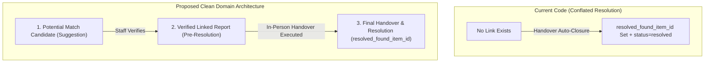

# 02. Report Linking and Resolution Audit — Investigation of `resolved_found_item_id`

## 1. Finding Overview

| Attribute | Details |
|---|---|
| **Finding Identifier** | `FINDING-LF-03` |
| **Audit Focus** | Audit 02 — Report Linking and Resolution Architecture |
| **Verification Status** | **VERIFIED ARCHITECTURAL DEFECT** |
| **Severity** | **HIGH** |
| **Target Implementation Phase** | Phase 02 (Report Linking Domain Model) |

---

## 2. Relevant Business Requirement

1. **Clear Separation of Operational Lifecycle Phases**:
   A campus Lost & Found management system must strictly separate three distinct stages of relationship between a **LOST Report** and a **FOUND Item**:
   - **Stage 1: Potential Match (Candidate Suggestion)**: A statistical, heuristic, or algorithmic similarity between a lost report and a found item. Requires human review; has zero legal or domain state side-effects.
   - **Stage 2: Verified Relationship (Pre-Resolution Link)**: An authoritative verification by staff (or confirmation by the owner) establishing that Found Item X is indeed the physical item described in Lost Report Y. At this stage, physical custody remains open, and the item has not yet been physically handed over.
   - **Stage 3: Final Resolution (Completed Handover / Custody Closure)**: The legal and physical termination of the report lifecycle upon verified in-person handover and signed receipt.
2. **Immutability of Evidence and State Boundaries**:
   A report must remain fully editable or open for additional evidence as long as it is in `ACTIVE` status. Setting a link must not prematurely lock out the student or mark the report as resolved.

---

## 3. Actual Implementation and Source-Code Evidence

### 3.1. Database Schema and Column Definition
In migration [`2026_09_27_000003_create_lost_found_reports_table.php`](file:///home/hosam/Documents/compusfund/packages/CampusFind/LostAndFound/src/Database/Migrations/2026_09_27_000003_create_lost_found_reports_table.php#L17-L34):

```php
// File: packages/CampusFind/LostAndFound/src/Database/Migrations/2026_09_27_000003_create_lost_found_reports_table.php
$table->unsignedBigInteger('resolved_found_item_id')->nullable();
...
$table->foreign('resolved_found_item_id')
      ->references('id')
      ->on('lost_found_items')
      ->restrictOnDelete();
$table->index('resolved_found_item_id');
```

### 3.2. Model Relationships and Encapsulation
In [`CampusFind\LostAndFound\Models\LostReport`](file:///home/hosam/Documents/compusfund/packages/CampusFind/LostAndFound/src/Models/LostReport.php#L63-L66):
```php
public function resolvedFoundItem(): BelongsTo
{
    return $this->belongsTo(FoundItemProxy::modelClass(), 'resolved_found_item_id');
}
```

In [`CampusFind\LostAndFound\Models\FoundItem`](file:///home/hosam/Documents/compusfund/packages/CampusFind/LostAndFound/src/Models/FoundItem.php#L70-L73):
```php
public function resolvedLostReports(): HasMany
{
    return $this->hasMany(LostReportProxy::modelClass(), 'resolved_found_item_id');
}
```

In [`CampusFind\LostAndFound\Services\LostReportImageService`](file:///home/hosam/Documents/compusfund/packages/CampusFind/LostAndFound/src/Services/LostReportImageService.php#L79-L81):
```php
if ($lockedReport->resolved_found_item_id !== null) {
    throw new DomainException('LostReport images cannot be added when report is resolved.');
}
```

In [`CampusFind\LostAndFound\Repositories\LostReportRepository`](file:///home/hosam/Documents/compusfund/packages/CampusFind/LostAndFound/src/Repositories/LostReportRepository.php#L18-L27):
`resolved_found_item_id` is explicitly guarded against creation and updates by students.

---

## 4. Forensic Evaluation: What does `resolved_found_item_id` represent?

### 4.1. The Conflation Problem

1. **In the Codebase**:
   `resolved_found_item_id` is treated strictly as a **terminal resolution marker**. It is only populated when `status = 'resolved'`, and its presence immediately locks out further image uploads.
2. **In the Analysis Documentation (Doc 11 Hypotheses)**:
   Document 11 (lines 68–71) proposed:
   ```text
   StaffReview -- Verified Valid --> LinkRecords: lost_found_reports.resolved_found_item_id = 50
   LinkRecords --> NotifyOwner: Notify Alice to submit formal Claim #50
   NotifyOwner --> PhysicalHandover --> CloseBoth: Set FoundItem -> returned, LostReport -> resolved
   ```
   This document hypothesized using `resolved_found_item_id` to establish a pre-handover link *before* the student submits a claim or completes handover!
3. **The Resulting Semantic Breakdown**:
   If `resolved_found_item_id` is populated prior to handover:
   - It violates the database invariant where `resolved_found_item_id` implies the report is already resolved.
   - It causes `LostReportImageService` to prematurely reject legitimate evidence uploads while the claim is still being reviewed.
   - It leaves no explicit mechanism to record a verified link without triggering report resolution.



---

## 5. Proposed Clean Domain Architecture

To eliminate semantic ambiguity and establish robust operational integrity, the domain model should cleanly separate candidate suggestions, verified pre-handover relationships, and terminal resolutions:

### 5.1. Three Distinct Relational Primitives

1. **Candidate Suggestion (Ephemeral / Auditable)**:
   - Represented by a candidate match structure or transient query result (e.g. `lost_found_matches` or dynamic calculation).
   - Has status: `suggested`, `dismissed`, `confirmed`.
   - Modifies zero state on `lost_found_reports` or `lost_found_items`.
2. **Verified Relationship (Pre-Handover Linkage)**:
   - When staff or claimant verifies that a `LostReport` corresponds to a `FoundItem`, a formal relationship is established.
   - Either through:
     - The `LostFoundClaim` referencing the `LostReport` (`lost_found_claims.lost_report_id`), OR
     - An explicit pre-resolution link field on `lost_found_reports` (e.g. `matched_found_item_id` or `linked_claim_id`).
   - The `LostReport` remains in `ACTIVE` status until handover.
3. **Terminal Resolution (Post-Handover Record)**:
   - `resolved_found_item_id` on `lost_found_reports` is populated **only** upon successful physical handover by `HandoverService`.
   - `status` transitions cleanly from `ACTIVE` &rarr; `RESOLVED`.

---

## 6. Operational Consequences of Proposed Model

1. **Elimination of Premature Report Closure**:
   Reports remain open and visible for review during the claim verification period.
2. **Unambiguous Audit Logging**:
   Clear distinction between an algorithm's suggestion, a staff member's pre-verification link, and the legally binding physical item release.
3. **Safe Concurrency**:
   Linking and resolution can be validated under distinct row locks without conflicting state checks.

---

## 7. Dependencies

- **Database Migrations**: Add optional `lost_report_id` to `lost_found_claims` table or pre-resolution link field.
- **`LostFoundClaim` Model & Service**: Ability for a student or staff member to associate an existing `LostReport` when submitting/reviewing a claim on a found item.
- **`HandoverService`**: Populating `resolved_found_item_id` exclusively for the explicitly linked `LostReport` attached to the approved claim.

---

## 8. Required Automated Tests

1. `test_lost_report_remains_active_when_linked_to_claim_prior_to_handover()`:
   - Associate a LostReport with a Claim.
   - Verify report status remains `ACTIVE`.
   - Verify `resolved_found_item_id` remains `NULL`.
   - Verify student can still upload images while in `ACTIVE` status.
2. `test_handover_resolves_only_explicitly_linked_lost_report_from_approved_claim()`:
   - Complete handover for an approved claim that links to `LostReport #1`.
   - Assert `LostReport #1` status becomes `RESOLVED` and `resolved_found_item_id` equals the found item ID.
   - Assert unlinked `LostReport #2` belonging to same student and category remains untouched.

---

## 9. Acceptance Criteria

- [ ] `resolved_found_item_id` is never set prior to verified physical handover.
- [ ] Linking a lost report to a found item or claim does not alter report status or restrict valid active operations.
- [ ] Handover resolution strictly targets the verified linked report associated with the approved claim.
