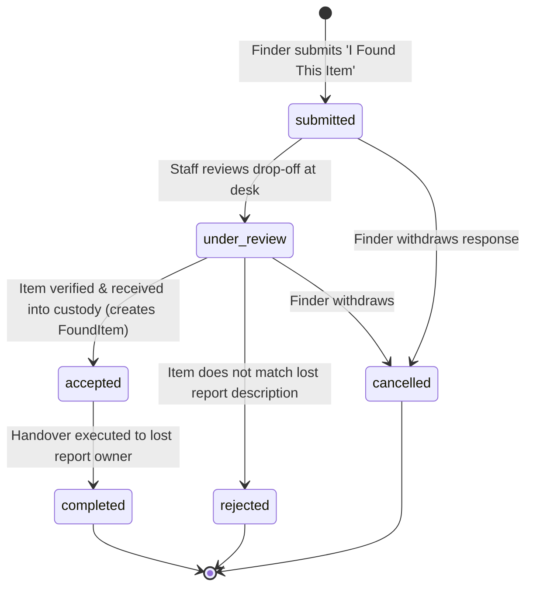

# 03. Found-Item Response Audit — Investigation of "I Found This Item" Workflow

## 1. Finding Overview

| Attribute | Details |
|---|---|
| **Finding Identifier** | `FINDING-LF-04` |
| **Audit Focus** | Audit 03 — Missing Found-Item Response Workflow |
| **Verification Status** | **VERIFIED MISSING FUNCTIONALITY** |
| **Severity** | **HIGH** |
| **Target Implementation Phase** | Phase 04 (Found-Item Response Subsystem) |

---

## 2. Relevant Business Requirement

1. **Direct Response to Lost Reports**:
   When a student publishes a **LOST Report**, another student, employee, or citizen visitor who finds the described item must be able to click **"I Found This Item"** directly on the report and submit a structured response.
2. **Distinct Business Operations (No Conflation with Claims)**:
   A **Found-Item Response** is fundamentally different from an **Ownership Claim**:
   - **Ownership Claim**: A claimant claims: *"This found item belongs to me; return it to me."* (Target: `FoundItem`; Actor: Owner; Direction: Out of custody).
   - **Found-Item Response**: A finder reports: *"I found an item matching your lost report and am handing it over to campus custody."* (Target: `LostReport`; Actor: Finder; Direction: Into custody).
   These operations must **not** share database tables, state machines, or controller logic.
3. **No Automatic Closure**:
   Submitting a found-item response must **never** automatically resolve the original lost report.
4. **Privacy and Safety Invariants**:
   - The finder's personal phone number or email must remain confidential and not be exposed to the lost item owner.
   - All physical drop-offs must be routed through authorized institutional custody desks (e.g., Campus Security, Student Affairs, Library Desk).
5. **Multiple Responses Support**:
   Multiple finders may independently submit responses to the same lost report (e.g., two distinct black wallets found in different buildings). The system must support evaluating and resolving each response independently.

---

## 3. Actual Implementation and Source-Code Evidence

### 3.1. Forensic Verification of Absence
A systematic inspection of the codebase confirms:
1. **Zero Database Tables**: No table exists for storing responses to lost reports (e.g. `lost_found_report_responses`).
2. **Zero Domain Models**: No `ReportResponse` or `FoundItemResponse` model exists in `packages/CampusFind/LostAndFound/src/Models/`.
3. **Zero HTTP Routes**: `packages/CampusFind/LostAndFound/src/Routes/` and `packages/CampusFind/Web/src/Web/Routes/web.php` contain zero routes for responding to a lost report.
4. **Frontend Dead End**: In `packages/CampusFind/Web/src/Web/Resources/views/items/index.blade.php` and `items/show.blade.php`, there is no UI component, modal, or button for "I Found This Item".

### 3.2. Forensic Analysis of `ReportController@storeFound`
The only existing found-reporting mechanism is [`ReportController@storeFound`](file:///home/hosam/Documents/compusfund/packages/CampusFind/Web/src/Web/Http/Controllers/ReportController.php#L130-L205).
Inspection reveals:
- It serves as a generic citizen drop-off notification form (`/reports/found`).
- It creates an independent `FoundItem` in status `draft` assigned to a fallback `"System Intake"` user.
- It has **zero relationship to any `LostReport`**.
- It does not take a `lost_report_id` or reference code, and cannot be used to respond to an existing lost report.

---

## 4. Operational Consequences of the Gap

1. **Broken Two-Way Communication Loop**:
   Campus members who find lost items posted on the portal have no direct, trackable way to report that they found the item. They are forced to file an unlinked general found item report, leaving the original lost report open and unmatched.
2. **Duplicate and Fragmented Records**:
   Unlinked drop-offs lead to parallel, disjointed records in the database for the same physical object.
3. **Increased Administrative Overhead**:
   Lost & Found staff must manually cross-reference notes and emails instead of managing verified responses directly in the system.

---

## 5. Proposed Domain Architecture for Found-Item Responses

To fulfill the business requirement without compromising security or coupling unrelated workflows, a dedicated **Found-Item Response Subsystem** must be implemented:

### 5.1. Database Schema (`lost_found_report_responses`)
- `id`: BigIncrements (PK)
- `lost_report_id`: FK &rarr; `lost_found_reports.id` (`restrictOnDelete`)
- `responder_student_id`: FK &rarr; `students.id` (`nullable`, `restrictOnDelete`)
- `responder_name`: VARCHAR(120), nullable (for guest finders)
- `responder_contact`: TEXT, encrypted, nullable
- `status`: VARCHAR(32), default: `'submitted'` (`submitted`, `under_review`, `accepted`, `rejected`, `cancelled`, `completed`)
- `found_location`: VARCHAR(255), required
- `found_at`: DATETIME, nullable
- `dropoff_location`: VARCHAR(255), required (e.g. 'Security Gate 1', 'Library Desk')
- `message`: TEXT, nullable
- `image_storage_key`: VARCHAR(255), nullable (stored on `lost_found_private` disk)
- `resulting_found_item_id`: FK &rarr; `lost_found_items.id`, nullable (`restrictOnDelete`)
- `timestamps`.

### 5.2. Operational Flow and Rules
1. **Submission**:
   - Finder navigates to published `LostReport` detail page (`/items/lost/{reference}`).
   - Finder clicks **"I Found This Item"** and fills the intake form.
   - If finder is an authenticated student, `responder_student_id` is set; if guest, contact details are encrypted.
   - Status is set to `submitted`.
2. **Notification & Verification**:
   - Staff receives notification of a pending drop-off.
   - Lost report owner receives notification: *"A finder reported finding an item matching your report at [Drop-off Desk]. Staff will verify intake."* (Owner cannot see finder PII).
3. **Physical Intake & Acceptance**:
   - Finder drops physical item at desk.
   - Staff inspects item in employee console.
   - If matching: Staff accepts response &rarr; transitions to `accepted`, triggers `CustodyService::receive`, creates linked `FoundItem`, and links `resulting_found_item_id`.
   - If non-matching: Staff rejects response &rarr; transitions to `rejected` with note. Original `LostReport` remains `ACTIVE`.

---

## 6. Dependencies

- **`LostReport` Model**: Add `hasMany(ReportResponse::class)` relation.
- **`LostFoundRasterSanitizer`**: For sanitizing proof photos uploaded by finders.
- **`CustodyService`**: For receiving accepted responses into formal storage.
- **Student & Web Packages**: For public and student UI integration.

---

## 7. Required Automated Tests

1. `test_authenticated_student_can_submit_found_response_to_active_lost_report()`:
   - Create active LostReport.
   - Submit response via `POST /reports/lost/{reference}/found`.
   - Assert: Response is persisted in status `submitted`.
   - Assert: Original LostReport remains `ACTIVE`.
2. `test_multiple_finders_can_submit_independent_responses_to_same_lost_report()`:
   - Submit response A and response B on same report.
   - Assert: Two distinct response records exist under report.
3. `test_rejecting_found_response_leaves_lost_report_active()`:
   - Staff rejects response A.
   - Assert: Response A is `rejected`.
   - Assert: LostReport remains `ACTIVE` and open for other responses.
4. `test_responder_contact_is_encrypted_and_hidden_from_owner()`:
   - Verify serialization of response data in owner views omits finder phone/email.

---

## 8. Acceptance Criteria

- [ ] Dedicated `lost_found_report_responses` migration and `ReportResponse` model implemented.
- [ ] Dedicated state machine governs response lifecycle completely separate from `ClaimStateService`.
- [ ] Submitting a found-item response never closes or alters the status of the target `LostReport`.
- [ ] Finder contact details are encrypted at rest and never exposed to the lost item owner.
- [ ] 100% of new response unit and feature tests pass cleanly.
