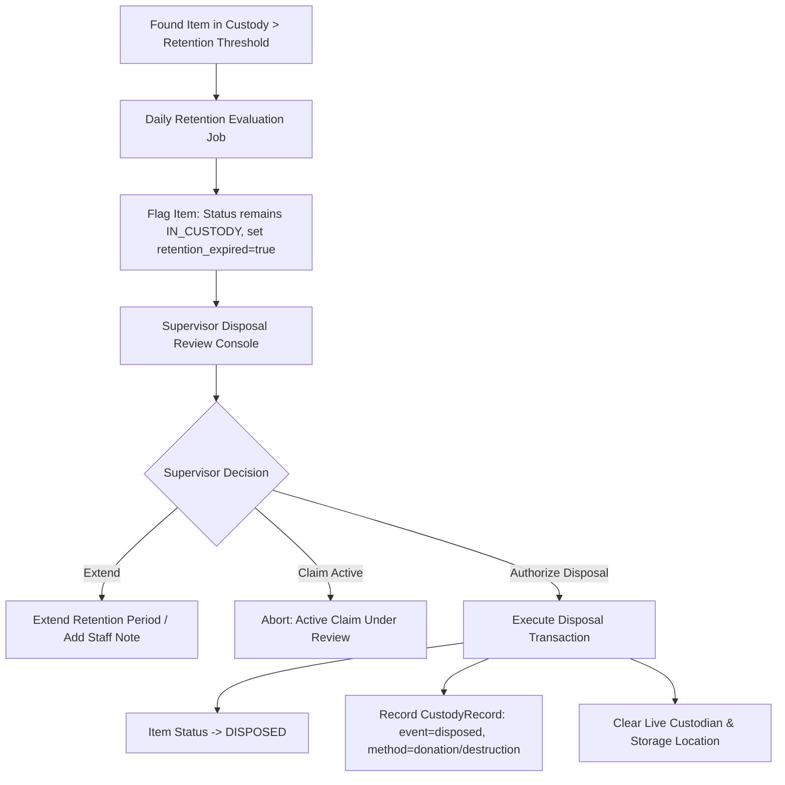

# 06. Retention and Unclaimed Items Policy Audit — Forensic Evaluation of Disposal Workflows

## 1. Finding Overview

| Attribute | Details |
|---|---|
| **Finding Identifier** | `FINDING-LF-08` |
| **Audit Focus** | Audit 06 — Retention Policy, Expiration, and Disposal Analysis |
| **Verification Status** | **VERIFIED UNIMPLEMENTED / SPECULATIVE POLICY HYPOTHESIS** |
| **Severity** | **LOW (INFORMATIONAL / GOVERNANCE SCOPE)** |
| **Target Implementation Phase** | Phase 07 (Retention & Controlled Disposal) |

---

## 2. Relevant Business Requirement

1. **Governance of Unclaimed Property**:
   Disposing of unclaimed personal property (e.g. laptops, wallets, IDs, textbooks) carries serious institutional, legal, and privacy implications for a university.
2. **Policy-Backed Retention Timelines**:
   Any item expiration schedule (e.g., standard items retained for $N$ days, perishable items for $M$ days, official IDs returned to government/registrar) must be governed by an **approved institutional policy**, not arbitrary developer assumptions.
3. **Strict Prohibition of Automatic Destructive Disposal**:
   Automatic unreviewed purging or permanent disposal of items by unmonitored cron jobs without human supervisory review is strictly prohibited.
4. **Audit and Chain-of-Custody Invariants**:
   Any disposal must be explicitly authorized by a designated supervisor, recorded in immutable custody logs (`CustodyRecord` with `CustodyEventType::DISPOSED`), and clear active physical custody.

---

## 3. Actual Implementation and Source-Code Evidence

### 3.1. What Actually Exists in the Codebase
1. **Enum Support for Disposed State**:
   In [`CampusFind\LostAndFound\Enums\ItemStatus`](file:///home/hosam/Documents/compusfund/packages/CampusFind/LostAndFound/src/Enums/ItemStatus.php#L11):
   ```php
   case DISPOSED = 'disposed';
   ```
2. **State Machine Transition**:
   In [`CampusFind\LostAndFound\Services\ItemStateService`](file:///home/hosam/Documents/compusfund/packages/CampusFind/LostAndFound/src/Services/ItemStateService.php#L20):
   ```php
   ItemStatus::IN_CUSTODY->value => [
       ItemStatus::RETURNED->value,
       ItemStatus::DISPOSED->value,
   ],
   ```
   An item in custody is structurally allowed to transition to `DISPOSED`.
3. **Repository Comments**:
   In [`FoundItemRepository.php#L65`](file:///home/hosam/Documents/compusfund/packages/CampusFind/LostAndFound/src/Repositories/FoundItemRepository.php#L65):
   > *"CustodyService owns entry into custody; return and disposition remain later waves."*

### 3.2. What Is Absent from the Codebase
1. **Zero Scheduled Commands or Cron Tasks**:
   `app/Console/Kernel.php` or `routes/console.php` contains zero tasks for processing retention limits (no `lost-found:check-retention` command).
2. **Zero Configuration Parameters**:
   `config/lost_found.php` contains zero keys for retention days (e.g. `retention_days => 90`).
3. **Zero Disposal Authorization Services**:
   There is no service method for executing disposal, no UI for supervisor approval, and no disposal batch console.

---

## 4. Forensic Investigation of the "90-Day Retention" Claim

The previous analysis documents repeatedly cited a "90-day retention period" as if it were an established law of the system:
- `03_COMPLETE_OPERATIONAL_SCENARIOS.md#L184`: *"retention period (e.g. 90 days)"*
- `04_STATE_MACHINES.md#L59`: *"Retention period elapsed (>90 days)"*
- `08_MISSING_FUNCTIONALITY.md#L69`: *"90 days standard, 30 days perishable"*

### Forensic Determination:
The 90-day retention period is a **speculative documentation hypothesis**. There is zero backing evidence in code, configuration, or university charter files.
Automated background destruction or disposal must **never** be built on speculative numbers.

---

## 5. Architectural Proposal for Policy-Compliant Retention & Disposal

When institutional stakeholders approve a formal retention policy, implementation should follow these strict principles:



### 5.1. Safety Invariants
1. **Active Claim Lockout**: An item with an active, unrejected claim (`submitted`, `under_review`, `needs_information`, `approved`) can **never** be authorized for disposal.
2. **Human-in-the-Loop Requirement**: The scheduled command only generates an administrative review queue; an authorized supervisor (`lost_found.items.edit` / superadmin) must individually or batch-authorize disposal.
3. **Immutable Audit Record**: The `CustodyRecord` must capture `actor_user_id`, disposal method (charity donation, university auction, safe electronic recycling, destruction), and supervisor notes.

---

## 6. Dependencies

- Formal stakeholder sign-off on university retention schedule by category.
- `config/lost_found.php` configuration for category-specific retention days.
- Supervisor disposal console view in Admin package.

---

## 7. Required Automated Tests (for Phase 07)

1. `test_retention_scanner_identifies_items_exceeding_configured_days()`:
   - Create item with `custody_started_at` 100 days ago.
   - Assert item is identified in expired queue without altering database status.
2. `test_item_with_active_claim_cannot_be_disposed()`:
   - Attempt to dispose item with approved or under-review claim.
   - Assert `DomainException` thrown.
3. `test_authorized_disposal_records_disposed_custody_event_and_clears_projection()`:
   - Execute authorized disposal.
   - Assert `ItemStatus::DISPOSED`, live custodian is `NULL`, and `CustodyRecord` event is `disposed`.

---

## 8. Acceptance Criteria

- [ ] Zero automatic background disposal without supervisor authorization.
- [ ] Retention timelines configured via explicit config keys, not hardcoded constants.
- [ ] Disposal invariants prevent disposal of items under active claim review.
- [ ] Complete chain-of-custody audit trail preserved upon disposal.
