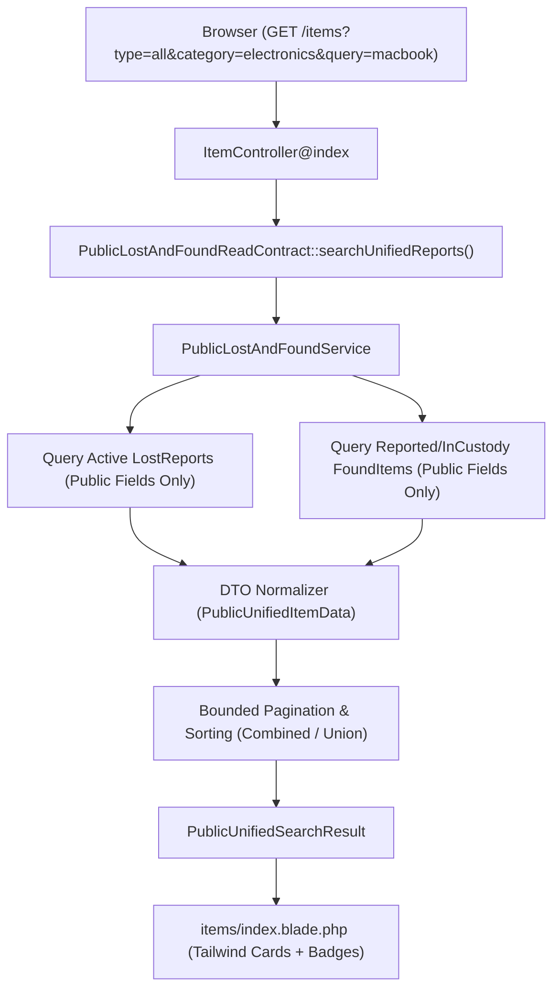

# 07. Unified Browsing Architecture — Public Catalog Integration and Information Safeguards

## 1. Finding Overview

| Attribute | Details |
|---|---|
| **Finding Identifier** | `FINDING-LF-05` |
| **Audit Focus** | Audit 07 — Unified Browsing Architecture & Public Catalog Integration |
| **Verification Status** | **VERIFIED ARCHITECTURAL GAP** |
| **Severity** | **HIGH** |
| **Target Implementation Phase** | Phase 03 (Unified Public Catalog & DTO Normalization) |

---

## 2. Relevant Business Requirement

1. **Single Unified Browsing Interface**:
   All public-safe **LOST reports** and **FOUND items** must appear side-by-side in one unified catalog at `GET /items`.
2. **Context-Aware Action Buttons**:
   - For **LOST Reports**: Primary action button must read **"I Found This Item"** (`/reports/lost/{reference}/found`).
   - For **FOUND Items**: Primary action button must read **"Claim Ownership"** (`/items/{reference}/claim`).
3. **Information Security & Privacy Safeguards**:
   - Only public-safe attributes (title, public description, general location, date, category, public reference, and `public_safe` images) may be rendered.
   - Student IDs, University Card numbers, personal phone numbers/emails, private distinguishing marks, encrypted serial fragments, and internal staff notes must be strictly excluded from public JSON/HTML.
4. **Preservation of Design System Architecture**:
   - The solution must leverage the existing **Tailwind CSS** and Blade component system (`<x-campusfind_web_web::...>` in Web package).
   - Zero new CSS frameworks, zero React or Vue SPAs, and zero third-party UI widgets.
   - Full bidirectional **Arabic RTL** and **English LTR** support.

---

## 3. Actual Implementation and Source-Code Evidence

### 3.1. Current Query Architecture
In [`CampusFind\LostAndFound\Services\PublicLostAndFoundService`](file:///home/hosam/Documents/compusfund/packages/CampusFind/LostAndFound/src/Services/PublicLostAndFoundService.php#L56-L129):

```php
// Method: searchPublicFoundItems()
$query = FoundItem::query()
    ->select(['id', 'public_reference', 'category_id', 'title', 'public_description', 'found_location', 'found_at', 'status'])
    ->whereIn('status', [ItemStatus::REPORTED, ItemStatus::IN_CUSTODY]);
```

`PublicLostAndFoundService` queries **only** `lost_found_items`. `lost_found_reports` records are completely ignored, meaning students and visitors cannot browse lost items.

### 3.2. Current Contract and DTO Boundaries
In [`PublicLostAndFoundReadContract.php`](file:///home/hosam/Documents/compusfund/packages/CampusFind/LostAndFound/src/Contracts/PublicLostAndFoundReadContract.php):
- `getRecentPublicFoundItems(int $limit): array`
- `searchPublicFoundItems(PublicFoundItemSearchCriteria $criteria): PublicFoundItemSearchResult`
- `findPublicFoundItemByReference(string $reference): ?PublicFoundItemData`
- `getPublicCategories(): array`

The contract only exposes found items via `PublicFoundItemData`. There is no unified contract method or normalized DTO.

### 3.3. Current Blade View
In [`packages/CampusFind/Web/src/Web/Resources/views/items/index.blade.php`](file:///home/hosam/Documents/compusfund/packages/CampusFind/Web/src/Web/Resources/views/items/index.blade.php#L65-L88):
- Renders only `searchResult->items` of type `PublicFoundItemData`.
- Hardcodes link to `campusfind_web.web.items.show` (found item view).
- Lacks report type toggle pills (`All`, `Lost`, `Found`).

---

## 4. Proposed Minimal Maintainable Unified Browsing Architecture

To support unified browsing cleanly without introducing architectural bloat, we propose extending the existing query and DTO layers with zero frontend rewrites:



### 4.1. Normalized DTO Structure (`PublicUnifiedItemData`)
An immutable DTO representing either report type:
```php
namespace CampusFind\LostAndFound\DataTransferObjects;

use DateTimeInterface;

final readonly class PublicUnifiedItemData
{
    public function __construct(
        public string $type,                    // 'lost' or 'found'
        public string $reference,               // 'LR-...' or 'LF-...'
        public string $title,                   // Public title
        public ?string $category,               // Category code (e.g. 'electronics')
        public ?string $location,               // Location lost or found
        public ?DateTimeInterface $occurredAt,  // lost_at or found_at
        public ?string $description,            // Sanitized public description
        public ?string $imageUrl,               // Public CDN safe image URL
        public bool $hasImage,                  // Boolean image presence
        public string $actionRoute,             // Pre-calculated target route name
        public string $badgeVariant,            // 'rose' for LOST, 'mint' for FOUND
    ) {}
}
```

### 4.2. Database Query Strategy (Optimized UNION Query)
To achieve fast, indexed, bounded pagination across both tables in a single query:

```sql
SELECT 
    'lost' AS item_type,
    id,
    public_reference,
    public_reference_key,
    category_id,
    title,
    public_description,
    lost_location AS location,
    lost_at AS occurred_at,
    submitted_at AS recorded_at
FROM lost_found_reports
WHERE status = 'active'
  AND (category_id = :cat OR :cat IS NULL)
  AND (title LIKE :query OR public_description LIKE :query OR lost_location LIKE :query)

UNION ALL

SELECT 
    'found' AS item_type,
    id,
    public_reference,
    public_reference_key,
    category_id,
    title,
    public_description,
    found_location AS location,
    found_at AS occurred_at,
    reported_at AS recorded_at
FROM lost_found_items
WHERE status IN ('reported', 'in_custody')
  AND (category_id = :cat OR :cat IS NULL)
  AND (title LIKE :query OR public_description LIKE :query OR found_location LIKE :query)

ORDER BY occurred_at DESC, id DESC
LIMIT :perPage OFFSET :offset;
```

**Performance Benefits**:
- Uses existing composite indexes:
  - `lost_found_reports`: `(status, category_id, lost_at)`
  - `lost_found_items`: `(status, category_id, found_at)`
- Bounded memory footprint with `LIMIT 12 OFFSET :offset`.
- Total count query executes quickly across indexed status filters.

### 4.3. UI / Blade Component Updates (items/index.blade.php)
1. **Type Filter Tabs**:
   Add segmented pill controls at the top of the search bar:
   ```blade
   <div class="flex items-center gap-2 mb-6">
       <a href="{{ route('campusfind_web.web.items.index', array_merge(request()->query(), ['type' => 'all'])) }}"
          class="px-4 py-2 rounded-xl text-sm font-bold {{ ($type ?? 'all') === 'all' ? 'bg-[#185c54] text-white' : 'bg-slate-100 text-slate-700' }}">
           @lang('campusfind_web_web::app.web.tabs.all_reports') ({{ $searchResult->total }})
       </a>
       <a href="{{ route('campusfind_web.web.items.index', array_merge(request()->query(), ['type' => 'lost'])) }}"
          class="px-4 py-2 rounded-xl text-sm font-bold {{ ($type ?? '') === 'lost' ? 'bg-rose-700 text-white' : 'bg-slate-100 text-slate-700' }}">
           @lang('campusfind_web_web::app.web.tabs.lost_reports')
       </a>
       <a href="{{ route('campusfind_web.web.items.index', array_merge(request()->query(), ['type' => 'found'])) }}"
          class="px-4 py-2 rounded-xl text-sm font-bold {{ ($type ?? '') === 'found' ? 'bg-emerald-700 text-white' : 'bg-slate-100 text-slate-700' }}">
           @lang('campusfind_web_web::app.web.tabs.found_items')
       </a>
   </div>
   ```
2. **Context-Aware Action Buttons on Cards**:
   - If `$item->type === 'lost'`: Render Rose Badge (`LOST`), and CTA button **"I Found This Item"** (`href="{{ route('campusfind_web.web.reports.lost.show', $item->reference) }}"`).
   - If `$item->type === 'found'`: Render Mint Badge (`FOUND`), and CTA button **"Claim Ownership"** (`href="{{ route('campusfind_web.web.items.show', $item->reference) }}"`).

---

## 5. Information Security and Privacy Safeguards

| Data Field | `FoundItem` Exposure | `LostReport` Exposure | Privacy Enforcement |
|---|---|---|---|
| **Title** | Public Safe | Public Safe | Sanitized text only |
| **Public Description** | Public Safe | Public Safe | Sanitized text only |
| **Private Distinctive Details** | **EXCLUDED** (AES-256) | **EXCLUDED** (AES-256) | Eloquent `$hidden` & excluded from SQL `SELECT` |
| **Student Identity / Card #** | **EXCLUDED** | **EXCLUDED** | Not queried; never exposed |
| **Warehouse Storage Shelf** | **EXCLUDED** | **N/A** | Excluded from public query |
| **Photos** | Only `public_safe` images | Stored on `lost_found_private` (only public thumbnail stream if approved) | Strictly checked via storage disk rules |

---

## 6. Dependencies

- `PublicLostAndFoundReadContract` and `PublicLostAndFoundService` in `LostAndFound` package.
- `ItemController` and Blade views in `Web` package.

---

## 7. Required Automated Tests

1. `test_unified_catalog_returns_both_active_lost_reports_and_found_items()`:
   - Create active LostReport and reported FoundItem.
   - Query `GET /items`.
   - Assert both items appear in the response with correct `type` badges.
2. `test_unified_catalog_filters_by_type_correctly()`:
   - Query `GET /items?type=lost` &rarr; assert only Lost reports returned.
   - Query `GET /items?type=found` &rarr; assert only Found items returned.
3. `test_unified_catalog_never_exposes_private_student_or_staff_notes()`:
   - Inspect JSON/HTML output to verify private fields are 100% absent.

---

## 8. Acceptance Criteria

- [ ] Single endpoint `/items` renders active Lost Reports and Found Items side-by-side.
- [ ] Contextual action buttons clearly distinguish "I Found This Item" from "Claim Ownership".
- [ ] Zero leakage of sensitive student identity, private distinctive marks, or internal notes.
- [ ] Existing Tailwind CSS and Blade component structure strictly preserved without React/Vue.
- [ ] 100% of unified browsing tests pass cleanly in all 7 supported languages.
