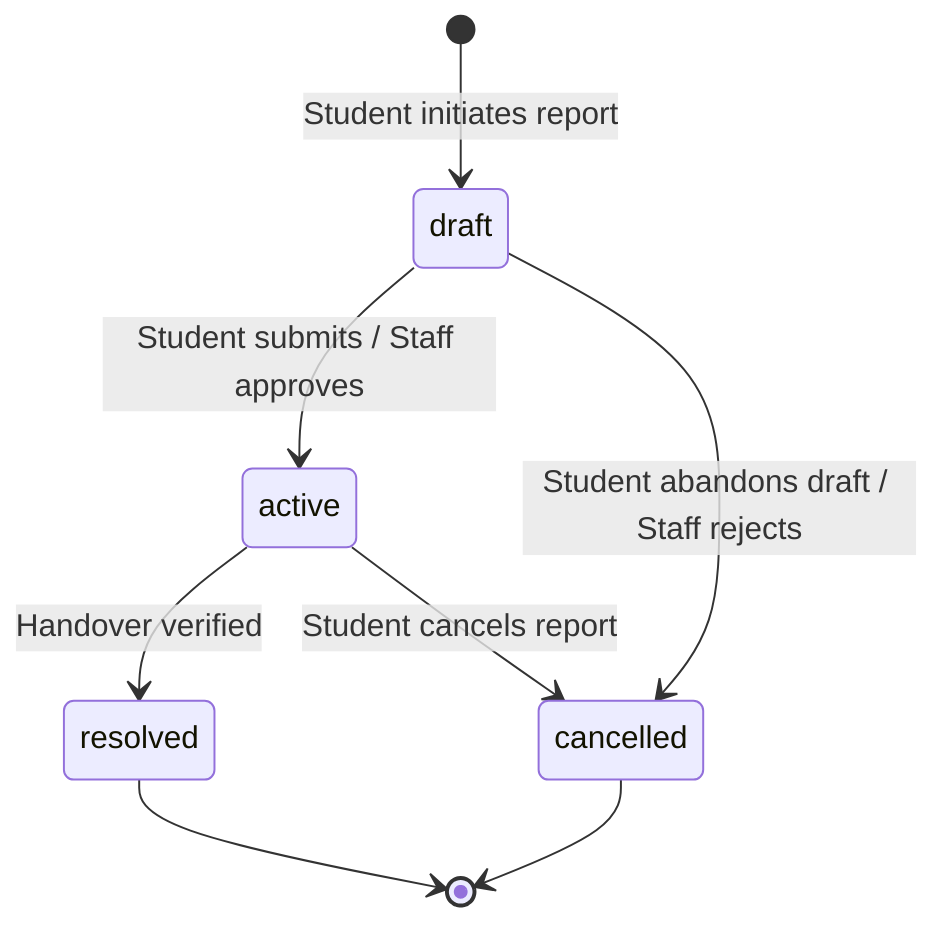
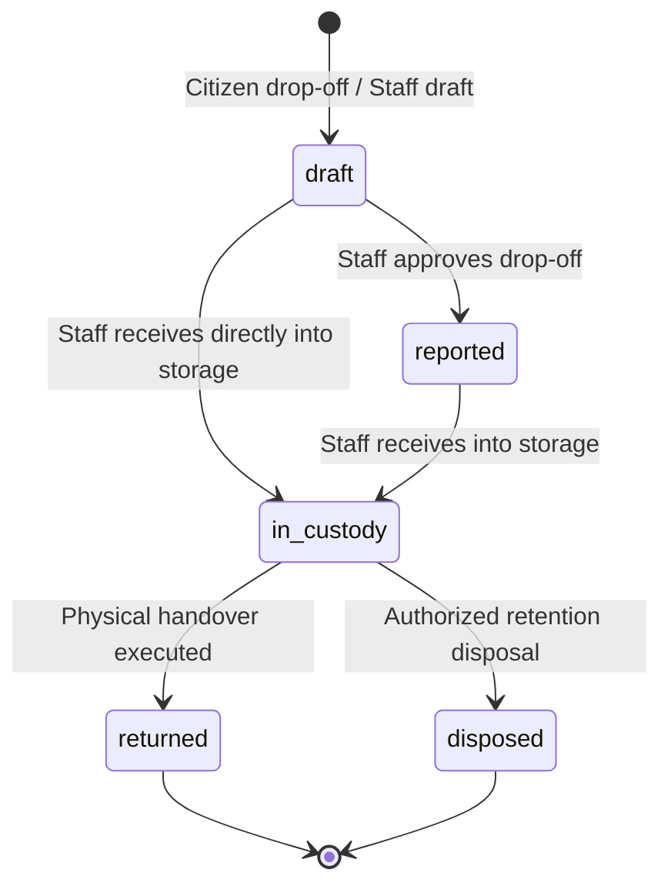
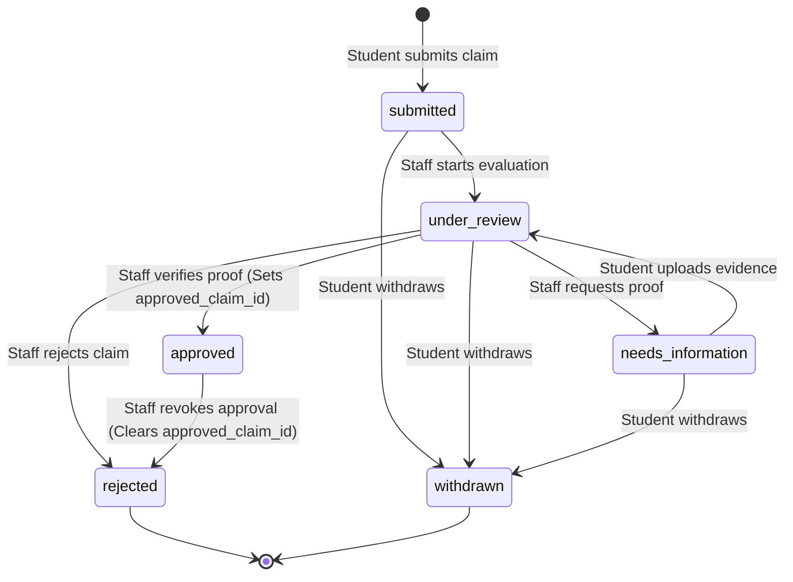
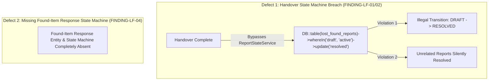

# 08. State-Machine Verification and Domain Invariants Audit

## 1. Domain State Machines Overview

This document provides the exhaustive forensic extraction and formal verification of all domain state machines, concurrency locks, and lifecycle invariants in `packages/CampusFind/LostAndFound`.

Existing codebase behavior is documented strictly separately from proposed corrections.

---

## 2. Extraction of Actual Implemented State Machines

### 2.1. Lost Report State Machine (`LostReport`)
Governed by [`CampusFind\LostAndFound\Services\ReportStateService`](file:///home/hosam/Documents/compusfund/packages/CampusFind/LostAndFound/src/Services/ReportStateService.php#L10-L21) and [`ReportStatus`](file:///home/hosam/Documents/compusfund/packages/CampusFind/LostAndFound/src/Enums/ReportStatus.php).



#### Transition Invariant Matrix
| Initial State | Target State | Legal in `ReportStateService`? | Actual Method / Trigger | Flaw / Violation Identified |
|---|---|---|---|---|
| `[*] (None)` | `draft` | **YES** | `StudentReportApplicationService@createLostReport` | None |
| `draft` | `active` | **YES** | `StudentReportApplicationService@submitOwnLostReport` | None |
| `draft` | `cancelled` | **YES** | `StudentReportApplicationService@cancelOwnLostReport` | None |
| `active` | `resolved` | **YES** | `StudentReportApplicationService@resolveReport` | None (valid transition path) |
| `active` | `cancelled` | **YES** | `StudentReportApplicationService@cancelOwnLostReport` | None |
| **`draft`** | **`resolved`** | **NO (ILLEGAL)** | **`HandoverService@complete` (raw SQL)** | **CRITICAL DEFECT (FINDING-LF-02)**: Direct SQL updates `draft` to `resolved` without transition validation. |

---

### 2.2. Found Item State Machine (`FoundItem`)
Governed by [`CampusFind\LostAndFound\Services\ItemStateService`](file:///home/hosam/Documents/compusfund/packages/CampusFind/LostAndFound/src/Services/ItemStateService.php#L10-L24) and [`ItemStatus`](file:///home/hosam/Documents/compusfund/packages/CampusFind/LostAndFound/src/Enums/ItemStatus.php).



#### Transition Invariant Matrix
| Initial State | Target State | Legal in `ItemStateService`? | Actual Method / Trigger | Verified Invariants |
|---|---|---|---|---|
| `[*] (None)` | `draft` | **YES** | `ReportController@storeFound` | Item hidden from public catalog |
| `draft` | `reported` | **YES** | `EmployeeFoundItemController@approve` | Item becomes searchable in public catalog |
| `draft` | `in_custody` | **YES** | `CustodyService@receive` | Requires valid storage location; logs custody |
| `reported` | `in_custody` | **YES** | `CustodyService@receive` | Requires valid storage location; logs custody |
| `in_custody` | `returned` | **YES** | `HandoverService@complete` | Requires approved claim + non-secret ID check |
| `in_custody` | `disposed` | **YES** | *(Enum permitted; no service built yet)* | Unimplemented in practice |
| `returned` | *any* | **NO** | Blocked | Terminal state |
| `disposed` | *any* | **NO** | Blocked | Terminal state |

---

### 2.3. Ownership Claim State Machine (`LostFoundClaim`)
Governed by [`CampusFind\LostAndFound\Services\ClaimStateService`](file:///home/hosam/Documents/compusfund/packages/CampusFind/LostAndFound/src/Services/ClaimStateService.php#L10-L30) and [`ClaimStatus`](file:///home/hosam/Documents/compusfund/packages/CampusFind/LostAndFound/src/Enums/ClaimStatus.php).



#### Key Invariants Verified in Codebase:
1. **Submitting a Claim $\neq$ Establishing Ownership**:
   - Initial state is strictly `submitted`.
   - `lost_found_items.approved_claim_id` remains `NULL`.
2. **Claim Approval $\neq$ Physical Handover**:
   - Approving transitions claim to `approved` and sets `items.approved_claim_id`.
   - Item status remains strictly `in_custody` (NOT `returned`).
3. **Automatic Competing Claims Rejection**:
   - In [`ClaimResolutionService@approve`](file:///home/hosam/Documents/compusfund/packages/CampusFind/LostAndFound/src/Services/ClaimResolutionService.php#L122-L128), all other active claims on that item are automatically locked and transitioned to `rejected` with note `'ownership_awarded_to_competing_claim'`.
4. **Approval Revocation**:
   - Staff can revoke an approved claim (`approved` &rarr; `rejected`) before handover, clearing `approved_claim_id` and reopening item for review.

---

### 2.4. Chain of Custody Event Model (`CustodyRecord`)
Governed by [`CampusFind\LostAndFound\Services\CustodyService`](file:///home/hosam/Documents/compusfund/packages/CampusFind/LostAndFound/src/Services/CustodyService.php).

#### Projection Consistency Invariant:
For every item in `in_custody` status:
```text
lost_found_items.current_custodian_user_id == latest(custody_records).to_custodian_user_id
lost_found_items.current_storage_location  == latest(custody_records).to_storage_location
lost_found_items.custody_changed_at        == latest(custody_records).occurred_at
```
Enforced by `CustodyService::assertProjectionMatchesHistory()`. Any divergence causes transactional abort.

---

### 2.5. Physical Handover Security Invariants (`HandoverService`)
1. **Pessimistic Row Locking**:
   - Item locked via `FoundItem::lockForUpdate()`.
   - All claims locked via `lockForUpdate()`.
   - Recipient student locked via `Student::lockForUpdate()`.
   - Staff user locked via `User::lockForUpdate()`.
2. **Double-Handover Prevention**:
   - DB UNIQUE constraint on `lost_found_handovers.found_item_id` and `lost_found_handovers.claim_id`.
   - Code assertion: `Handover::where('found_item_id', $item->id)->lockForUpdate()->exists()`.
3. **Secret Prohibition**:
   - Multilingual inspection via `SecurityInvariants::assertNoAuthSecrets`. Verification notes containing passwords, PINs, or unlock codes abort with `InvalidArgumentException`.

---

## 3. Identified State Machine Violations and Missing State Machines



---

## 4. Proposed Target State Machine: Found-Item Response (`ReportResponse`)

To govern the new "I Found This Item" workflow cleanly:

| Initial State | Target State | Authorized Actor | Preconditions | Side Effects |
|---|---|---|---|---|
| `[*] (None)` | `submitted` | Student / Citizen Finder | Target `LostReport` is `ACTIVE` | Persists response with intake desk & proof photo. Target report remains `ACTIVE`. |
| `submitted` | `under_review` | Staff (`lost_found.items.edit`) | Drop-off arrives at desk | Response marked for verification. |
| `submitted` | `cancelled` | Finder | Own response | Finder withdraws report. |
| `under_review` | `accepted` | Staff (`lost_found.items.edit`) | Physical item matches description | Creates linked `FoundItem` in `in_custody`. Target report remains `ACTIVE`. |
| `under_review` | `rejected` | Staff (`lost_found.items.edit`) | Item does not match report | Response closed. Target report remains `ACTIVE`. |
| `accepted` | `completed` | Staff (`lost_found.handover.complete`) | Physical handover signed | Target report becomes `RESOLVED`. Response becomes `COMPLETED`. |

---

## 5. Verification Checklist for Concurrency and Invariant Guarantees

| Invariant / Operational Property | Current Status | Code Enforcement Mechanism |
|---|---|---|
| **Submitting response does not close LOST report** | *[Target Model]* | Response is separate entity; Lost report status unchanged. |
| **Submitting claim does not establish ownership** | **VERIFIED CORRECT** | Claim status = `submitted`, `approved_claim_id` = `NULL`. |
| **Claim approval $\neq$ physical handover** | **VERIFIED CORRECT** | Item remains `in_custody`, `Handover` record absent until in-person collection. |
| **Completing handover resolves only verified report** | **VERIFIED DEFECT (Fixed in Phase 01)** | Remove category bulk query; resolve only linked report via `ReportStateService`. |
| **Concurrent operations cannot produce invalid states** | **VERIFIED CORRECT** | Row-level `lockForUpdate()` on all entity mutations. |
| **Immutable audit logs cannot be modified or deleted** | **VERIFIED CORRECT** | `Handover`, `CustodyRecord`, `ClaimEvidence`, `ClaimReview` throw `LogicException` on edit/delete. |
