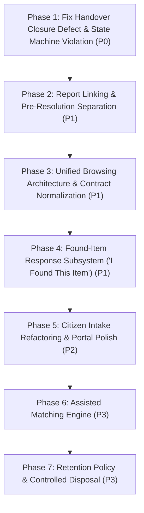

# 10. Prioritized Implementation Plan and Modular Execution Prompts

## 1. Executive Implementation Strategy

This document defines the authoritative, risk-prioritized implementation roadmap to resolve all verified defects and missing capabilities identified during the Phase 00 audit.

Execution is organized into **7 self-contained, modular phases** ordered strictly by technical dependencies, domain safety, and operational risk.



---

## 2. Phase 01: Fix Critical Handover Closure Defect & State Machine Violation

### 2.1. Target Findings
- `FINDING-LF-01`: Heuristic mass auto-closure of unrelated lost reports during handover.
- `FINDING-LF-02`: State machine violation (updating `draft` to `resolved` via raw SQL).

### 2.2. Scope of Work
1. Refactor [`HandoverService@complete`](file:///home/hosam/Documents/compusfund/packages/CampusFind/LostAndFound/src/Services/HandoverService.php#L162-L175).
2. Remove raw `DB::table('lost_found_reports')->where('category_id', ...)->update(...)`.
3. If an explicit report link is not present on the claim, leave all lost reports untouched.
4. If an explicit report is linked, lock it via `lockForUpdate()`, validate `status === ReportStatus::ACTIVE`, and transition via `ReportStateService::transition(ReportStatus::ACTIVE, ReportStatus::RESOLVED)`.
5. Add regression tests in `LostAndFoundHandoverPersistenceTest.php`.

### 2.3. Modular Implementation Prompt (Prompt 01)
```markdown
### Task: Fix Critical Handover Lost Report Auto-Closure Defect (P0)

**Context**: In `packages/CampusFind/LostAndFound/src/Services/HandoverService.php` lines 162–175, completing physical handover executes a bulk SQL update closing ALL active and draft lost reports belonging to the recipient in that category.

**Requirements**:
1. Modify `HandoverService::complete()`:
   - Remove the heuristic mass `update` on `lost_found_reports` matching solely on `student_id` and `category_id`.
   - Never alter draft or unrelated active lost reports.
2. In `LostAndFoundHandoverPersistenceTest.php`:
   - Add test proving that completing handover for a student with multiple active lost reports in the same category leaves unrelated reports in `ACTIVE` status and draft reports in `DRAFT` status.
3. Ensure 100% of existing tests in `packages/CampusFind/LostAndFound/tests` pass cleanly.
```

---

## 3. Phase 02: Report Linking Domain Model and Pre-Resolution Separation

### 3.1. Target Findings
- `FINDING-LF-03`: Conflation of candidate matching, pre-handover linking, and terminal resolution via `resolved_found_item_id`.

### 3.2. Scope of Work
1. Add migration adding nullable `lost_report_id` to `lost_found_claims` table (`restrictOnDelete`).
2. Update `LostFoundClaim` model and `StudentClaimApplicationService@submitClaim` to allow passing optional `lost_report_id`.
3. Ensure linking a lost report to a claim preserves `LostReport` status as `ACTIVE` and `resolved_found_item_id` as `NULL`.
4. Update `HandoverService` to resolve the specific `LostReport` associated with the approved claim.

### 3.3. Modular Implementation Prompt (Prompt 02)
```markdown
### Task: Implement Explicit Pre-Handover Report Linking (P1)

**Context**: Separate the concept of associating a Lost Report with a Claim from the final physical handover resolution.

**Requirements**:
1. Add migration `add_lost_report_id_to_lost_found_claims_table.php` with foreign key referencing `lost_found_reports.id` (nullable, `restrictOnDelete`).
2. Update `LostFoundClaim` model with `belongsTo(LostReportProxy::modelClass(), 'lost_report_id')`.
3. Update `HandoverService::complete()`: When an approved claim has a non-null `lost_report_id`, lock that specific `LostReport`, assert `status === ACTIVE`, and transition to `RESOLVED` with `resolved_found_item_id = $item->id`.
4. Add feature tests verifying pre-handover link persistence and single-report resolution on handover.
```

---

## 4. Phase 03: Unified Browsing Architecture and Public Read Contract

### 4.1. Target Findings
- `FINDING-LF-05`: Public search catalog indexes only `FoundItem` and ignores `LostReport`.

### 4.2. Scope of Work
1. Define `PublicUnifiedItemData` and `PublicUnifiedSearchResult` DTOs.
2. Add `searchUnifiedReports(PublicUnifiedSearchCriteria $criteria): PublicUnifiedSearchResult` method to `PublicLostAndFoundReadContract` and `PublicLostAndFoundService`.
3. Execute indexed SQL UNION query querying active `LostReport` and reported/in-custody `FoundItem` records.
4. Update `ItemController@index` and `packages/CampusFind/Web/src/Web/Resources/views/items/index.blade.php`:
   - Add type filter pills (`All`, `Lost`, `Found`).
   - Render contextual action buttons on cards:
     - Lost card: "I Found This Item"
     - Found card: "Claim Ownership"
   - Preserve existing Tailwind CSS and Blade components without adding React or new frameworks.

### 4.3. Modular Implementation Prompt (Prompt 03)
```markdown
### Task: Implement Unified Public Browsing for Lost & Found Reports (P1)

**Context**: All active lost reports and found items must appear side-by-side in `/items` with category filtering, search, and contextual card action buttons.

**Requirements**:
1. Create `PublicUnifiedItemData` DTO and update `PublicLostAndFoundReadContract` in `CampusFind/LostAndFound`.
2. Implement `searchUnifiedReports()` in `PublicLostAndFoundService` using an indexed query returning both active lost reports and public found items.
3. Update `packages/CampusFind/Web/src/Web/Resources/views/items/index.blade.php`:
   - Add `[ All | Lost | Found ]` filter pills.
   - Display distinctive badge pills (Rose for LOST, Mint for FOUND).
   - Display contextual buttons: "I Found This Item" for lost reports, "Claim Ownership" for found items.
4. Maintain 100% test coverage and 7-locale translation parity.
```

---

## 5. Phase 04: Found-Item Response Workflow ("I Found This Item")

### 5.1. Target Findings
- `FINDING-LF-04`: Missing found-item response workflow.
- `FINDING-LF-06`: Authorization gaps for response submission and review.

### 5.2. Scope of Work
1. Create migration `create_lost_found_report_responses_table.php`.
2. Create model `ReportResponse` with `belongsTo(LostReport)` and status transitions (`submitted` &rarr; `under_review` &rarr; `accepted` | `rejected` | `cancelled` &rarr; `completed`).
3. Create `ReportResponseApplicationService` and `StudentReportResponseController`.
4. Create frontend view `packages/CampusFind/Web/src/Web/Resources/views/reports/response.blade.php`.
5. Ensure responder contact information is encrypted and never exposed to the lost item owner.

### 5.3. Modular Implementation Prompt (Prompt 04)
```markdown
### Task: Build Found-Item Response Subsystem ('I Found This Item') (P1)

**Context**: When users discover a published LOST report, they must be able to submit a found-item response without altering the lost report's active status.

**Requirements**:
1. Create migration `create_lost_found_report_responses_table.php` (`id`, `lost_report_id`, `responder_student_id`, `responder_contact`, `found_location`, `dropoff_location`, `status`, `message`, `image_storage_key`, `resulting_found_item_id`, `timestamps`).
2. Create `ReportResponse` model, `ResponseStateService`, and `ReportResponseApplicationService`.
3. Register routes:
   - `GET /reports/lost/{reference}/found` (form)
   - `POST /reports/lost/{reference}/found` (submission)
   - `POST /admin/lost-found/responses/{id}/review`, `approve`, `reject`
4. Write feature tests verifying response persistence, image sanitization, and PII protection.
```

---

## 6. Phase 05: Citizen Intake Refactoring and Student Portal Polish

### 6.1. Target Findings
- `FINDING-LF-06`: "System Intake" pseudo-user creation in `ReportController@storeFound`.
- Self-service evidence upload and claim withdrawal on student dashboard.

### 6.2. Scope of Work
1. Refactor `ReportController@storeFound` to make `logged_by_user_id` nullable for citizen drop-offs until an employee receives custody.
2. Update student dashboard (`account/dashboard.blade.php`) to add:
   - "Upload Additional Evidence" modal when a claim is in `needs_information`.
   - "Withdraw Claim" action button with confirmation dialog.
   - "Cancel Lost Report" action button with confirmation dialog.

### 6.3. Modular Implementation Prompt (Prompt 05)
```markdown
### Task: Refactor Citizen Intake and Enhance Student Portal Dashboard (P2)

**Context**: Eliminate synthetic employee user creation and provide complete self-service tools on the student dashboard.

**Requirements**:
1. Update `ReportController@storeFound` to avoid creating dummy `"System Intake"` users in `users` table; handle open citizen intakes cleanly.
2. In `account/dashboard.blade.php`:
   - Add interactive modal for students to submit additional evidence images/text for claims in `needs_information` status.
   - Add confirmation modals for claim withdrawal and lost report cancellation.
3. Add unit and feature tests covering dashboard self-service interactions.
```

---

## 7. Phase 06: Assisted Matching Suggestions

### 7.1. Target Findings
- `FINDING-LF-07`: Unbuilt matching engine.

### 7.2. Scope of Work
1. Implement `CampusFind\LostAndFound\Services\Matching\ItemMatchingEngine`.
2. Compare category code, date proximity, and title/description token similarity.
3. Create admin widget rendering "Suggested Matches" on item and report detail views.
4. Ensure match suggestions have zero automated state side-effects.

---

## 8. Phase 07: Retention Policy and Controlled Disposal

### 8.1. Target Findings
- `FINDING-LF-08`: Unverified retention policy and missing disposal authorization workflow.

### 8.2. Scope of Work
1. Add configuration keys in `config/lost_found.php` for retention schedules.
2. Create `DisposalAuthorizationService` requiring supervisor approval.
3. Build Artisan command `lost-found:check-retention` to identify expired items.
4. Transition approved items to `ItemStatus::DISPOSED`, log `CustodyEventType::DISPOSED` in `CustodyRecord`, and clear live custody projections.
