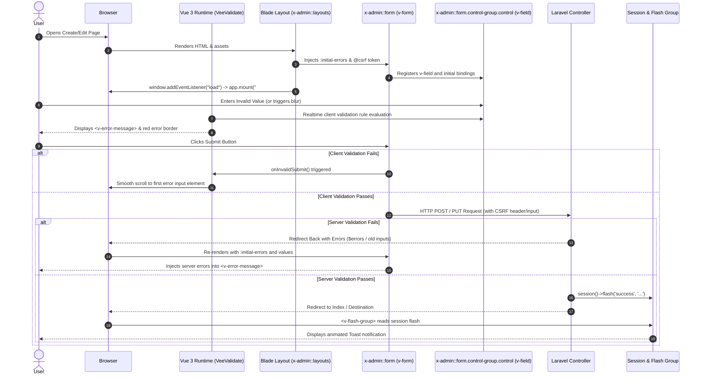

# ADMIN FORM SYSTEM — COMPLETE FORENSIC EXECUTION TRACE

## 1. Overview & Architectural Principles

The form execution architecture in the Laraseed/Bagisto platform combines server-rendered Blade templates with Vue 3 reactive validation (via `vee-validate` 4.x) and Laravel's session error flashing and CSRF protection.

---

## 2. End-to-End Execution Trace



---

## 3. Detailed Step-by-Step Analysis

### Step 1 — Blade Page Form Definition
- The developer writes standard Blade markup using `<x-admin::form :action="route('admin.settings.roles.store')">`.
- Inside the form, inputs are wrapped in `<x-admin::form.control-group>` containing a label, control, and error component.

### Step 2 — Component Transformation & Vue Field Registration
- `<x-admin::form>` renders `<v-form>` passing:
  - `method="POST"`
  - `:initial-errors="{{ json_encode($errors->getMessages()) }}"`
  - `v-slot="{ meta, errors, setValues }"`
  - `@invalid-submit="onInvalidSubmit"`
  - `@csrf` and `@method(...)`
- `<x-admin::form.control-group.control>` generates `<v-field>`:
  - Wraps the native `<input>`, `<select>`, or `<textarea>`.
  - Binds VeeValidate rules (e.g. `rules="required|email"` or `rules="required|min:6"`).
  - Dynamically binds error classes `:class="[errors.length ? 'border !border-red-600 hover:border-red-600' : '']"`.
  - For checkboxes and radio inputs, invokes `<v-checked-handler>` to synchronize initial server state.

### Step 3 — Client-Side Validation Engine
- Registered rules in `plugins/vee-validate.js`:
  - Standard rules imported from `@vee-validate/rules`.
  - Custom domain rules: `phone`, `address`, `postcode`, `decimal`, `required_if`, `date_format`, `after`.
  - Multi-language dictionary localized dynamically on window load using `@vee-validate/i18n`.
- Field validation is triggered on blur, input, and change (`validateOnBlur: true`, `validateOnInput: true`, `validateOnChange: true`).

### Step 4 — Form Submission & Error Scrolling
- When the user submits:
  - If any client-side rule fails, VeeValidate intercepts the submission and calls `onInvalidSubmit`.
  - `onInvalidSubmit({ values, errors })` finds the first invalid field (`document.querySelector('[name="' + errorKeys[0].key + '"]')`) and smoothly scrolls the viewport to it:
    ```javascript
    firstErrorElement.scrollIntoView({
        behavior: "smooth",
        block: "center"
    });
    ```

### Step 5 — Server-Side Validation & Controller Execution
- The form submits standard HTTP payload or AJAX payload with `@csrf` protection.
- In Laravel Controller:
  - Validates request data (`$this->validate(...)` or FormRequest).
  - Dispatches domain lifecycle events (`Event::dispatch('settings.role.create.before')`).
  - Executes repository persistence (`$this->roleRepository->create($data)`).
  - Dispatches post-creation events (`Event::dispatch('settings.role.create.after', $role)`).
  - Flashes message to session: `session()->flash('success', trans('...'))`.
  - Returns redirect response (`redirect()->route(...)`).

### Step 6 — Notification & Flash Feedback Rendering
- Upon redirection, `<x-admin::flash-group>` renders `<v-flash-group>` on the new page:
  - In `created()`, iterates through `['success', 'warning', 'error', 'info']` checking `session()->has($key)` and populates `flashes` array.
  - Sub-component `<v-flash-item>` renders an animated notification toast with a circular SVG timer ring (5000ms duration) that automatically pauses on mouse hover and resumes on mouse leave.
  - Also listens to `$emitter.on('add-flash', this.add)` for dynamically emitted client-side toasts.

---

## 4. Web Package Parity Blueprint

The Web package replicates this exact architecture under the `<x-web::>` namespace:
1. `<x-web::form>` renders `<v-form>` with identical `:initial-errors`, `@invalid-submit="onInvalidSubmit"`, `@csrf`, and `@method` support.
2. `<x-web::form.control-group.control>` provides `<v-field>` bindings across all control types (`text`, `email`, `password`, `select`, `textarea`, `checkbox`, `radio`, `switch`, `file`, `price`, `date`, `datetime`, `tags`, `image`, `custom`).
3. Complete client validation via Web's `plugins/vee-validate.js` with localized messages for all 7 application locales (`ar`, `en`, `es`, `fa`, `pt_BR`, `tr`, `vi`).
4. Toast notifications via `<x-web::flash-group>` and `<v-flash-group>` with full RTL/LTR animations and circular timer progress.
