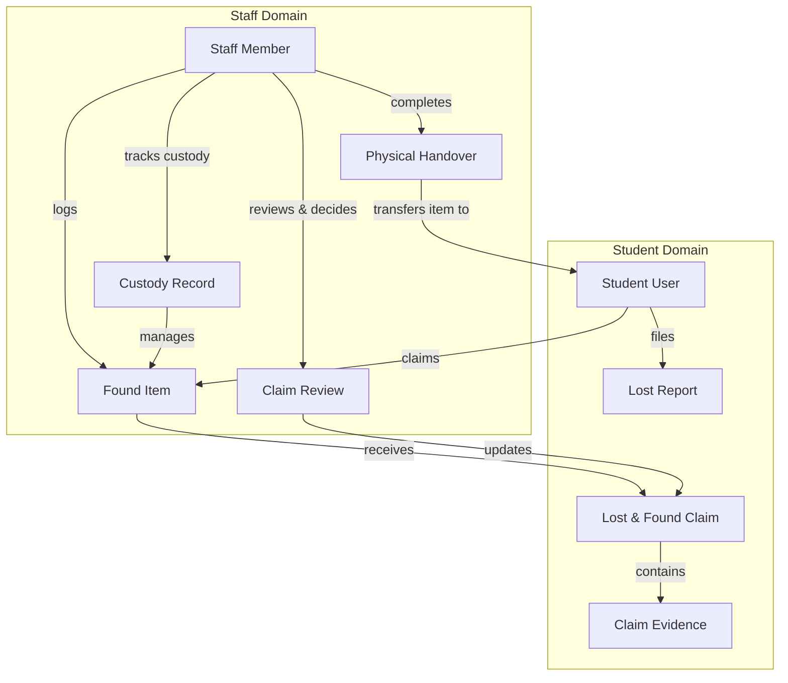

# CampusFind Lost and Found Package Architecture

## 1. Domain Overview

The `CampusFind\LostAndFound` package models physical item recovery, student claims, institutional custody, and physical handovers within campus facilities.

---

## 2. Package Boundaries & Dependencies

- **Vendor / Package**: `CampusFind\LostAndFound`
- **Composer Name**: `campus-find/lost-and-found`
- **Dependencies**:
  - `campus-find/student`: Required for claimant identity resolution (`StudentProxy`) and student authentication guard (`auth:student`).
  - `webkul/user`: Required for employee identity (`UserProxy`) and role-based ACL (`bouncer()`).
  - `webkul/core`: Base repositories, config mergers, and view render events.
  - `webkul/admin`: Admin UI layouts, DataGrid components, and breadcrumbs.

---

## 3. State Machines & Invariants

### 3.1 Item Lifecycle (`ItemStatus`)
1. `DRAFT` &rarr; `REPORTED` &rarr; `IN_CUSTODY` &rarr; `RETURNED` / `DISPOSED`
- Custody entrance is managed exclusively by `CustodyService`.
- Terminal states (`RETURNED`, `DISPOSED`) prevent any further modifications or evidence uploads.

### 3.2 Claim Lifecycle (`ClaimStatus`)
1. `SUBMITTED` &rarr; `UNDER_REVIEW` / `NEEDS_INFORMATION` &rarr; `APPROVED` / `REJECTED` / `WITHDRAWN`
- Only one authoritative approved claim is permitted per found item at any given time.
- Competing claims are rejected upon approval of the winning claim.
- Revocation of approval resets claim status and clears item pointer atomically.

### 3.3 Custody Tracking (`CustodyEventType`)
- `LOGGED`: Initial receipt of item into custody.
- `TRANSFERRED`: Chain-of-custody transfer from Custodian A to Custodian B.
- `STORAGE_LOCATION_CHANGED`: Relocation within campus storage.
- `HANDED_OVER`: Final release of physical item to verified claimant.

---

## 4. Storage & Image Pipelines

- **Public-Safe Images**: Resized, sanitized raster images (JPEG/PNG/WebP) stored in public storage.
- **Private Evidence Images**: Stored on `lost_found_private` disk with SHA-256 storage key hashing, encrypted paths, and restricted visibility.
- **Filesystem Compensation**: Transactional rollback listeners ensure staged files are purged on database exceptions.
